# Workshop pre-work

## Prep for your upcoming F5/NGINX Workshop

If you're here that probably means you are currently in, or registered for, an upcoming NGINXperts Workshop. By taking the time to run through this exercise you are helping us save time during the workshop and ensure that you meet the prerequisites to access the workshop. We appreciate you taking time to check your system and your access.

 

## Step 0: If this is your first time in an F5 Hosted Workshop

Look for an email from **`courses@notify.udf.f5.com`**. This will have instructions on how you can login into UDF (F5 workshop environment).

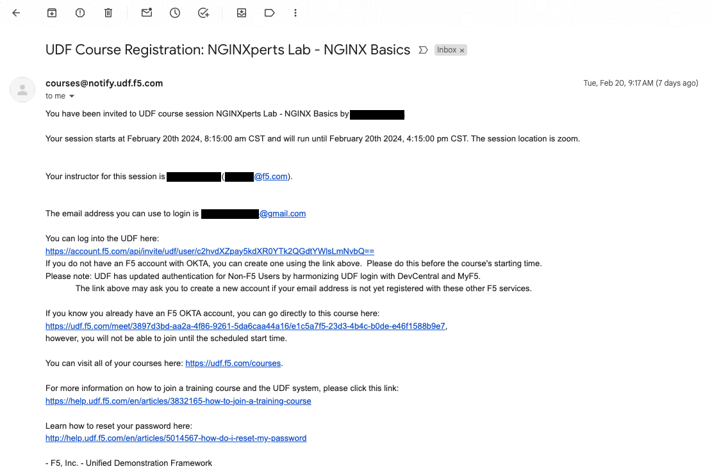

### If you cannot find your invite email ("UDF Course Registration:NGINXperts Lab ...") STOP

- These commonly get caught by spam/junk filters. *Make sure to check your spam folder **and** your system's email Quarantine.*

- If you still cannot find your invite email, you either have not been invited to a workshop or we have an incorrect email. Please get help from whoever sent you to this page.

## Step 1: Get yourself to UDF

- Navigate to [https://udf.f5.com/](https://udf.f5.com/) and select `Invited Users`
    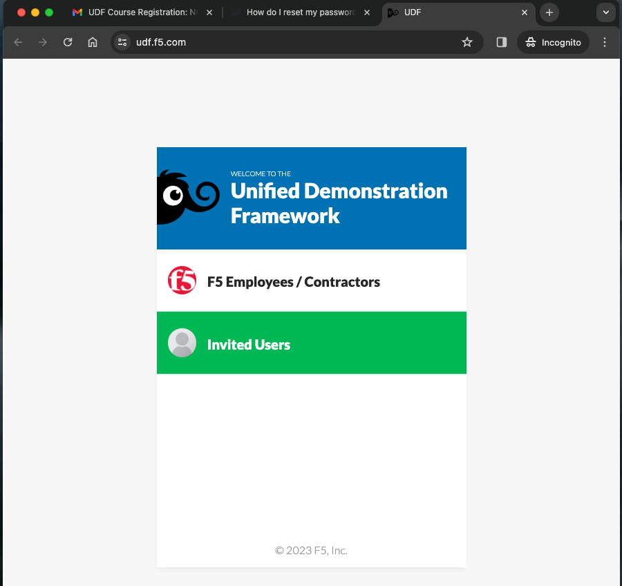

- If this is your first time using UDF, use the `Sign Up` link which would take your to F5 registration page.
  
  **NOTE:** this will *not be the password to the Ubuntu Desktop or other VMs in the class!*
    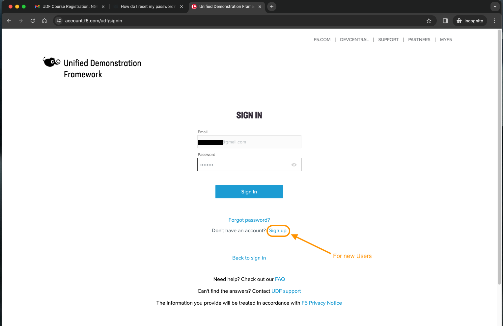

- Once you have filled in your registration details, you should be receiving an `Account Activation` email as shown below
  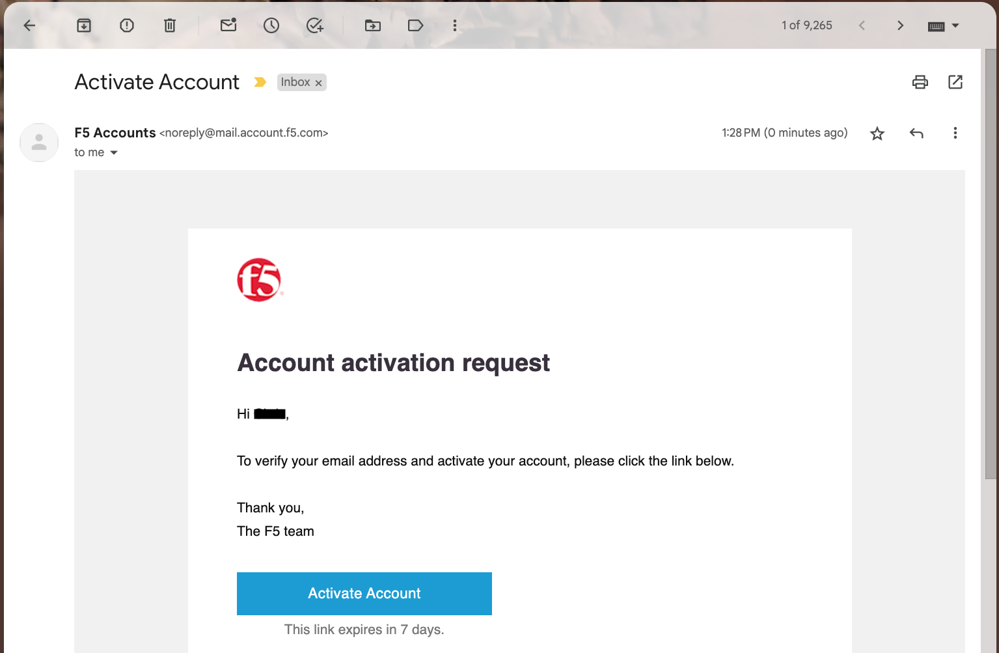

- When you click on the `Activate Account` button within the activation email, you would be redirected to setup 2 factor authentication as shown below. Select your preferred authentication method.
  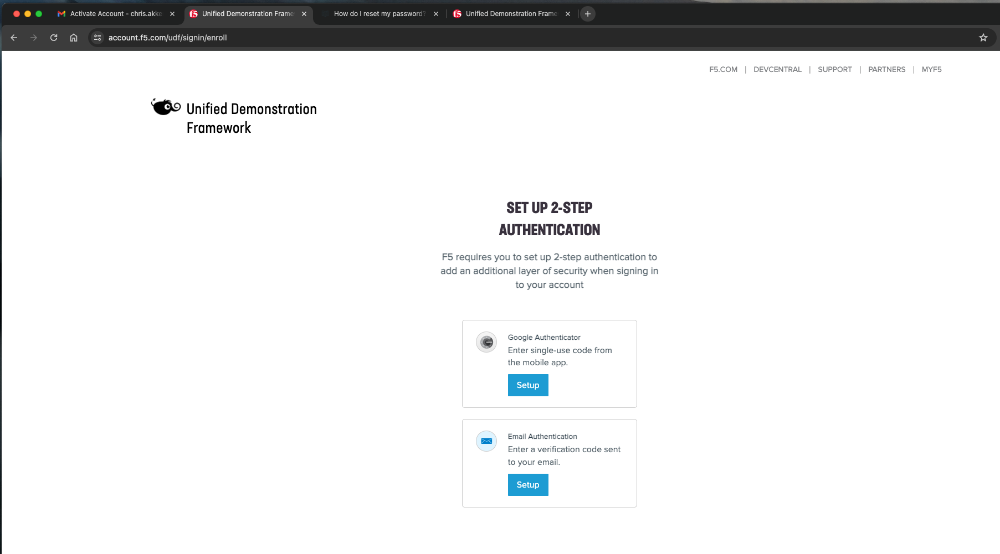

- Once you have set up 2 factor authentication successfully, you will see a `green` checkmark on your preferred method. Click on `Finish`.
  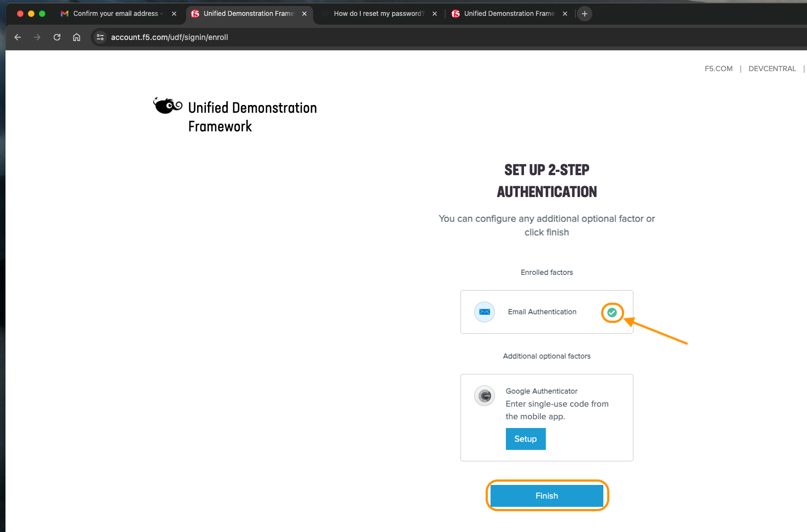

- If you already have an account but you can't remember your password, simply reset your password by clicking on `Forgot Password?` link.
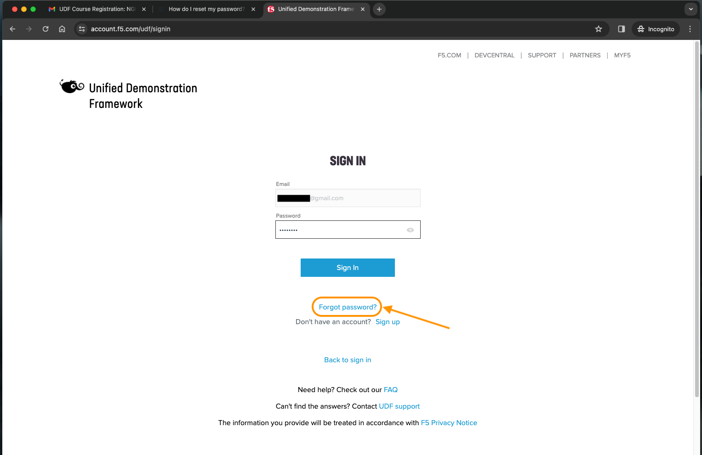

## Step 2: Start the course

- Once logged into UDF, click `Launch` (This will open a new tab.)
  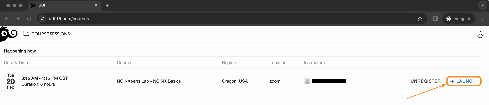

- And then click on `Join`
  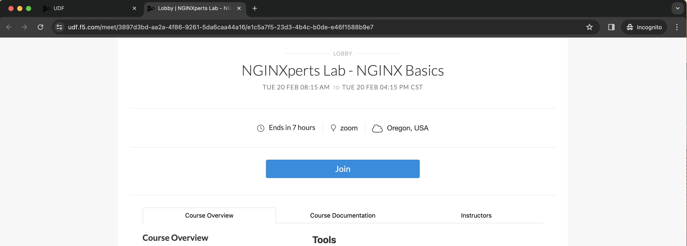

- Click the `DEPLOYMENT` tab at the top
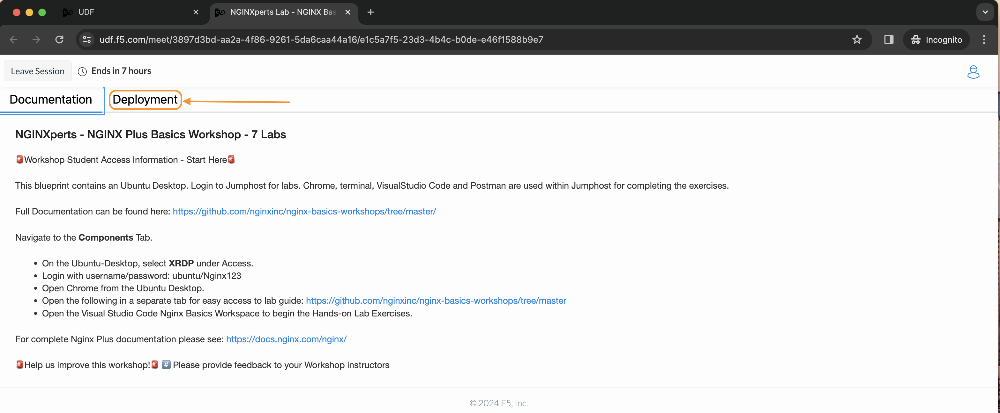

## Step 3: RDP to the Jumphost

- Wait for the Jumphost to finish booting...

    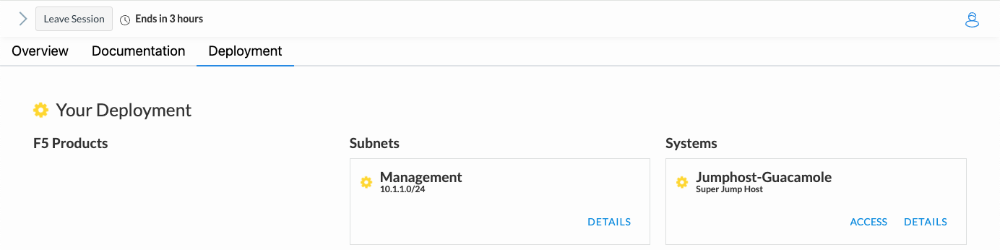

- There are two ways to RDP to the Jumphost

    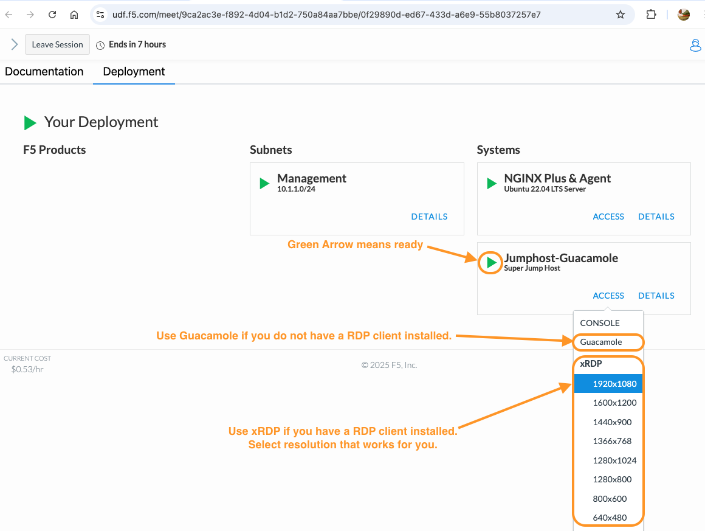

  ### OPTION 1: Using **Apache Guacamole**

  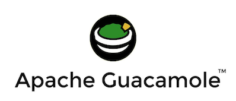
  
  This workshop is enabled with Apache Guacamole, which is a clientless remote desktop gateway.

  - To use Apache Guacamole, select `Guacamole` from the ACCESS drop down for the Jumphost.

  - Click on "Allow" for the popup and then enter below credentials.

      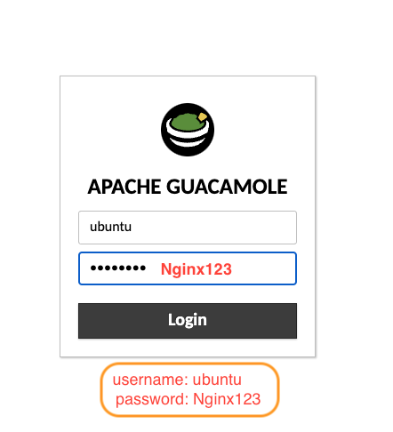
  
  - In the next window click on "OK" and then enter the login password (`Nginx123`) to log into the Jumphost.

      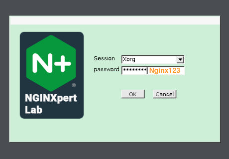

  ### OPTION 2: Using **xRDP**

  

  THIS OPTION REQUIRES AN RDP CLIENT! If you have a Mac *and* haven't downloaded an RDP client before, here is the first-party version:

  [Microsoft's RDP client on the Apple Apps Store](https://apps.apple.com/us/app/microsoft-remote-desktop/id1295203466?mt=12)

  - To use your RDP client, select `xRDP` from the ACCESS drop down for the Jumphost. Make sure to select a small enough resolution to see the whole screen.

  - Once you select the resolution, your browser will download an rdp file. Open this file to connect to the Jumphost.

  - Accept the self-signed cert and then enter the login password (`Nginx123`) to log into the Jumphost.
  
    (**NOTE:** This is *not* your UDF login password.)

    

    > **If you can't connect to the Jumphost, *remember to shut off your VPN*, or join a non-proxied network (sometimes a guest network in the office will work)**

    **For machines running Windows and attached to a domain, Windows will helpfully attempt to use your domain creds to log in, and you'll see:**

    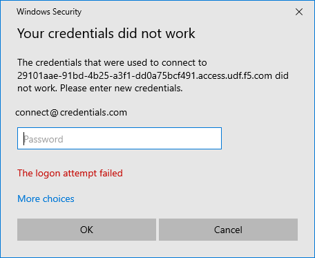

    **Click "More choices" to enter both a username and a password**

    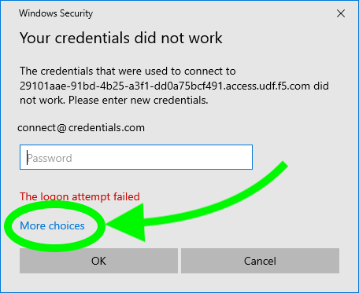

- Irrespective of which Option you choose to RDP to Jumphost, once logged in you should see an ubuntu desktop as below screenshot.

  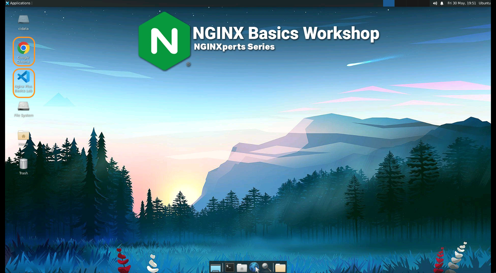

That wraps the pre-requisites.

### Authors

- Chris Akker - Solutions Architect - Community and Alliances @ F5, Inc.
- Shouvik Dutta - Solutions Architect - Community and Alliances @ F5, Inc.
- Adam Currier - Solutions Architect - Community and Alliances @ F5, Inc.

-------------

Navigate to ([Lab1](../lab1/readme.md) | [Main Menu](../readme.md))
