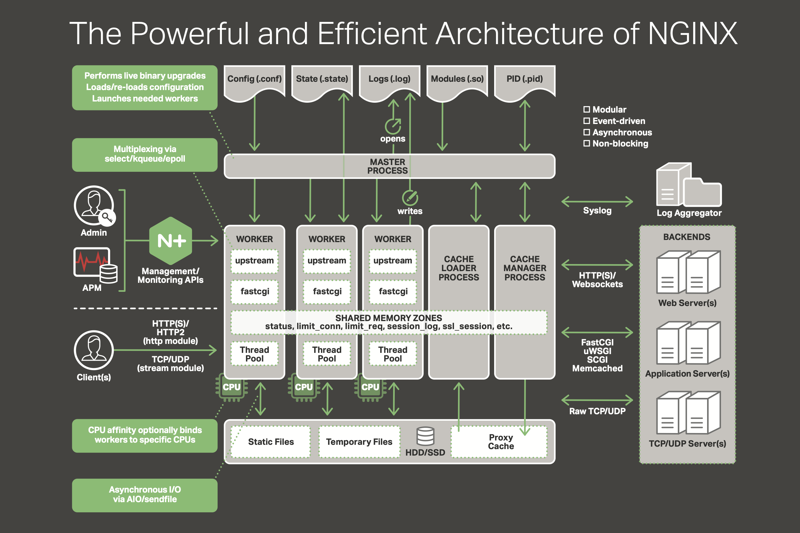
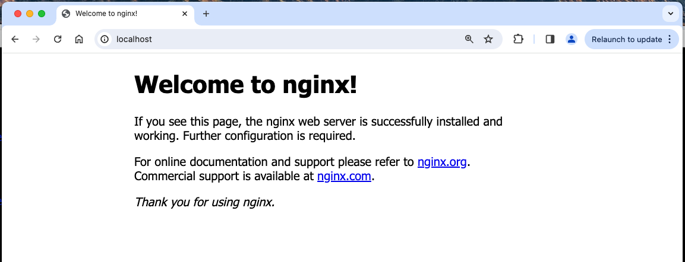
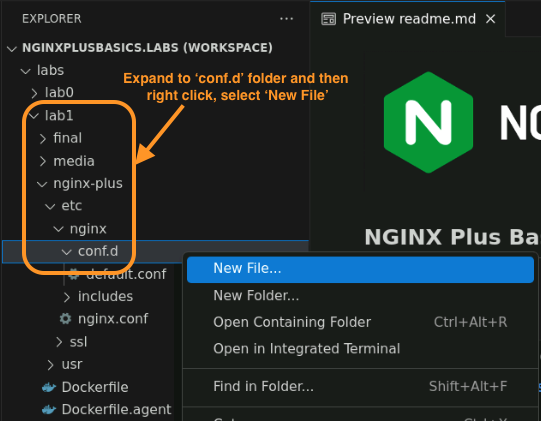
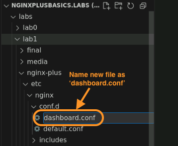
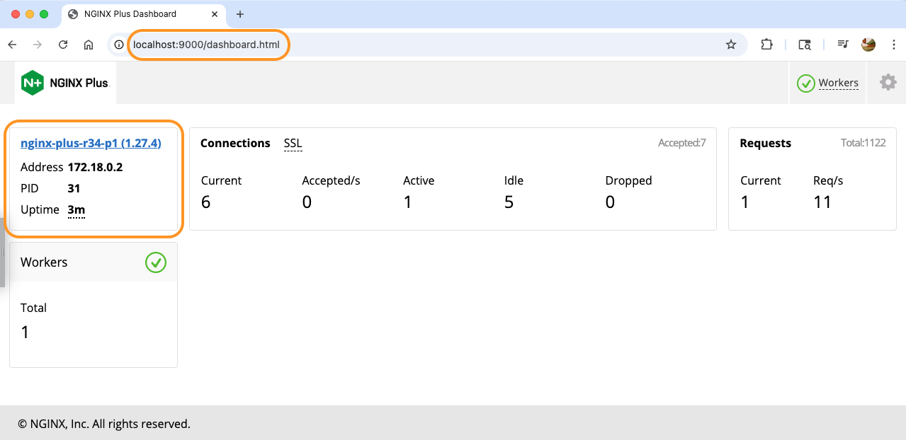
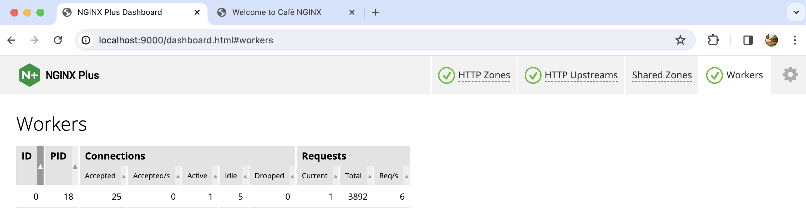

# Build and Run NGINX Plus on Docker

## Introduction

You will build a Docker container running the Plus version of NGINX, which requires a subscription/license.  You will need a subscription license, using the TLS `nginx-repo.crt, nginx-repo.key and nginx-repo.jwt` files.  These files provide access to the `NGINX Plus Repository` where the Plus binary files are located.  These are not publicly accessible, you must have a valid Certificate and Key for access. You also need the JWT license file to validate your subscription and automatically send usage reports to F5 licensing endpoint to be compliant with subscription agreement.  This new NGINX Plus container will be used for the rest of the Lab exercises, while you explore and add Plus features and options to your environment.

## Learning Objectives

By the end of the lab you will be able to:

- Review the History and Architecture of NGINX
- Build an `NGINX Plus Docker` image
- Run this NGINX Plus image, and test it
- Configure and Test the NGINX Plus Dashboard

<br/>

## The History and Architecture of NGINX

NGINX | NGINX
:-------------------------:|:-------------------------:
|

NGINX was written in 2002 by Igor Sysov while he was working at rambler.ru, a web company providing Internet Search content.  As Rambler continued to grow, Igor kept hitting the practical limit of 10,000 simultaneous HTTP requests with Apache HTTP server.  The only way to handle more traffic was to buy and run more servers.  So he wrote NGINX to solve the `C10k concurrency problem` - how do you handle more than 10,000 concurrent requests on a single Linux server.  

Igor created a new TCP connection and request handling concept called the `NGINX Worker`.  The Workers are Linux processes that continually wait for incoming TCP connections, and immediately handle the Request, and deliver the Response.  It is based on event-driven computer program logic written in the `native C programming language`, which is well-known for its speed and power.  Importantly, NGINX Workers can use any CPU, and can scale in performance as the compute hardware scales up, providing a nearly linear performance curve.  There are many articles written and available about this NGINX Worker architecture if you are interested in reading more about it.  

Another architecural concept in NGINX worth noting, is the `NGINX Master` process.  The master process interacts with the Linux OS, controls the Workers, reads and validates config files before using them, writes to error and logging files, and performs other NGINX and Linux management tasks.  It is considered the Control plane process, while the Workers are considered the Data plane processes.  The `separation of Control functions from Data handling functions` is also very beneficial to handling high concurrency, high volume web traffic.

NGINX also uses a `Shared Memory model`, where common elements are equally accessed by all Workers.  This reduces the overall memory footprint considerably, making NGINX very lightweight, and ideal for containers and other small compute environments.  You can literally run NGINX off a legacy floppy disk!

In the `NGINX Architectural` diagram below, you can see these different core components of NGINX, and how they relate to each other.  You will notice that Control and Management type functions are separate and independent from the Data flow functions of the Workers that are handling the traffic.  You will find links to NGINX core architectures and concepts in the References section.

>> It is this unique architecture that makes NGINX so powerful and efficient.



- In 2004, NGINX was released as open source software (OSS).  It rapidly gained popularity and has been adopted by millions of websites.

- In 2013, NGINX Plus was released, providing additional features and Commercial Support for Enterprise customers.

<br/>

## So what is NGINX Plus?  

NGINX Plus | Docker
:-------------------------:|:-------------------------:
  |

NGINX Plus is the `Commercial version of NGINX`, with additional Enterprise features on top of the base NGINX Opensource OSS build. Here is a Summary list of the Plus features:

- Dynamic reconfiguration reloads with no downtime
- Dynamic NGINX software updates with no downtime
- Dynamic DNS resolution and DNS Service discovery
- Active Health Checks
- NGINX Plus API w/statistics and dashboard, over 240 metrics
- NGINX JavaScript Prometheus exporter libraries
- Dynamic Upstreams
- Key Value store
- Cache Purge API controls
- NGINX Clustering for High Availability
- JWT processing with OIDC for user authentication
- NGINX App Protect Firewall WAF

## Pre-Requisites

> **NOTE:** If you are attending an F5 hosted workshop then you can ignore the pre-requisites section as the F5 workshop environment should have all the tooling pre installed.

- You must have a license for NGINX Plus, see Lab0 Prerequisites for details 
- You must have Docker installed and running
- You must have Docker-compose installed
- (Optional) You should have Visual Studio Code installed to work through the NGINX configuration files.
- (Optional) You should have the Visual Studio Thunder Client extension tool to make calls to NGINX Plus API.
- See `Lab0` for instructions on setting up your system for this Workshop

<br/>

## Build and Run NGINX Plus Docker Container

Visual Studio Code | Docker
:-------------------------:|:-------------------------:
  |

<details>
   <summary><b>Expand to see optional Steps if you are not using F5 provided UDF environment</b></summary>

1. Download and copy your NGINX Plus license files to your computer.  There are 3 files provided, you will need all three files `.crt and .key and .jwt` files for this Workshop:

    - `nginx-repo.crt`, TLS certificate for Plus Repo access
    - `nginx-repo.key`, TLS key for Plus Repo access
    - `nginx-repo.jwt`, a JWT Token to validate your subscription. This JWT Token is also used to access private F5 container registry

    If you need an NGINX Plus Trial license, you can request one here:

    [NGINX Plus Trial](https://www.f5.com/trials/nginx-one)

    >After submitting the Trial Request form, you will receive an Email in a few minutes with links to download your three license files.  The links are only good for a one-time download.  *Notice - you will also likely receive F5 sales and marketing emails.*

1. Copy your Plus `nginx-repo.crt` and `nginx-repo.key` license files to the `lab1/nginx-plus/etc/ssl/nginx` folder within your workshop folder.  The `nginx-repo.crt` and `nginx-repo.key` files must be located in this exact folder for Docker compose to build the container properly.

    ```bash
    # Example
    cp /user/home/nginx-repo.crt /user/home/nginx-basics-workshop/Plus/labs/lab1/nginx-plus/etc/ssl/nginx
    
    cp /user/home/nginx-repo.key /user/home/nginx-basics-workshop/Plus/labs/lab1/nginx-plus/etc/ssl/nginx

    ```

1. Copy `nginx-repo.jwt` JWT token file to the `labs` folder within your workshop folder. The `nginx-repo.jwt` file must be located in this exact folder for Docker compose to build the container properly.

    ```bash
    # Example
    cp /user/home/nginx-repo.jwt /user/home/nginx-basics-workshop/Plus/labs

    ```

</details>

<br/>

1. Open the Workshop folder with Visual Studio Code, so you can read and edit the files provided.

    >**NOTE:** If you are not using F5 provided UDF environment then please perform the optional steps mentioned above that covers downloading NGINX Plus license files before jumping to next Step.


1. Using the Visual Studio Terminal, set the `JWT` environment variable with your `labs/nginx-repo.jwt` license file. This is required to pull the NGINX Plus container images from the NGINX Private Registry referenced in the dockerfile.

    ```bash
    export JWT=$(cat nginx-repo.jwt)
    ```

    And verify it was set:

    ```bash
    echo $JWT
    ```

1. Using Docker, Login to to the NGINX Private Registry, using the $JWT ENV variable for the username, as follows. (Your system may require sudo):

    ```bash
    docker login private-registry.nginx.com --username=$JWT --password=none
    ```

1. Inspect the `docker-compose.yml` file, located in the `labs/lab1` folder. Notice you start with building the NGINX-Plus container.  There are several folders that are mounted, and several TCP ports opened.

   ```bash
    nginx-plus:                  # NGINX Plus Web / Load Balancer
    hostname: nginx-plus
    container_name: nginx-plus
    build: ./nginx-plus          # Build new container, using /nginx-plus/Dockerfile
    image: nginx-plus:workshop
    volumes:                     # Copy these files/folders to container
        - ./nginx-plus/etc/nginx/conf.d:/etc/nginx/conf.d        
        - ./nginx-plus/etc/nginx/includes:/etc/nginx/includes
        - ./nginx-plus/usr/share/nginx/html:/usr/share/nginx/html
        - ./nginx-plus/etc/nginx/nginx.conf:/etc/nginx/nginx.conf
        - ../nginx-repo.jwt:/etc/nginx/license.jwt      # Copy JWT Token to fulfill licensing requirement
    ports:
        - 80:80       # Open for HTTP
        - 443:443     # Open for HTTPS
        - 9000:9000   # Open for Plus Dashboard page / API
    restart: always 

   ```

1. Ensure you are in the `lab1` folder.  Using the Visual Studio Terminal, run Docker Compose to build and run the above container.

   ```bash
    cd lab1
    docker compose up --force-recreate -d

   ```

   >If you encounter any errors during the Nginx Plus build process, or starting the containers, you must fix them before proceeding.  The most common errors are related to the nginx-repo files missing or expired or invalid.

1. Verify your `nginx-plus` container is up and running:

    ```bash
    docker ps | grep nginx-plus
    ```

    ```bash
    ###Sample output###
    CONTAINER ID   IMAGE                   COMMAND                  CREATED          STATUS          PORTS                                                                        NAMES
    701272e031e2   nginx-plus:workshop   "nginx -g 'daemon of…"   34 seconds ago   Up 33 seconds   0.0.0.0:80->80/tcp, 0.0.0.0:443->443/tcp, 8080/tcp, 0.0.0.0:9000->9000/tcp, 9113/tcp   nginx-plus

    ```

1. Test curl access to your NGINX Plus container.

    ```bash
    curl http://localhost
    ```

    You should see the Nginx Welcome page.

    Now also test with Chrome or a browser, go to http://localhost, you should see the same page.

    

<br/>

### Explore the NGINX Plus container

In this section, you explore and learn about various Nginx and Linux commands used to configure Nginx and see what is happening in your container.

1. Using a second Terminal window, log into the NGINX Plus container with the Docker Exec command:

    ```bash
    docker exec -it nginx-plus /bin/bash
    ```

1. Run some commands inside the NGINX Plus Container:

    ```bash
    # Check NGINX help page
    nginx -h
    ```

    ```bash
    ##Sample Output##
    nginx version: nginx/1.27.4 (nginx-plus-r34-p1)
    Usage: nginx [-?hvVtTq] [-s signal] [-p prefix]
             [-e filename] [-c filename] [-g directives]

    Options:
      -?,-h         : this help
      -v            : show version and exit
      -V            : show version and configure options then exit
      -t            : test configuration and exit
      -T            : test configuration, dump it and exit
      -d            : dancing help not available to you
      -q            : suppress non-error messages during configuration testing
      -s signal     : send signal to a master process: stop, quit, reopen, reload
      -p prefix     : set prefix path (default: /etc/nginx/)
      -e filename   : set error log file (default: /var/log/nginx/error.log)
      -c filename   : set configuration file (default: /etc/nginx/nginx.conf)
      -g directives : set global directives out of configuration file

    ```

    ```bash
    # What version of Nginx is running:
    nginx -v
    ```

    ```bash
    ##Sample Output##
    nginx version: nginx/1.27.4 (nginx-plus-r34-p1)  # Notice the "-plus-rXX" label

    ```

    ```bash
    # List all modules and config settings of NGINX Plus:
    nginx -V
    ```

    ```bash
    ##Sample Output##
    nginx version: nginx/1.27.4 (nginx-plus-r34-p1)
    built by gcc 12.2.0 (Debian 12.2.0-14+deb12u1) 
    built with OpenSSL 3.0.16 11 Feb 2025           # notice the OpenSSL version
    TLS SNI support enabled
    configure arguments: --prefix=/etc/nginx --sbin-path=/usr/sbin/nginx --modules-path=/usr/lib/nginx/modules --conf-path=/etc/nginx/nginx.conf --error-log-path=/var/log/nginx/error.log --http-log-path=/var/log/nginx/access.log --pid-path=/var/run/nginx.pid --lock-path=/var/run/nginx.lock --http-client-body-temp-path=/var/cache/nginx/client_temp --http-proxy-temp-path=/var/cache/nginx/proxy_temp --http-fastcgi-temp-path=/var/cache/nginx/fastcgi_temp --http-uwsgi-temp-path=/var/cache/nginx/uwsgi_temp --http-scgi-temp-path=/var/cache/nginx/scgi_temp --user=nginx --group=nginx --with-compat --with-file-aio --with-threads --with-http_addition_module --with-http_auth_request_module --with-http_dav_module --with-http_flv_module --with-http_gunzip_module --with-http_gzip_static_module --with-http_mp4_module --with-http_random_index_module --with-http_realip_module --with-http_secure_link_module --with-http_slice_module --with-http_ssl_module --with-http_stub_status_module --with-http_sub_module --with-http_v2_module --with-http_v3_module --with-mail --with-mail_ssl_module --with-stream --with-stream_realip_module --with-stream_ssl_module --with-stream_ssl_preread_module --build=nginx-plus-r34-p1 --state-path=/var/lib/nginx/state --with-http_auth_jwt_module --with-http_f4f_module --with-http_hls_module --with-http_oidc_module --with-http_proxy_protocol_vendor_module --with-http_session_log_module --with-mgmt --with-stream_mqtt_filter_module --with-stream_mqtt_preread_module --with-stream_proxy_protocol_vendor_module --system-ca-bundle=/etc/ssl/certs/ca-certificates.crt --with-cc-opt='-g -O2 -ffile-prefix-map=/home/builder/debuild/nginx-plus-1.27.4/debian/debuild-base/nginx-plus-1.27.4=. -fstack-protector-strong -Wformat -Werror=format-security -Wp,-D_FORTIFY_SOURCE=2 -fPIC' --with-ld-opt='-Wl,-z,relro -Wl,-z,now -Wl,--as-needed -pie'

    ```

    ```bash
     dpkg -s nginx-plus
    ```

    ```bash
    ##Sample Output##
    Package: nginx-plus
    Status: install ok installed
    Priority: optional
    Section: httpd
    Installed-Size: 5173
    Maintainer: NGINX Packaging <nginx-packaging@f5.com>
    Architecture: arm64
    Version: 34-2~bookworm
    Replaces: nginx, nginx-core, nginx-plus-debug
    Provides: httpd, nginx, nginx-plus-r34
    Depends: libc6 (>= 2.34), libcrypt1 (>= 1:4.1.0), libpcre2-8-0 (>= 10.22), libssl3 (>= 3.0.0), zlib1g (>= 1:1.1.4), lsb-base (>= 3.0-6), ca-certificates
    Recommends: logrotate
    Conflicts: nginx, nginx-common, nginx-core
    Conffiles:
    /etc/init.d/nginx 0b8cb35c30e187ff9bdfd5d9e7d79631
    /etc/init.d/nginx-debug ed610161bfa49f021f5afa483a10eac5
    /etc/logrotate.d/nginx a4da44b03e39926b999329061770362b
    /etc/nginx/conf.d/default.conf 5e054c6c3b2901f98e0d720276c3b20c
    /etc/nginx/fastcgi_params 4729c30112ca3071f4650479707993ad
    /etc/nginx/mime.types 754582375e90b09edaa6d3dbd657b3cf
    /etc/nginx/nginx.conf e7b0272ab0408de48c8440432787ba7b
    /etc/nginx/scgi_params df8c71e25e0356ffc539742f08fddfff
    /etc/nginx/uwsgi_params 88ac833ee8ea60904a8b3063fde791de
    Description: NGINX Plus, provided by Nginx, Inc.
    NGINX Plus extends NGINX open source to create an enterprise-grade
    Application Delivery Controller, Accelerator and Web Server. Enhanced
    features include: Layer 4 and Layer 7 load balancing with health checks,
    session persistence and on-the-fly configuration; Improved content caching;
    Enhanced status and monitoring information; Streaming media delivery.
    Homepage: https://www.nginx.com/

    ```

    ```bash
    # What nginx processes are running?
    ps aux |grep nginx
    ```

    ```bash
    ##Sample Output##
   root        31  0.1  0.1  12608  9108 ?        S    22:24   0:00 nginx: master process /usr/sbin/nginx -g daemon off;
    nginx       32  0.0  0.1  86996  8296 ?        S    22:24   0:00 nginx: worker process
    root        41  0.0  0.0   3080  1356 pts/0    S+   22:25   0:00 grep nginx

    ```

    ```bash
    # Which TCP Ports are being used by NGINX ?
    netstat -alpn
    ```

    ```bash
    ##Sample output##
    Active Internet connections (servers and established)
    Proto Recv-Q Send-Q Local Address           Foreign Address         State       PID/Program name    
    tcp        0      0 0.0.0.0:80              0.0.0.0:*               LISTEN      31/nginx: master pr 
    tcp        0      0 127.0.0.11:46387        0.0.0.0:*               LISTEN      -                   
    udp        0      0 127.0.0.11:47095        0.0.0.0:*                           -                   
    Active UNIX domain sockets (servers and established)
    Proto RefCnt Flags       Type       State         I-Node   PID/Program name     Path
    unix  3      [ ]         STREAM     CONNECTED     27341    31/nginx: master pr  
    unix  3      [ ]         STREAM     CONNECTED     27342    31/nginx: master pr  
    unix  2      [ ACC ]     STREAM     LISTENING     35714    1/python3            /var/run/supervisor.sock.1

    ```

    ```bash
    # Look around the nginx configuration folders
    ls -l /etc/nginx

    ls -l /etc/nginx/conf.d
    ```

    ```bash
    # Test the current NGINX configuration
    nginx -t
    ```

    ```bash
    ##Sample Output##
    nginx: the configuration file /etc/nginx/nginx.conf syntax is ok
    nginx: configuration file /etc/nginx/nginx.conf test is successful

    ```

    ```bash
    # Reload Nginx - checks your new config and reloads Nginx
    nginx -s reload
    ```

    ```bash
    # Display the entire NGINX configuration, includes all files
    nginx -T
    ```

    ```bash
    # Check the Nginx access log
    cat /var/log/nginx/access.log

    ```

    ```bash
    # Check the Nginx error log
    cat /var/log/nginx/error.log

    ```

    **You will use most of these Nginx and Linux commands in the next Lab exercises so you can see how they work.**

    Type `exit` to log out of the `nginx-plus` container when you finished exploring.

    *NOTE: When you are done looking around, do not close this Second Terminal, you will use it for the next exercises to control and watch Nginx.*

<br/>

## NGINX Plus Live Monitoring Dashboard


In this section, you will enable the NGINX Plus status Dashboard and watch it for status changes and metrics while you add new configerations and run various tests on NGINX.

The NGINX Plus Dashboard and statistics API provide over 240 metrics about the requests and responses flowing through NGINX Plus. This is a great feature to allow you to watch and triage any potential issues with NGINX Plus as well as any issues with your backend applications. Some of metrics provided include the following:

- TCP throughput and connections
- HTTP request and response metrics and all status codes
- Virtual Server and Location context metrics
- HTTP Upstream context metrics
- TCP Upstream context metrics
- Healthcheck success/failure counters
- TLS handshakes, sessions and reuse
- NGINX caching metrics
- DNS resolver
- NGINX clustering
- NGINX Worker Metrics
- Ratelimit Metrics

All of these metrics are available via NGINX Plus API as a JSON object making it easy to import these stats/metrics into your choice of Monitoring tools.  You will do this in a lab exercise.

1. Using Visual Studio, create a new file called `dashboard.conf` within `lab1/nginx-plus/etc/nginx/conf.d` folder as shown in below screenshots.  

    

    <br/>

    

1. Copy/paste the Nginx config provided below within this new `dashboard.conf` config file:

    ```nginx

    # NGINX Plus Basics, Nov 2024
    # Chris Akker, Shouvik Dutta, Adam Currier
    # dashboard.conf
    #
    server {
        # Conventional port for the NGINX Plus API is 8080
        listen 9000;
        access_log off; # reduce noise in access logs

        location /api/ {
        # Enable in read-write mode
        api write=on;
        }
        # Conventional location of the NGINX Plus dashboard
        location = /dashboard.html {
            root /usr/share/nginx/html;
        }

        # Redirect requests for "/" to "/dashboard.html"
        location / {
            return 301 /dashboard.html;
        }
    }

    ```

    Notice the following configuration parameters:
    - The Dashboard is listening on port 9000, not port 80.
    - The URL is /dashboard.html, using the local folder /usr/share/nginx/html
    - The full URL will be [http://localhost:9000/dashboard.html](http://localhost:9000/dashboard.html)
    - There is a helper redirect from `/` to `/dashboard.html`.

1. Test your Nginx configuration and reload Nginx, using the Terminal logged into the Nginx Plus container:

   ```bash
   docker exec -it nginx-plus /bin/bash
   nginx -t
   nginx -s reload

   ```

1. Test the URL in Chrome at `http://localhost:9000/dashboard.html`.

    You should see the Dashboard.  Note:  There is not much yet to see, because you have not configured anything yet!  

    

    Click on the `Workers tab` in the upper right corner, you can see the stats like process id, active connections, idle connections, total request, requests per second for each Nginx worker process.

    

    Does the helper redirect work, if you try http://localhost:9000 ?

    >NOTE:  Leave this browser window with the Plus Dashboard open, you will refer to it often in all the upcoming lab exercises.

1. Test access to all the Nginx Plus metrics with the API.  Try it:

    ```bash
    curl http://localhost:9000/api/9 |jq

    ```

    ```bash
    ## Sample output
    % Total    % Received % Xferd  Average Speed   Time    Time     Time  Current
                                    Dload  Upload   Total   Spent    Left  Speed
    100    78  100    78    0     0  13607      0 --:--:-- --:--:-- --:--:-- 15600
    [
    "nginx",
    "processes",
    "connections",
    "slabs",
    "http",
    "resolvers",
    "ssl",
    "workers"
    ]

    ```

    The current version of the Plus API is `9`, and you can see there is data and metrics available for nginx, processes, connections, http, etc.  You will explore these in upcoming labs.

## Wrap Up

>If you are finished with this lab, you can use Docker Compose to shut down your test environment.

(**NOTE:** Make sure you have exited out of the container by typing `exit` and pressing enter in the container prompt. Also make sure in your terminal, you are back within `labs/lab1` folder before running the command)

```bash
docker compose down
```

```bash
##Sample output##
Running 2/2
Container nginx-plus         Removed                            
Network lab1_default         Removed

```

**This completes Lab 1.**

<br/>

## References

- [NGINX Plus](https://docs.nginx.com/nginx/)
- [NGINX Plus on Docker](https://docs.nginx.com/nginx/admin-guide/installing-nginx/installing-nginx-docker/)
- [NGINX Admin Guide](https://docs.nginx.com/nginx/admin-guide/)
- [NGINX Technical Specs](https://docs.nginx.com/nginx/technical-specs/)
- [NGINX Plus API Module](https://nginx.org/en/docs/http/ngx_http_api_module.html)
- [NGINX Plus Live Monitoring](https://docs.nginx.com/nginx/admin-guide/monitoring/live-activity-monitoring/)
- [NGINX Dashboard Demo](https://demo.nginx.com/)

### Authors

- Chris Akker - Solutions Architect - Modern Apps Team @ F5, Inc.
- Shouvik Dutta - Solutions Architect - Modern Apps Team @ F5, Inc.
- Adam Currier - Solutions Architect - Modern Apps Team @ F5, Inc.

-------------

Navigate to ([Lab2](../lab2/readme.md) | [Main Menu](../readme.md))
