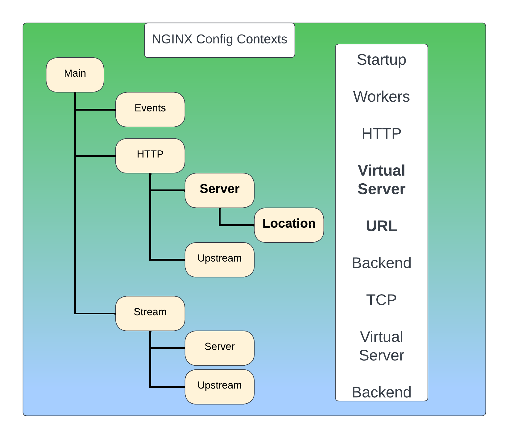
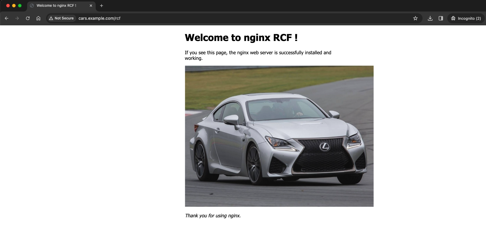
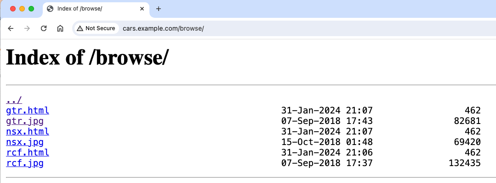

# Build Test Lab with NGINX Plus

## Introduction

<br/>

In this lab, you will run NGINX as a web server, basic web and content serving concepts will be covered.  A quick review of HTTP and URLs is presented, as your NGINX configurations will follow these HTTP principles.

<br/>

## Learning Objectives

<br/>

By the end of the lab you will be able to:

- Describe NGINX server operations
- Review HTTP Requests and URLs
- Create NGINX configurations for basic web content
- Create and edit simple NGINX configs following best practices
- Be familiar with NGINX logging files, formats, variables

<br/>

NGINX Plus | Docker
:-------------------------:|:-------------------------:
  |

<br/>

## Prerequisites

<br/>

- You must have Docker installed and running
- You must have Docker-compose installed
- See `Lab0` for instructions on setting up your system for this Workshop
- Familiarity with basic Linux commands and commandline tools
- Familiarity with basic Docker concepts and commands
- Familiarity with basic HTTP protocol

<br/>

### HTTP URL Review

<br/>

In order to understand how NGINX works as web server, a basic understanding of the HTTP protocol, and how URLS work is neccessary.  This is not a lab on HTTP, but the principle objects and definitions are briefly reviewed here as they relate to NGINX.  You will find a link to more information on HTTP in the [References](#references) section.

So what is a URL??  URL stands for `Uniform Resource Location` - an Internet standard that describes a web object that is globally unique.


Every URL consists of 4 or 5 distinct fields.

Given the URL:   `http://www.example.com/application1?arg=123456`

It is decoded as:

Scheme  | Hostname        | URI           | Argument
:------:|:---------------:|:-------------:|:-----------:
http:// | `www.example.com` | /application1 | ?arg=123456

>If the TCP port used by the webserver is `not 80`, it must be included in the URL request, like this example using port 8080:

Given the URL:  `http://www.example.com:8080/application1?arg=123456`

It is decoded with the extra `port`field:

Scheme  | Hostname        | Port  | URI    | Argument
:------:|:--------:|:--------:|:--------:|:--------:
http:// | `www.example.com` | :8080 | /application1 | ?arg=123456

In the examples above:

- the Scheme is the protocol to use, usually either `HTTP` or `HTTPS`.  It must be followed by a colon, and two forward slashs.
- The Hostname is a fully qualified DNS name, often with a subdomain like `www` in this example.  It must contain the root level Domain name.  It must follow DNS standards based naming conventions.  Using a non-FQDN name is possible, but outside the scope of this lab.
- Modern browsers use port 80 for HTTP requests, and port 443 for HTTPS by default, and this port number does not appear in the URL.  However, if you are not using Port 80 for HTTP, or Port 443 for HTTPS, the Hostname and Port must be separated by a colon `:`.
- The URI, `Uniform Resource Identifier`, is often called the `path`, because it often refers to a matching folder name on the web server's disk system.  It must start with a forward slash `/`, just like a Linux disk folder does.
- The Argument, also commonly known as a `query string` is an optional extension of the URI, and adds additional information the web server might need to understand the request properly.  It must start with a question mark, and each argument has a unique name followed by an equal sign. Multiple arguments are allowed, each separated by the ampersand character `&`.

As you configure NGINX, you will see that it uses these HTTP standards and definitions to determine how to handle incoming requests, where to route them, and how to respond correctly.

Now you can configure the NGINX contexts to handle an HTTP request properly.  Let's overlay the NGINX configuration contexts with the example URL.

Given the URL: `http://www.example.com/application1`

Scheme  | Hostname        | URI
:------:|:--------:|:--------:
http:// | `www.example.com` | /application1

Would require the following NGINX configuration Contexts:

URL Field | Context
:--------:|:---------------:
scheme  | http{}
hostname | server{}
URI | location{}

```nginx
# Note:  the use of indented nested contexts makes it easier to read
#
http {

    server {
        listen 80;
        server_name www.example.com;
        
        location /application1 {
            index index.html;
        }
    }
}

```

<br/>

### Run Nginx Plus

Go ahead and try some of these NGINX commands in your nginx-plus container now, so you are familiar with them.  Open a second Terminal, so you can Watch the docker logs while you try these different commands.  It is recommended that you use 2 Terminals, one for issuing commands, and one for watching logs.

1. >NOTE:  Make sure you ran `docker compose down` from the lab1 folder, before starting Lab2!

1. Ensure you are in the `lab2` folder.  Using the Visual Studio Terminal, run Docker Compose to build and run the above container.

   ```bash
    cd lab2
    docker compose up --force-recreate -d

   ```

   >If you encounter any errors during the Nginx Plus build process, or starting the containers, you must fix them before proceeding.  The most common errors are related to the nginx-repo files missing or expired or invalid.

1. Verify your `nginx-plus:workshop` container is up and running:

    ```bash
    docker ps

    ```

    ```bash
    ###Sample output###
    CONTAINER ID   IMAGE                   COMMAND                  CREATED          STATUS          PORTS                                                                        NAMES
    701272e031e2   nginx-plus:workshop   "nginx -g 'daemon of…"   34 seconds ago   Up 33 seconds   0.0.0.0:80->80/tcp, 0.0.0.0:443->443/tcp, 8080/tcp, 0.0.0.0:9000->9000/tcp, 9113/tcp   nginx-plus

    ```

1. Test curl and browser access to your NGINX Plus container welcome page and Dashboard:

    ```bash
    curl http://localhost

    ```

    You should see the Nginx Welcome page.

    Now also test with Chrome or a browser, go to http://localhost, you should see the same page.

    

    ```bash
    curl -I http://localhost:9000/dashboard.html

    ```

    You should see the Nginx Plus Dashboard page with a 200 OK.

    Now also test with Chrome or a browser, go to http://localhost:9000/dashboard.html, you should see the same page.

    

<br/>

### Introduction to NGINX Commands

<br/>

NGINX runs as several Linux processes, so you must be familiar with the basic commands to control NGINX, and understand what happens when you issue commands to NGINX.  Like most Linux processes, the Host OS is responsible for starting/stopping/enable/disable the initial state of the nginx process when the Linux OS is booted.

Try some Nginx commands:

1. Docker Exec into the nginx-plus container.

    ```bash
    docker exec -it nginx-plus /bin/bash

    ```

    Here is a quick review of the NGINX commands you should be familiar with.  Depending on your Linux system, you may need to prefix these commands with `sudo`.

    ```bash

    nginx -v                  #displays NGINX version details

    nginx -s quit             #graceful shutdown (Note: This will exit the container)

    nginx -s stop             #terminates all NGINX processes (Note: This will exit the container)

    nginx -t                  #test configuration syntax and files

    nginx -T                  #dumps the current running configurations

    nginx -s reload           #reloads NGINX with new configuration

    ```

<br/>

<details>
   <summary><b>Deep Dive: NGINX Reloads</b></summary>

#### NGINX Reloads

<br/>

It is important to understand the details about what NGINX does, when you change the configuration and request an `nginx -s reload`.  At a high level, this is what happens:

- The `nginx -s reload` command sends a SIGHUP signal to the Linux Kernel.
- Example looks like this, from the `nginx error.log`:

  ```bash
   2024/01/31 22:26:13 [notice] 1#1: signal 1 (SIGHUP) received from 155, reconfiguring
  
   2024/01/31 22:26:13 [notice] 1#1: reconfiguring
   ```

- The master process reads all the config files, and validates the syntax, configuration commands, variables, and many other dependencies.  It also validates that any dependent Linux system level objects are correct, like folder/file names and paths, file permissions, networking objects like IP addresses, sockets, etc.  
  
  If there are any errors, it prints out a `Configuration File /etc/nginx/nginx.conf Test Failed` error with the configuration filename and the line number where the error exists, and some helpful information, like `"path /cahce not found" (you have a typo: /cahce should be spelled /cache).`  The validation STOPS on the first error encountered.  So you must address the error, and run `nginx -t` again to further check for errors, until you get two successful test messages, like this:

  ```bash
   nginx: the configuration file /etc/nginx/nginx.conf syntax is ok
   nginx: configuration file /etc/nginx/nginx.conf test is successful
   
   ```

- Once the master process configuration validation is successful, then NGINX will do the following:

    - With NGINX Plus, new Worker processes are created, and begin using the new configuration immediately for all new connections and requests.  The old Workers are allowed to complete their previous task, and then close their TCP connections naturally, traffic in flight is not dropped!  The master process terminates the old Workers after they finish their work and close all their connections.  This is called Dynamic Reconfiguration in NGINX Plus documentation.  You can see this yourself with the Linux `top` command, watching the Nginx Worker processes when you reload Nginx.

    - With NGINX OSS, new Workers are created, and the old Worker processes are immediately shutdown, along with all existing TCP connections.  After the master process spawns new Worker processes, and they begin handling new connections and traffic based on the new configuration.  Any traffic in flight can be dropped!

- The Nginx master process writes log information about the reload to the error.log so you can see what happened when, like shown below:

```bash
#Sample output for "nginx -s reload" command##

...
2024/02/02 00:27:21 [notice] 1#1: signal 1 (SIGHUP) received from 81, reconfiguring
2024/02/02 00:27:21 [notice] 1#1: reconfiguring
2024/02/02 00:27:21 [notice] 1#1: using the "epoll" event method
2024/02/02 00:27:21 [notice] 1#1: start worker processes
2024/02/02 00:27:21 [notice] 1#1: start worker process 82
2024/02/02 00:27:21 [notice] 1#1: start worker process 83
2024/02/02 00:27:21 [notice] 1#1: signal 29 (SIGIO) received
2024/02/02 00:27:21 [notice] 1#1: signal 17 (SIGCHLD) received from 76
2024/02/02 00:27:21 [notice] 1#1: worker process 76 exited with code 0
2024/02/02 00:27:21 [notice] 1#1: signal 29 (SIGIO) received
2024/02/02 00:27:21 [notice] 1#1: signal 17 (SIGCHLD) received from 69
2024/02/02 00:27:21 [notice] 1#1: worker process 69 exited with code 0
...

```

You can easily see the nginx master and worker processes in Linux with `top`, it would look something like this:

```bash
##Sample output for "top -n 1" command##

Mem: 1221044K used, 6916284K free, 1460K shrd, 15872K buff, 505096K cached
CPU:   0% usr   0% sys   0% nic  99% idle   0% io   0% irq   0% sirq
Load average: 0.00 0.00 0.00 1/568 95
  PID  PPID USER     STAT   VSZ %VSZ CPU %CPU COMMAND
    1     0 root     S     8976   0%   6   0% nginx: master process nginx -g daemon off;
   88     1 nginx    S     9440   0%   8   0% nginx: worker process
   89     1 nginx    S     9440   0%  11   0% nginx: worker process
...
   60     0 root     S     3404   0%  10   0% /bin/bash
   34     0 root     S     1676   0%   3   0% /bin/sh
   66    60 root     S     1604   0%  10   0% top

```

By default, nginx Master process will create a Worker process for every CPU core in the system.  If you reload NGINX while watching top, you will see the new Workers created with new PIDs, and old Workers disappear as they are terminated.

Or use can use another Linux command `ps aux|grep nginx` to see the nginx processes:

```bash
##Sample output##

    1 root      0:00 nginx: master process nginx -g daemon off;
   82 nginx     0:00 nginx: worker process
   83 nginx     0:00 nginx: worker process
  100 root      0:00 grep nginx

```

<br/>

</details>

<br/>

<details>
   <summary><b>Deep Dive: NGINX Configuration Overview</b></summary>

#### NGINX Configuration Overview

<br/>

Now that you can see and control NGINX, a review of the configuration details is required. There are many things to understand about how to configure NGINX, you will learn this step by step from top to bottom.

NGINX Configurations are made up from 4 common elements:

- Contexts
- Includes
- Directives
- Blocks

`Contexts` refer to which SECTION of the NGINX configuration you are working with.

`Includes` refer to additional files that NGINX should use for configuration.

`Directives` refer to NGINX configurations consisting of 2 types:

- **Simple directives:**  these are single line commands with some parameters that end in a **semi-colon `;`**

- **Block directives:** these are multiple line commands, with an opening and closing curly brace **`{}`**.   A block directive will contain single line directives, and also can contain other block directives, called nested blocks.

Let's take a look at some examples, by inspecting the default `nginx.conf` that comes installed with NGINX.

Inspect the nginx.conf file, here are some explanations:

```nginx
# This is the "main" NGINX context, where NGINX gets its start up parameters
# Notice main does NOT have curly braces {} !
#

user  nginx;                               #Linux user
worker_processes  auto;                    #Number of Workers, 1 per CPU core

error_log  /var/log/nginx/error.log info;  #set NGINX error log path and name and level
pid        /var/run/nginx.pid;             #set NGINX master process PID file

```

```nginx
# This is the block and context called "events"
# Configures NGINX Workers and other core parameters
#

events {                                   
    worker_connections  1024;              #each Worker should handle 1024 connections
}

```

```nginx
# This is the "http" context, used for all http configurations
#
# Notice both "include" commands, which tells NGINX to use these files
#

http {
    include       /etc/nginx/mime.types;
    default_type  application/octet-stream;

    # Set the access logging format - this is the NGINX default log format
    log_format  main  '$remote_addr - $remote_user [$time_local] "$request" '
                      '$status $body_bytes_sent "$http_referer" '
                      '"$http_user_agent" "$http_x_forwarded_for"';

    # Set the path and name and format for the access log
    access_log  /var/log/nginx/access.log  main;

    sendfile        on;

    keepalive_timeout  65;

    # Use all .conf files located in the in /etc/nginx/conf.d folder
    include /etc/nginx/conf.d/*.conf;  
}

```

```nginx
# This is a "server" and "location" block, used for creating the http virtual server
# And creating the URL paths 
#
# NOTICE:  the location blocks are nested within the server block
#

server {
    listen       80;                  # TCP port to listen on
    server_name  localhost;           # HTTP hostname matching

    access_log  /var/log/nginx/localhost.access.log  main;    # Notice the custom filename

    location / {                         # URL to look for "/", the base
        root   /usr/share/nginx/html;    # folder for content to be served
        index  index.html index.htm;     # default html page to use
    }

    location /images/ {                   # URL path for "/images" 
        root   /data;                     # folder for images
    }
)

```



In general, the contexts and blocks are in a logical hierarchy that follows the construction of an HTTP URL, as follows.

- main and events > nginx start up parameters
- http > high level http parameters - logging, data types, timers, include files
- server > virtual server parameters - listen port, hostname, access log, include files
- location > URL path, object type

`http://www.example.com:8080/images/smile.png`

maps to:

**schema://hostname:port/uri/object.type**

>NOTE:  The lab exercises will focus on the HTTP, Server, and Location contexts and blocks.  The Stream context is for Layer4 TCP/UDP traffic, which is not covered in these labs.

</details>

<br/>

### NGINX on Linux File Structure

<br/>

The hierarchy of these contexts also maps to the folders/files layout on disk. This is how the folders and files are laid out for this lab exercise, following NGINX guidelines and best practices.

```bash

/etc # tree nginx
nginx                             
├── conf.d                        # http contexts
│   ├── cafe.example.com.conf     # server and location contexts for each website
│   ├── cars.example.com.conf
│   ├── default.conf
│   ├── dashboard.conf
│   ├── www.example.com.conf
│   └── www2.example.com.conf
├── includes                      # Include other shared config files
├── fastcgi.conf
├── fastcgi_params
├── mime.types
├── modules -> /usr/lib/nginx/modules
├── nginx.conf                    # main and events contexts
├── scgi_params
└── uwsgi_params

2 directories, 13 files

```

It is considered an NGINX best practice to follow this folder and file layout, so you will learn and use this in the lab exercises.

<br/>

## NGINX as a Webserver Exercises

<br/>

Now that you have a basic understanding of the NGINX binary, contexts, and configuration files, let's configure NGINX as a web server following HTTP standards.  You will configure some websites, URI paths, HTML pages, and create NGINX configs to correctly serve some content based on the Full URL in the HTTP request.

<br/>

### NGINX Host based Routing

<br/>

In this exercise, you will create 2 new HTTP configurations, for 2 different web sites.  You will use `www.example.com` and `www2.example.com` as the two hostnames.

1. First, using vi or a text editor, update your local DNS resolver hosts file, usually `etc/hosts` on MacOS/Linux, to add these FQDN Hostnames used for these lab exercises. `www.example.com www2.example.com`

    ```bash
     sudo vi /etc/hosts

     # NGINX Basics hostnames for labs
     127.0.0.1 localhost www.example.com www2.example.com 
    ```

1. Navigate to the `labs/lab2/nginx-plus/etc/nginx/conf.d` folder.  Remember, this is the default folder for NGINX HTTP configuration files that is volume mounted to the container.

1. Within this folder, create a new file called `www.example.com.conf`, and copy/paste the example provided.

    ```nginx

    server {
        
        listen 80 default_server;      # Listening on port 80 on all IP addresses on this machine

        server_name www.example.com;   # Set hostname to match in request

        access_log  /var/log/nginx/www.example.com.log main; 
        error_log   /var/log/nginx/www.example.com_error.log info; 

        location / {
            
            default_type text/html;    # Set type to avoid browser downloading to file
            return 200 "You have reached www.example.com, location /\n";

        }

    }

    ```

1. Once the content of the file has been saved, Docker Exec into the nginx-plus container.

    ```bash
    docker exec -it nginx-plus /bin/bash
    ```

1. As the `labs/lab2/nginx-plus/etc/nginx/conf.d` folder is volume mounted to the `nginx-plus` container, the new file that you created should appear within the container under `/etc/nginx/conf.d` folder.

1. Test the new config file with `nginx -t`.  If the configuration is valid, it will tell you so.  If you have any errors, it will tell you which file and line number needs to be fixed.

1. Reload NGINX with below command from within the container.  

   ```bash
   nginx -s reload
   ```

1. Test access to your new website, using terminal, curl to 127.0.0.1:

    ```bash
     # Run curl from outside of container
    curl 127.0.0.1
    ```

    You should see something like:

    ```bash
     ##Sample output##
     You have reached www.example.com, location /

    ```

1. Within the same folder (`labs/lab2/nginx-plus/etc/nginx/conf.d`), create a new file called `www2.example.com.conf`, and type in below commands.  Copy/paste using the example provided:

    ```nginx

    server {
        
        listen 80 default_server;        # Listening on port 80 on all IP addresses on this machine

        server_name www2.example.com;   # Set hostname to match in request

        access_log  /var/log/nginx/www2.example.com.log main; 
        error_log   /var/log/nginx/www2.example.com_error.log info; 

        location / {
            
            default_type text/html;      
            return 200 "Congrats, you have reached www2.example.com, the base path /\n";

        }

    }

    ```

1. Save your file, and test your NGINX config by running  `nginx -t` command from within the container.

    **Uh oh - what happened?**  Did you figure out the error?  You can't actually have 2 default servers in NGINX - that makes sense, right ?

1. Go back and edit the line with `listen` parameter in www2.example.com.conf, and remove the `default_server` parameter, save the file again.

1. Now the `nginx -t` should be successful, so go ahead a reload NGINX by running `nginx -s reload` command within the container.

1. Test access to the second website, using curl:

    ```bash
     # Run curl from outside of container
     curl 127.0.0.1
    ```

>BUT WAIT!  Curl is still going to the FIRST website - why ??

You need to include the `Host Header` in your curl request, so NGINX can route the request to the proper Server block with matching `server_name` directive, `www2.example.com`.

Try adding the Host Header:

```bash
    # Run curl from outside of container
    curl 127.0.0.1 -H "Host: www2.example.com"
```

```bash
##Sample output##
Congrats, you have reached www2.example.com, the base path /

```

Now you see that the `Host Based Routing` is working correctly, because you provided the `Host Header` that NGINX needs to select the correct virtual `Server{}` block.  Some important items to understand with Host Headers and Host Based Routing:

- NGINX is using the `same IP Address and TCP port` ( listen 80 ) for *both* of these hostnames.  You can literally run thousands of websites with unique hostnames on just one IP address:port.  NGINX will route the incoming request to the matching Server block as expected.
- The `default_server` parameter is used as a last resort Server block, it is used when none of the hostnames in the request are a match.  This is an optional parameter, you do not have to declare a default_server if it is not needed.
- The `return` directive used in the exercises above is a quick and easy way to test Server and Location blocks in NGINX, it can be used to verify NGINX is routing your requests to the proper block.
- The HTTP Host Header is required for HTTP/1.1 and later protocols, so the `server_name directive` will be a required common element of your NGINX configurations that must be correct!

<br/>

### NGINX Path based Routing

<br/>

Now that you have a basic understand of how NGINX routes requests based on the Host Header matching an HTTP hostname, let's look deeper at the next component of the URL, the `URI path`.

In this exercise, you will continue to learn how NGINX routes requests, by looking at the URI ( the path ) of the URL.  You will create a third website, to show Path based routing.

1. First, using vi or a text editor, update your local DNS resolver hosts file, usually `etc/hosts` on MacOS/Linux, to add these FQDN Hostnames used for these lab exercises. `cafe.example.com`

    ```bash
     sudo vi /etc/hosts

     # NGINX Basics hostnames for labs
     127.0.0.1 localhost www.example.com www2.example.com cafe.example.com

    ```

1. Within the mounted folder (`labs/lab2/nginx-plus/etc/nginx/conf.d`), create a new file called `cafe.example.com.conf`, and type in below commands.  Copy/paste using the example provided:

```nginx

server {
    
    listen 80;      # Listening on port 80 on all IP addresses on this machine

    server_name cafe.example.com;   # Set hostname to match in request

    access_log  /var/log/nginx/cafe.example.com.log main; 
    error_log   /var/log/nginx/cafe.example.com_error.log info; 

    location / {
        
        default_type text/html;
        return 200 "Congrats, you have reached cafe.example.com, path $uri\n";
    }
    
    location /coffee {
        
        default_type text/html;
        return 200 "Caffiene relief from cafe.example.com, path $uri\n";
    }
    
    location /tea {
        
        default_type text/html;
        return 200 "Green Tea from cafe.example.com, path $uri\n";
    }
    
    location /hours {
        
        default_type text/html;
        return 200 "We are open:\nSun 6am-3pm\nMon Closed\nTue 6am-3pm\nWed 6am-3pm\nThurs 6am-3pm\nFri 6am-3pm\nSat 6am-3pm\nSun 6am-3pm\nat cafe.example.com, path $uri\n";
    }
    
    location /hours/closed {
        
        default_type text/html;
        return 200 "Sorry - We are Closed on Tuesdays\nat cafe.example.com, path $uri\n";
    }

}

```

1. Save your file, and test your NGINX config by running `nginx -t` command from within the container.  If the configuration is valid, it will tell you so.  If you have any errors, it will tell you which file and line number needs to be fixed.

1. Reload NGINX with below command from within the container.

   ```bash
   nginx -s reload
   ```

1. Test your new /paths with curl, do you need the Host Header?:

    ```bash
    curl cafe.example.com
    ```

    ```bash
    curl cafe.example.com/coffee
    ```

    ```bash
    curl cafe.example.com/tea
    ```

    ```bash
    curl cafe.example.com/hours
    ```

    ```bash
    curl cafe.example.com/hours/closed
    ```

    ```bash
     ##Sample outputs##
     Congrats, you have reached cafe.example.com, path /

     Caffeine relief from cafe.example.com, path /coffee

     Green Tea from cafe.example.com, path /tea

     We are open:
     Sun 6am-3pm
     Mon Closed
     Tue 6am-3pm
     Wed 6am-3pm
     Thurs 6am-3pm
     Fri 6am-3pm
     Sat 6am-3pm
     Sun 6am-3pm
     at cafe.example.com, path /hours
 
     Sorry - We are Closed on Tuesdays
     at cafe.example.com, path /hours/closed

    ```

    > **NOTE:**  Look closely at the `return directive` in your config - you added an NGINX variable, `$uri`, to echo back what the request URI path that was received.  There are many more NGINX variables that can be used like this.  Let's use more of these `NGINX $variables` to build a simple `debug` page, that will echo back some of the important information you might need when working/testing NGINX:

<br/>


### NGINX Logging

<br/>

In this exercise, you will learn about NGINX logging.  There are only 2 logs that you need to worry about.  The NGINX error.log, and the access.logs.

1. The NGINX `error.log`, despite its name, it also used to record other important information at NGINX boot and runtime:

    - NGINX binary start/stop/reload messages
    - NGINX version and binary file details
    - Networking errors
    - Configuration errors
    - Linux System Errors

    For example, here is what the nginx error.log shows when NGINX is started:

    ```bash
    ##Sample output##
    2024/02/02 00:11:28 [notice] 1#1: using the "epoll" event method
    2024/02/02 00:11:28 [notice] 1#1: nginx/1.25.4
    2024/02/02 00:11:28 [notice] 1#1: built by gcc 12.2.1 20220924 (Alpine 12.2.1_git20220924-r10)
    2024/02/02 00:11:28 [notice] 1#1: OS: Linux 6.4.16-linuxkit
    2024/02/02 00:11:28 [notice] 1#1: getrlimit(RLIMIT_NOFILE): 1048576:1048576
    2024/02/02 00:11:28 [notice] 1#1: start worker processes
    2024/02/02 00:11:28 [notice] 1#1: start worker process 22
    2024/02/02 00:11:28 [notice] 1#1: start worker process 23

    ```

    You see that it contains useful information about the version, build, platform, Linux OS, and even some Linux parameters like `RLIMIT_NOFILE`.

1. The NGINX `access.log`, is where the HTTP request/response metadata is recorded.  It is a Best Practice to have a separate unique access log file for each website/server block, and sometimes you might even want an access.log for a uri/location block.  You will configure these in the following exercises, using many of the hundreds of available NGINX $variables.  The access logging is very flexible, allowing you to configure a `log format` that meets your needs.

    For reference, this is the default NGINX logging format, called `main` or combined, which is always found in `/etc/nginx/nginx.conf` in the http context, is enabled by default, and can be found at `/var/log/nginx/access.log`:  

    ```nginx

        log_format  main  '$remote_addr - $remote_user [$time_local] "$request" '
                        '$status $body_bytes_sent "$http_referer" '
                        '"$http_user_agent" "$http_x_forwarded_for"';
        
        access_log  /var/log/nginx/access.log  main;   # default name and location

    ```

    As a Best Practice, you should not modify this `main` log format, but rather copy this one and create a new one with your changes.  The `include` directive is also introduced here, because it makes your NGINX configurations more concise, uniform, and consistent.  As you will likely want to use the same access log format for multiple websites, you will define it ONCE, but use it for every server block, instead of duplicating the log format config for every website.  If you need to make a change to your log format, you can update it in one file, but it would apply to all your websites/server blocks.

1. Inspect `main_ext.conf`file that can be found within `labs/lab2/nginx-plus/etc/nginx/includes/log_formats` folder:

    ```nginx
    # Extended Metrics Log Format
    log_format  main_ext    'remote_addr="$remote_addr", '
                            '[time_local=$time_local], '
                            'request="$request", '
                            'status="$status", '
                            'http_referer="$http_referer", '
                            'body_bytes_sent="$body_bytes_sent", '
                            'Host="$host", '
                            'sn="$server_name", '
                            'request_time=$request_time, '
                            'http_user_agent="$http_user_agent", '
                            'http_x_forwarded_for="$http_x_forwarded_for", '
                            'request_length="$request_length", ';

    ```

1. Notice we have added a few new fields using $variables, like the $server_name, $request_time, etc.  You can modify this as you like to suit your needs.

1. Similar to `/etc/nginx/conf.d` folder we have volume mounted `etc/nginx/includes` folder. So any changes that you make within this folder locally will sync up within the running `nginx-plus` container.

1. Now you need to tell NGINX where to find these new log format definitions. Edit your `nginx.conf`, uncomment line #24 to add your `/includes/log_formats` folder as a search location:

    ```nginx
    http {
        include       /etc/nginx/mime.types;
        default_type  application/octet-stream;

        log_format  main  '$remote_addr - $remote_user [$time_local] "$request" '
                        '$status $body_bytes_sent "$http_referer" '
                        '"$http_user_agent" "$http_x_forwarded_for"';

        access_log  /var/log/nginx/access.log  main;

        include /etc/nginx/includes/log_formats/*.conf; # Custom Access logs formats found here

        sendfile        on;
        #tcp_nopush     on;

        keepalive_timeout  65;

        #gzip  on;

        include /etc/nginx/conf.d/*.conf;
    }

    ```

1. Save your `nginx.conf` file, and test your NGINX config by running `nginx -t` command from within the container.

1. Next, enable your `cafe.example.com` website to use this new log format. To do so you need to modify `cafe.example.com.conf` file to make use of the new log format by updating the log format from `main` to `main_ext`:

    ```nginx

    server {
        
        listen 80;      # Listening on port 80 on all IP addresses on this machine

        server_name cafe.example.com;   # Set hostname to match in request

        access_log  /var/log/nginx/cafe.example.com.log main_ext;  # Change log format to main_ext

        error_log   /var/log/nginx/cafe.example.com_error.log info;
        ...
    }

    ```

1. Save your file, and test your NGINX config by running `nginx -t` command from within the container.

1. Reload NGINX with `nginx -s reload` command.  If all was correct, it will reload and now your cars.example.com website will be using a new access log.  Let's go check.

1. `cafe.example.com` access logs are written within a custom file(`/var/log/nginx/cafe.example.com.log`) which is also passed as one of the parameters to the `access_log` directive. Within the `nginx-plus`container, tail this log file, and watch as you send a couple requests.

    ```bash
    docker exec -it nginx-plus /bin/bash

    tail -f /var/log/nginx/cafe.example.com.log
    ```

    Use curl or your browser to `http://cafe.example.com/coffee`.  The access log should look similar to this:

    ```bash
    ## Sample output
    remote_addr="192.168.65.1", [time_local=11/Nov/2024:22:57:16 +0000], request="GET /coffee HTTP/1.1", status="200", http_referer="-", body_bytes_sent="52", Host="cafe.example.com", sn="cafe.example.com", request_time=0.000, http_user_agent="Mozilla/5.0 (Macintosh; Intel Mac OS X 10_15_7) AppleWebKit/537.36 (KHTML, like Gecko) Chrome/128.0.0.0 Safari/537.36", http_x_forwarded_for="-", request_length="604",

    ```

    You see the GET request for the coffee page, with metadata from the Nginx $variables.

<br/>

>If you are finished with this lab, you can use Docker Compose to shut down your test environment. Make sure you are in the `lab2` folder:

```bash
cd lab2
docker compose down
```

```bash
##Sample output##
Running 2/2
Container nginx-plus          Removed                            
Network lab2_default         Removed

```

<br/>

<details>
   <summary><b>Optional Lab Exercise 1 - Create an Nginx DEBUG page</b></summary>

#### Optional Lab Exercise 1 - Create an Nginx DEBUG page

1. Update the file `cafe.example.com.conf` to add a new `location` block called `/debug`, open the file and type in below commands.  You don't need to type the comments.  Don't just copy/paste these lines, type them by hand so you learn.

    ```nginx

        location /debug {      # Used for testing, returns IP, HTTP, NGINX info 
            
            return 200 "NGINX Debug/Testing URL from cafe.example.com\n\nIP Parameters: ClientIP=$remote_addr, NginxIP=$server_addr, UpstreamIP=$upstream_addr, Connection=$connection\n\nHTTP Parameters: Scheme=$scheme, Host=$host, URI=$request, Args=$args, Method=$request_method, UserAgent=$http_user_agent, RequestID=$request_id\n\nSystem Parameters: Time=$time_local, NGINX version=$nginx_version, NGINX PID=$pid\n\n";
        }
        
    ```

1. Save your file, and test your NGINX config by running `nginx -t` command from within the container.  If the configuration is valid, it will tell you so.  If you have any errors, it will tell you which file and line number needs to be fixed.

1. Reload NGINX with `nginx -s reload` command.

1. Test your new /debug path with curl, did you remember your Host Header?

    ```bash
    curl 127.0.0.1/debug -H "Host: cafe.example.com"
    ```

    You should see a response from the `/debug location block`, with the NGINX `$variables` filled in with data for each request to <http://cafe.example.com/debug> :

    ```bash
    #Sample output
    NGINX Debug/Testing URL from cafe.example.com

    IP Parameters: ClientIP=172.18.0.2, NginxIP=172.18.0.2, UpstreamIP=, Connection=8

    HTTP Parameters: Scheme=http, Host=cafe.example.com, URI=GET /debug HTTP/1.1, Args=, Method=GET, UserAgent=curl/8.5.0, RequestID=7a29149e6a687bb52c6901dfc19079f8

    System Parameters: Time=31/Jan/2024:18:53:11 +0000, NGINX version=1.25.3, NGINX PID=89

    ```

If you like this debug page, feel free to explore and ADD additional Request and Response variables, to make the page display the data that is interesting to you.

</details>

<br/>

<details>
   <summary><b>Optional Lab Exercise 2 - NGINX Static HTML pages</b></summary>

#### Optional Lab Exercise 2 - NGINX Static HTML pages

<br/>

Let try some HTML files and images.  You will create another new website, `cars.example.com`, that will have 3 new HTML files and some images of the cars, which will represent 3 high performance autos: the `Lexus RCF, Nissan GTR, and Acura NSX`.  Each car will have it's own URL and location block, and matching .html and .jpg files on disk.

The default directory for serving HTML content with NGINX is `/usr/share/nginx/html`, so you will use that as the root of your new website.

1. First, using vi or a text editor, update your local DNS resolver hosts file, usually `etc/hosts` on MacOS/Linux, to add these FQDN Hostnames used for these lab exercises. `cars.example.com`

    ```bash
     sudo vi /etc/hosts

     # NGINX Basics hostnames for labs
     127.0.0.1 localhost www.example.com www2.example.com cafe.example.com cars.example.com

    ```

1. Within the mounted folder (`labs/lab2/nginx-plus/etc/nginx/conf.d`),  create a new file called `cars.example.com.conf`, and type in below commands.  You don't need to type the comments.  Don't just copy/paste these lines, type them by hand so you learn.

    ```nginx

    server {
        
        listen 80;      # Listening on port 80 on all IP addresses on this machine

        server_name cars.example.com;   # Set hostname to match in request

        access_log  /var/log/nginx/cars.example.com.log main; 
        error_log   /var/log/nginx/cars.example.com_error.log info;

        root /usr/share/nginx/html;      # Set the root folder for the HTML and JPG files

        location / {           
            default_type text/html;
            return 200 "Let's go fast, you have reached cars.example.com, path $uri\n";
        }

        location /gtr {
            try_files $uri $uri.html;     # Look for a filename that matches the URI requested
        }
        
        location /nsx {
            try_files $uri $uri.html;
        }
        
        location /rcf {
            try_files $uri $uri.html;
        }

    } 

    ```

1. Save your file, and test your NGINX config by running `nginx -t` command from within the container.  If the configuration is valid, it will tell you so.  If you have any errors, it will tell you which file and line number needs to be fixed.

1. Reload NGINX with `nginx -s reload` command.

1. Test all three URLs, one for each car with curl. Because you have updated local `/etc/hosts` file you can now use your FQDN with curl:

    ```bash
    curl cars.example.com/gtr
    curl cars.example.com/nsx
    curl cars.example.com/rcf
    ```

    ```bash
    ##Sample output##
    <!DOCTYPE html>
    <html>
    <head>
    <title>Welcome to nginx GTR !</title>
    <style>
        body {
            width: 35em;
            margin: 0 auto;
            font-family: Tahoma, Verdana, Arial, sans-serif;
        }
    </style>
    </head>
    <body>
    <h1>Welcome to nginx GTR !</h1>
    <p>If you see this page, the nginx web server is successfully installed and
    working.</p>

    </img>

    <p><em>Thank you for using nginx.</em></p>
    </body>
    </html>

    ```

    Try all three in a browser, like <http://cars.example.com/gtr>, <http://cars.example.com/nsx>, <http://cars.example.com/rcf> :

    

    You will notice, this page has just a few simple modification to NGINX's default Welcome page.  Feel free to try adding some of your favorite images, and create a new hostname, and location blocks to serve up your new content ... now that you have a couple examples to work with - it's easy with NGINX!

</details>

<br/>

<details>
   <summary><b>Optional Lab Exercise 3 - NGINX Directory Browsing</b></summary>

#### Optional Lab Exercise 3 - NGINX Directory Browsing

<br/>

Now that you have some hot cars in your garage to show off, you might want to let users browse images without knowing all the names or links.  Or, you might want to know what files are in different folders on your webserver, either for yourself or for your visitors, so a File Manager type of user interface would be nice.  NGINX can provide this for you with a module called `http_auto_index`, that can provide this feature.  You will now create a new `location` block called `/browse` that will perform `Directory Browsing` using this feature module:

1. Update the `cars.example.com.conf` file, and add this new Location Block, change the URL path if you like:

    ```nginx

        location /browse {                   # new URL path
        
            alias /usr/share/nginx/html;     # Browse this folder
            index index.html;                # Use this file, but if it does *not* exist
            autoindex on;                    # Perform directory/file browsing
        }

    ```

1. Because the `index.html` file *does* exist, you need to rename it to allow Nginx to autoindex the folder.  Go the `/nginx-plus/usr/share/nginx/html` folder, and rename the index.html file to `index.html.bak`.

1. Save your file, and test your NGINX config by running `nginx -t` command from within the container.

1. Reload NGINX with `nginx -s reload` command.

1. To see this in action, open your browser to <http://cars.example.com/browse/> , you should see something similar to this.  If you click on one of the .jpg files, you will see the image; or the webpage if you click on the .html files.  This is a handy feature for presenting images, downloading files from directories, PDFs for documents, etc.

    

</details>

<br/>

<details>
   <summary><b>Optional Lab Exercise 4 - Pull the Nginx Plus container from the Nginx Registry</b></summary>

#### Optional Lab Exercise 4 - Pull the Nginx Plus container from the Nginx Registry

In the next exercise, you will pull the Nginx provided Plus container from the official Nginx Container Private Registry, using only your JWT Token file.  This is a safe, fast, and convenient way to download and run Nginx Plus, without needing to build your own Docker image.  There are several different containers available, see the References section.

1. Make sure your `JWT` environment variable is still set, if not, then set using below command:

    ```bash
    cd labs
    export JWT=$(cat nginx-repo.jwt)
    ```

    Verify the $JWT is populated:

    ```bash
    echo $JWT
    ```

    ```bash
    ## Sample output
    eyJhbGciOiJSUzI1NiIsInR5cCI6IkpXVCI
    ...snip
    d41BhtS4fGLzD985rk

    ```

1. Login into the Nginx Private Registry, as shown:

    ```bash
    docker login private-registry.nginx.com --username=$JWT --password=none
    ```

1. Pull the Nginx Plus image, as shown:

    ```bash
    docker pull private-registry.nginx.com/nginx-plus/base:nginx-plus-r32-debian-bookworm
    ```

1. Verify the image was pulled, as shown:

    ```bash
    docker image list
    ```

    ```bash
    ## Sample output
    REPOSITORY                                               TAG                 IMAGE ID       CREATED             SIZE
    private-registry.nginx.com/nginx-plus/nginx-plus/base nginx-plus-r32-debian-bookworm  a947bb41179b   18 hours ago       239MB

    ```

Now you can tag it and push it to a private Registry if needed.

</details>

<br/>

**This completes Lab2.**

<br/>

## References

- [NGINX Beginner's Guide](https://nginx.org/en/docs/beginners_guide.html)
- [NGINX Plus](https://docs.nginx.com/nginx/)
- [NGINX Admin Guide](https://docs.nginx.com/nginx/admin-guide/)
- [Controlling NGINX](https://docs.nginx.com/nginx/admin-guide/basic-functionality/runtime-control/)
- [NGINX Config Files](https://docs.nginx.com/nginx/admin-guide/basic-functionality/managing-configuration-files/)
- [NIGNX Directives](https://nginx.org/en/docs/dirindex.html)
- [NGINX Variables](https://nginx.org/en/docs/varindex.html)
- [NGINX Logging](https://docs.nginx.com/nginx/admin-guide/monitoring/logging/)
- [HTTP URL Overview](https://en.wikipedia.org/wiki/URL)
- [Run NGINX off a Floppy disk](https://www.youtube.com/watch?v=IjjiTD-1Cvg)

<br/>

### Authors

- Chris Akker - Solutions Architect - Modern Apps Team @ F5, Inc.
- Shouvik Dutta - Solutions Architect - Modern Apps Team @ F5, Inc.
- Adam Currier - Solutions Architect - Modern Apps Team @ F5, Inc.

-------------

Navigate to ([Lab3](../lab3/readme.md) | [Main Menu](../readme.md))
