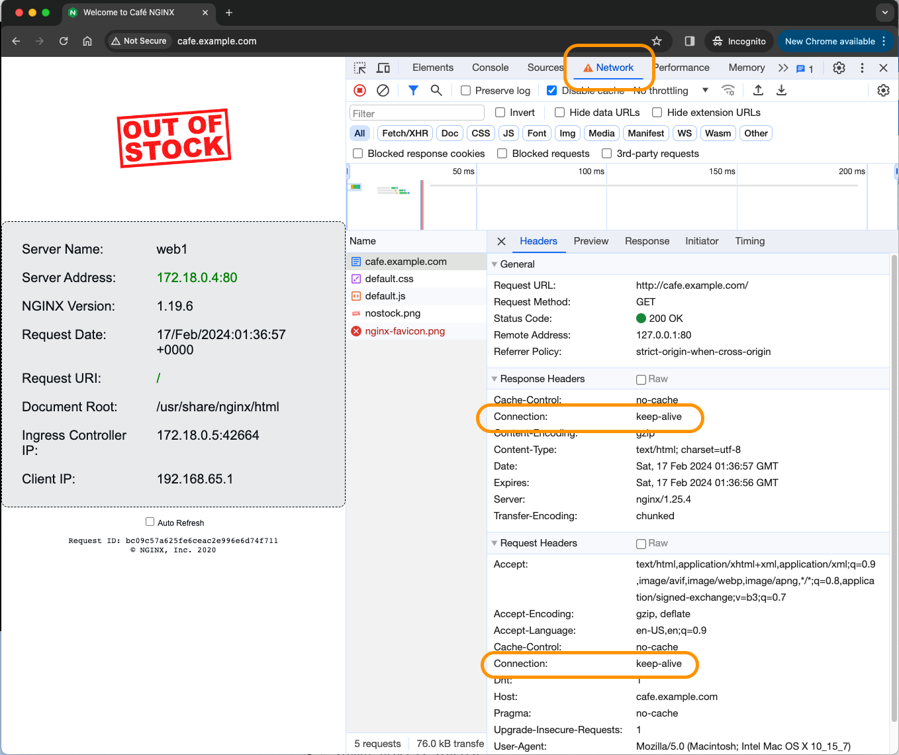

# NGINX Reverse Proxy and HTTP Load Balancing

## Introduction

In this lab, you will build a test lab environment using NGINX Plus and Docker.  This will require that you build and run NGINX Plus as a `Reverse Proxy and Load Balancer` in a Docker container.  Then you will run three NGINX demo web servers, to be used as your `backend` web servers.  After all the containers are running, you will test and verify each container, the NGINX Proxy and the web servers.  All of these NGINX containers will be used as a learning platform to complete the remaining Lab Exercises.  It is important to build and run these NGINX containers correctly to complete the exercises and receive the most benefit from the Workshop.

NGINX Plus | Docker
:-------------------------:|:-------------------------:
  |
  
## Learning Objectives

By the end of the lab you will be able to:

- Compose and run an `NGINX Plus Docker` image
- Build your Workshop enviroment with Docker Compose
- Verify Container build with NGINX tests
- Configure NGINX for Load Balancing
- Configure NGINX Extended Access Logging
- Configure and test Nginx Active Health Checks
- Explore Nginx load balancing algorithms
- Configure and test Persistence
- Add NGINX features following Best Practices

## Pre-Requisites

- Nginx-Plus container from Lab1
- You must have Docker installed and running
- You must have Docker-compose installed
- See `Lab0` for instructions on setting up your system for this Workshop
- Familiarity with basic Linux commands and commandline tools
- Familiarity with basic Docker concepts and commands
- Familiarity with basic HTTP protocol

## Build the Workshop Environment with Docker Compose

For this lab you will run 4 Docker containers.  The first one will be used as an NGINX-Plus reverse proxy, and other 3 will be used for upstream backend web servers.


<br/>

### Configure the NGINX-Plus Docker build parameters

<br/>

1. NOTE:  This lab exercise uses the `nginx-plus` container that you built in Lab1.

1. Inspect the `docker-compose.yml` file, located in the `labs/lab4` folder.  Notice you are running the NGINX-Plus web and Proxy container, from Lab1.  

    ```bash
    ...

    services:
    nginx-plus:                     # NGINX Plus Web / Load Balancer
        hostname: nginx-plus
        container_name: nginx-plus
        image: nginx-plus:workshop  # From Lab1
        volumes:                    # Sync these folders to container
            - ./nginx-plus/etc/nginx/nginx.conf:/etc/nginx/nginx.conf
            - ./nginx-plus/etc/nginx/conf.d:/etc/nginx/conf.d
            - ./nginx-plus/etc/nginx/includes:/etc/nginx/includes
            - ./nginx-plus/usr/share/nginx/html:/usr/share/nginx/html
        links:
            - web1:web1
            - web2:web2
            - web3:web3
        ports:
            - 80:80       # Open for HTTP
            - 443:443     # Open for HTTPS
            - 9000:9000   # Open for API / dashboard page
        restart: always

    ```

    Also notice in the `docker-compose.yml` you are running three Docker NGINX webserver containers, using an image from Docker Hub.  These will be your upstreams, backend webservers for the exercises.

    ```bash
    ...
    web1:
        hostname: web1
        image: nginxinc/ingress-demo       # Image from Docker Hub
        ports:
            - "80"                           # Open for HTTP
            - "443"                          # Open for HTTPS
    web2:
        hostname: web2
        image: nginxinc/ingress-demo
        ports:
            - "80"
            - "433"
    web3:
        hostname: web3
        image: nginxinc/ingress-demo
        ports:
            - "80"
            - "443"   

    ```

1. Ensure you are in the `lab4` folder.  Using a Terminal, run Docker Compose to build and run your containers:

   ```bash
    cd lab4
    docker compose up --force-recreate -d

   ```

1. Verify all four containers are running:

    ```bash
    docker ps -a

    ```

    ```bash
    ##Sample output##
    CONTAINER ID   IMAGE                   COMMAND                  CREATED       STATUS       PORTS                                                              NAMES
    ab101e69c186   nginx-plus:workshop     "nginx -g 'daemon of…"   5 seconds ago   Up 4 seconds   0.0.0.0:80->80/tcp, 0.0.0.0:443->443/tcp, 8080/tcp, 0.0.0.0:9000->9000/tcp, 9113/tcp   nginx-plus
    d671b5befb6c   nginxinc/ingress-demo   "/docker-entrypoint.…"   5 seconds ago   Up 5 seconds   0.0.0.0:52783->80/tcp, 0.0.0.0:52782->443/tcp                                          web1
    ec14194174bd   nginxinc/ingress-demo   "/docker-entrypoint.…"   5 seconds ago   Up 5 seconds   443/tcp, 0.0.0.0:52781->80/tcp, 0.0.0.0:52780->433/tcp                                 web2
    08898f34ad49   nginxinc/ingress-demo   "/docker-entrypoint.…"   5 seconds ago   Up 5 seconds   0.0.0.0:52785->80/tcp, 0.0.0.0:52784->443/tcp                                          web3

    ```

1. Verify `all` of your three web backend servers are working.  Using a Terminal, Docker exec into each one, and verify you get a response to a curl request.  The `Name` should be `web1`, `web2`, and `web3` respectively for each container.

    ```bash
    docker exec -it web1 bin/sh   # log into web1 container, then web2, then web3

    ```

    ```bash
    curl -s http://localhost |grep Name

    ```

    ```bash
    ##Sample outputs##

    <p class="smaller"><span>Server Name:</span> <span>web1</span></p>   # web1

    <p class="smaller"><span>Server Name:</span> <span>web2</span></p>   # web2

    <p class="smaller"><span>Server Name:</span> <span>web3</span></p>   # web3

    ```

    Check all three, just to be sure.  Quit the Docker Exec when you are finished by typing in `exit` within the container terminal.

1. Test the NGINX Plus container, verify it also sends back a response to a curl request:

    ```bash
    docker exec -it nginx-plus bin/bash   # log into nginx-plus container

    ```

    ```bash
    curl http://localhost

    ```

    ```bash
    ##Sample outputs##
   <!DOCTYPE html>
    <html>
    <head>
    <title>Welcome to nginx!</title>
    
    ...snip

    <p><em>Thank you for using nginx.</em></p>
    </body>
    </html>

    ```

    Congrats - you should see the `Welcome to nginx!` page. Quit the Docker Exec when you are finished by typing in `exit` within the container terminal.

<br/>

### NGINX Plus Dashboard Page

<br/>

1. Test your Nginx Plus Dashboard with Chrome, is it working on http://localhost:9000/dashboard.html ?

    If all these are working as expected, you are safe to proceed with the following lab exercises.  If not, address any issues before you continue.  Remember, the Nginx Plus Dashboard configuration is in the /etc/nginx/conf.d folder, `dashboard.conf` file.  The actual dashboard.html is in the `user/share/nginx/html` folder.

    

<br/>

### NGINX Reverse Proxy

<br/>

Now that you know all 4 containers are working with the NGINX Welcome page, and the Plus Dashboard page, you can build and test the **NGINX Plus Proxy and Load Balancing** functions.  You will use a new NGINX `proxy_pass` Directive. You will first start with a Reverse Proxy configuration, test it out then add the Upstream backends and test out Load Balancing.

Using your previous lab exercise experience, you will configure a new NGINX configuration for the `cafe.example.com` website.  It will be very similar to `cars.example.com.conf` from lab3.  

This will require a new NGINX config file, for the Server and Location Blocks. Follow below steps to create the new config files:

Using Visual Studio, navigate to the `labs/lab4/nginx-plus/etc/nginx/conf.d` folder. Remember, this is the default folder for NGINX HTTP configuration files that is volume mounted to the container.

1. Within this folder, create a new file called `cafe.example.com.conf`, which will be the config file for the Server and Location blocks for this new website.  

    However, instead of a Location block that points to a folder with html content on disk, you will tell NGINX to `proxy_pass` the request to one of your three web containers instead.  

    >This will show you how to unlock the amazing power of NGINX...
    >>it can serve it's own WEB content,
    >>> or **content from another web server!**

1. Copy/paste the example provided here, in your `cafe.example.com.conf` file.  

    ```nginx
    # cafe.example.com HTTP
    # NGINX Basics Workshop
    # Nov 2024, Chris Akker, Shouvik Dutta, Adam Currier
    #
    server {
        
        listen 80;      # Listening on port 80 on all IP addresses on this machine

        server_name cafe.example.com;   # Set hostname to match in request

        access_log  /var/log/nginx/cafe.example.com.log main; 
        error_log   /var/log/nginx/cafe.example.com_error.log info;

        location / {
            
            # New NGINX Directive, "proxy_pass", tells NGINX to proxy traffic to another server.
            
            proxy_pass http://web1;        # Send requests to web1
        }

    } 
    
    ```

1. Once the content of the file has been saved, Docker Exec into the nginx-plus container.

   ```bash
    docker exec -it nginx-plus bin/bash

    ```

1. As the `labs/lab4/nginx-plus/etc/nginx/conf.d` folder is volume mounted to the `nginx-plus` container, the new file that you created should appear within the container under `/etc/nginx/conf.d` folder, verify this.

1. Test and reload your NGINX config by running `nginx -t` and `nginx -s reload` commands respectively from within the container.

1. Test if your Proxy_pass configuration is working, using curl several times, and your browser.

    ```bash
    # Run curl from outside of container
    curl -s http://cafe.example.com |grep Server

    ```

    ```bash
     ##Sample outputs##
      
     #Test 1
      Server: nginx/1.25.4
      <p class="smaller"><span>Server Name:</span> <span>web1</span></p>   # web1
      <p class="smaller"><span>Server Address:</span> <span><font color="green">172.28.0.4:80</font></span></p>
      
     #Test 2
      Server: nginx/1.25.4
      <p class="smaller"><span>Server Name:</span> <span>web1</span></p>   # web1
      <p class="smaller"><span>Server Address:</span> <span><font color="green">172.28.0.4:80</font></span></p>

     #Test 3
      Server: nginx/1.25.4
      <p class="smaller"><span>Server Name:</span> <span>web1</span></p>   # web1
      <p class="smaller"><span>Server Address:</span> <span><font color="green">172.28.0.4:80</font></span></p>

    ```

    Likewise, your browser refreshes should show you the "Out of stock" graphic and webpage for web1.  
    
    
    
    If you like, change the `proxy_pass` to `web2` or `web3`, and see what happens.

    >This is called a `Direct proxy_pass`, where you are telling NGINX to Proxy the request to another server.  You can also use a FQDN name, or an IP:port with proxy_pass.  In this lab environment, Docker DNS is providing the IP for web1.

1. You can even use proxy_pass in front of a public website.  Try that, with `nginx.org`. What do you think, can you use a Docker container on your desktop to deliver someone else's website?  No, that `can't` be that easy, can it ?

1. Update the file `cafe.example.com.conf` within the same mounted folder(`labs/lab4/nginx-plus/etc/nginx/conf.d`) and change the `proxy_pass` directive as shown in below config snippet:

    ```nginx
    # cafe.example.com HTTP
    # NGINX Basics Workshop
    # Nov 2024, Chris Akker, Shouvik Dutta, Adam Currier
    #
    server {
        
        listen 80;      # Listening on port 80 on all IP addresses on this machine

        server_name cafe.example.com;   # Set hostname to match in request

        access_log  /var/log/nginx/cafe.example.com.log main; 
        error_log   /var/log/nginx/cafe.example.com_error.log info;

        location / {
            
            # New NGINX Directive, "proxy_pass", tells NGINX to proxy traffic to another website.
            
            proxy_pass http://nginx.org;    # Send all requests to nginx.org website 
        }
    } 
    
    ```

1. Once the content of the file has been updated and saved, Docker Exec into the nginx-plus container.

   ```bash
    docker exec -it nginx-plus bin/bash

    ```

1. Test and reload your NGINX config by running `nginx -t` and `nginx -s reload` commands respectively from within the container.

1. Try it with Chrome, <http://cafe.example.com>.  Yes, that works alright, NGINX sends your cafe.example.com request to `nginx.org`.  No WAY, that's cool.

    

<br/>

### NGINX Load Balancing

<br/>

You see the `proxy_pass` working for one backend webserver, but what about the other 2 backends?  Do you need high availability, and increased capacity for your website? Of course, you want to use multiple backends for this, and load balance them.  This is very easy, as it requires only 2 configuration changes:

- Create a new .conf file for the Upstream Block
- Modify the proxy_pass to use the name of this upstream block

You will now configure the `NGINX Upstream Block`, which is a `list of backend servers` that can be used by NGINX Proxy for load balancing requests.

1. Within the mounted folder (`labs/lab4/nginx-plus/etc/nginx/conf.d`), create a new file called `upstreams.conf`, which will be the config file for the Upstream Block with three backends - web1, web2, and web3. Type in the below commands within the new file.

    ```nginx
    # NGINX Basics, Plus Proxy to three upstream NGINX containers
    # Nov 2024 - Chris Akker, Shouvik Dutta, Adam Currier
    #
    # nginx_cafe servers

    upstream nginx_cafe {         # Upstream block, the name is "nginx_cafe"

        # Load Balancing Algorithms supported by NGINX
        # - Round Robin (Default if nothing specified)
        # - Least Connections
        # - IP Hash
        # - Hash (Any generic Hash)     

        # Uncomment for Least Connections algorithm      
        # least_conn;

        # From Docker-Compose:
        server web1:80;
        server web2:80;
        server web3:80;

        #Uncomment for IP Hash persistence
        # ip_hash;

        # Uncomment for keepalive TCP connections to upstreams
        # keepalive 16;

    }

    ```

1. Save the `upstreams.conf` file with above content.

1. Modify the `proxy_pass` directive in `cafe.example.com.conf`, to proxy the requests to the `upstream` block called `nginx_cafe`.  And it goes without saying, you can have literally hundreds of upstream blocks for various backend apps, but each upstream block name must be unique.  (And you can have hundreds of backends, if you need that much capacity for your website).

    ```nginx
    # cafe.example.com HTTP
    # NGINX Basics Workshop
    # Nov 2024, Chris Akker, Shouvik Dutta, Adam Currier
    #
    server {
        
        listen 80;      # Listening on port 80 on all IP addresses on this machine

        server_name cafe.example.com;   # Set hostname to match in request

        access_log  /var/log/nginx/cafe.example.com.log main; 
        error_log   /var/log/nginx/cafe.example.com_error.log info;

        root /usr/share/nginx/html;         # Set the root folder for the HTML and JPG files

        location / {
            
            # Change the "proxy_pass" directive, tell NGINX to proxy traffic to the upstream block.  
            # If there is more than one server, they will be load balanced
            
            proxy_pass http://nginx_cafe;        # Must match the upstream block name
        }

    } 
    
    ```

1. Once the content of the file has been updated and saved, Docker Exec into the nginx-plus container.

   ```bash
    docker exec -it nginx-plus bin/bash

    ```

1. Test and reload your NGINX config by running `nginx -t` and `nginx -s reload` commands respectively from within the container.

1. Verify that, with updated configs, `cafe.example.com` is load balancing to `all three containers`, run the curl command at least 3 times:

    ```bash
    # Run curl from outside of container
    curl -is http://cafe.example.com |grep Server     # run at least 3 times

    ```

    ```bash
     ##Sample output##

     # Run1
      Server: nginx/1.25.4
      <p class="smaller"><span>Server Name:</span> <span>web1</span></p>   # web1
      <p class="smaller"><span>Server Address:</span> <span><font color="green">172.28.0.4:80</font></span></p>

     # Run2
      Server: nginx/1.25.4
      <p class="smaller"><span>Server Name:</span> <span>web2</span></p>   # web2
      <p class="smaller"><span>Server Address:</span> <span><font color="green">172.28.0.3:80</font></span></p>

     # Run3
      Server: nginx/1.25.4
      <p class="smaller"><span>Server Name:</span> <span>web3</span></p>   # web3
      <p class="smaller"><span>Server Address:</span> <span><font color="green">172.28.0.2:80</font></span></p>

    ```

    You should see `Server Names` like `web1`, `web2`, and `web3` as NGINX load balances all three backends - your NGINX-Plus is now a Reverse Proxy, and load balancing traffic to 3 web containers! Notice the `Server Address`, with the IP address of each upstream container.  Note:  Your IP addresses will likely be different.

1. Test again, this time using a browser, click `Refresh` at least 3 times:

    Using your browser, go to http://cafe.example.com

    You should see the `Out of Stock` web page, note the `Server Name` and `Server Addresses`.

    NGINX Web1 | NGINX Web2 | NGINX Web3 
    :-------------------------:|:-------------------------:|:-------------------------:
      | |

>This is called an `Upstream proxy_pass`, where you are telling NGINX to Proxy the request to a list of servers in the upstream block, and load balance them.

1. These backend application do have the following multiple paths which can also be used for testing. Feel free to try them out:
   - [http://cafe.example.com/coffee](http://cafe.example.com/coffee)
   - [http://cafe.example.com/tea](http://cafe.example.com/tea)
   - [http://cafe.example.com/icetea](http://cafe.example.com/icetea)
   - [http://cafe.example.com/beer](http://cafe.example.com/beer)
   - [http://cafe.example.com/wine](http://cafe.example.com/wine)
   - [http://cafe.example.com/cosmo](http://cafe.example.com/cosmo)
   - [http://cafe.example.com/mojito](http://cafe.example.com/mojito)
   - [http://cafe.example.com/daiquiri](http://cafe.example.com/daiquiri)

<br/>

### Update the Nginx Plus Dashboard

Now that you have a server, location, and upstream block defined, you can add these to the Nginx Plus Dashboard so you can see the traffic.  Nginx uses a `status_zone` and `zone` Directives to allocate memory for storing the metrics, and making them available for display in the Dashboard.  The Status_Zone is used in the Server and Location blocks, the Zone is used for the Upstream block.

1. Add the `status_zone` to the `cafe.example.com.conf` server and location blocks, follow this example:

```nginx
    # cafe.example.com HTTP
    # NGINX Basics Workshop
    # Nov 2024, Chris Akker, Shouvik Dutta, Adam Currier
    #
    server {
        
        listen 80;      # Listening on port 80 on all IP addresses on this machine

        server_name cafe.example.com;   # Set hostname to match in request
        status_zone cafe-VirtualServer;   # Add metrics for Virtual Server

        access_log  /var/log/nginx/cafe.example.com.log main; 
        error_log   /var/log/nginx/cafe.example.com_error.log info;

        location / {
            
            status_zone /;   # Add metrics for location

            # New NGINX Directive, "proxy_pass", tells NGINX to proxy traffic to another server.
            
            proxy_pass http://nginx_cafe;        # Send requests to upstreams
        }

    } 

```

Test and Reload your Nginx config.

1. Add the `zone` directive to your Upstream block, in `upstreams.conf`, as follows:

```nginx
    # NGINX Basics, Plus Proxy to three upstream NGINX containers
    # Nov 2024 - Chris Akker, Shouvik Dutta, Adam Currier
    #
    # nginx_cafe servers

    upstream nginx_cafe {         # Upstream block, the name is "nginx_cafe"

    #
       zone nginx_cafe 256k;           # Add metrics for backend servers

        # Load Balancing Algorithms supported by NGINX
        # - Round Robin (Default if nothing specified)
        # - Least Connections
        # - IP Hash
        # - Hash (Any generic Hash)

        # Load Balancing Algorithms supported by NGINX Plus
        # - Least Time Last Byte / Header
        # - Random Two     

        # Uncomment for Least Time Last Byte algorithm      
        # least_time last_byte;

        # From Docker-Compose:
        server web1:80;
        server web2:80;
        server web3:80;

        #Uncomment for IP Hash persistence
        # ip_hash;

        # Uncomment for keepalive TCP connections to upstreams
        # keepalive 16;

    }

```

Test and Reload your Nginx config.

1. Now check out your Plus Dashboard, at http://localhost:9000/dashboard.html.  What do you see?

There should be two new Tabs at the Top.  `HTTP Zones` are for your Virtual Servers and Location blocks.  `HTTP Upstreams` are for your backends.  Hit refresh serveral times on your cafe.example.com browser, while watching the Dashboard.  You will see the metrics values changing in RealTime.


<br/>

### NGINX Extended Access Logging

<br/>

Now that you have a working NGINX Proxy, and several backends, you will be adding and using additional NGINX Directives, Variables, and testing them out.  In order to better see the results of these new Directives on your proxied traffic, you need better and more information in your Access logs.  The default NGINX `main` access log_format only contains a fraction of the information you need, so you will  `extend` it to include much more information, especially about the Upstream backend servers.

1. In this next exercise, you will use a new `log_format` which has additional $variables added the access.log, so you can see this metadata.  You will use the Best Practice of defining the log format ONCE, but potentially use it in many Server blocks.

1. Inspect the `main` access log_format that is the default when you install NGINX.  You will find it in the `/etc/nginx/nginx.conf` file.  As you can see, there is `nothing` in this log format about the Upstreams, Headers, or other details you need.

    ```nginx
    ...snip from /etc/nginx/nginx.conf

    log_format  main  '$remote_addr - $remote_user [$time_local] "$request" '
                    '$status $body_bytes_sent "$http_referer" '
                    '"$http_user_agent" "$http_x_forwarded_for"';

                    # nothing above on Upstreams, how do you even know which server handled the request ???

    ...

    ```

1. Inspect the `main_ext.conf` configuration file, located in the `/etc/nginx/includes/log_formats` folder.  You will see there are many added $variables, some are for the request, some for proxy functions, some for the response, and several are about the Upstream (so you know which backend was chosen and used for a request).  NGINX has `hundreds` of $variables you can use, depending on what you need to see.

    ```nginx
    # Extended Log Format
    # Nginx Basics
    log_format  main_ext    'remote_addr="$remote_addr", '
                            '[time_local=$time_local], '
                            'request="$request", '
                            'status="$status", '
                            'http_referer="$http_referer", '
                            'body_bytes_sent="$body_bytes_sent", '
                            'Host="$host", '
                            'sn="$server_name", '
                            'request_time=$request_time, '
                            'http_user_agent="$http_user_agent", '
                            'http_x_forwarded_for="$http_x_forwarded_for", '
                            'request_length="$request_length", '
                            'upstream_address="$upstream_addr", '
                            'upstream_status="$upstream_status", '
                            'upstream_connect_time="$upstream_connect_time", '
                            'upstream_header_time="$upstream_header_time", '
                            'upstream_response_time="$upstream_response_time", '
                            'upstream_response_length="$upstream_response_length", ';
                            
    ```

1. You will use the Extended log_format for the next few exercises.  Update your `cafe.example.com.conf` file within your mounted folder (`labs/lab4/nginx-plus/etc/nginx/conf.d`) to use the `main_ext` log format:

    ```nginx
    # cars.example.com HTTP
    # NGINX Basics Workshop
    # Nov 2024, Chris Akker, Shouvik Dutta, Adam Currier
    #
    server {
        
        listen 80;      # Listening on port 80 on all IP addresses on this machine

        server_name cafe.example.com;   # Set hostname to match in request
        status_zone cafe-VirtualServer;

        access_log  /var/log/nginx/cafe.example.com.log main_ext;         # Change this to "main_ext"
        error_log   /var/log/nginx/cafe.example.com_error.log info;

    ...snip

    ```

1. Once the content of the file has been updated and saved, Docker Exec into the nginx-plus container.

   ```bash
    docker exec -it nginx-plus bin/bash
    ```

1. Test and reload your NGINX config by running `nginx -t` and `nginx -s reload` commands respectively from within the container.

1. Test your new log format.  Docker Exec into your nginx-plus container.  Tail the `/var/log/nginx/cafe.example.com.log` access log file, and you will see the new Extended Log Format.

    ```bash
    docker exec -it nginx-plus bin/bash
    tail -f /var/log/nginx/cafe.example.com.log

    ```

1. Watch your new log format.  Using curl or your browser, hit the `cafe.example.com` website a few times.

    It should look something like this (comments and line breaks added for clarity):

    ```bash
     ##Sample output##

     # Raw Output
     remote_addr="192.168.65.1", [time_local=19/Feb/2024:19:14:32 +0000], request="GET / HTTP/1.1", status="200", http_referer="-", body_bytes_sent="651", Host="cafe.example.com", sn="cafe.example.com", request_time=0.001, http_user_agent="Mozilla/5.0 (Macintosh; Intel Mac OS X 10_15_7) AppleWebKit/537.36 (KHTML, like Gecko) Chrome/121.0.0.0 Safari/537.36", http_x_forwarded_for="-", request_length="471", upstream_address="172.18.0.3:80", upstream_status="200", upstream_connect_time="0.000", upstream_header_time="0.000", upstream_response_time="0.000", upstream_response_length="651",

     # Formatted output with Line Breaks to make it more readable
     remote_addr="192.168.65.1", 
     [time_local=19/Feb/2024:19:14:32 +0000], 
     request="GET / HTTP/1.1", status="200", 
     http_referer="-", 
     body_bytes_sent="651", 
     Host="cafe.example.com", 
     sn="cafe.example.com", 
     request_time=0.001, 
     http_user_agent="Mozilla/5.0 (Macintosh; Intel Mac OS X 10_15_7) AppleWebKit/537.36 (KHTML, like Gecko) Chrome/121.0.0.0 Safari/537.36", 
     http_x_forwarded_for="-", 
     request_length="471",
     upstream_address="172.18.0.3:80", # Nice, now you know what backend was selected
     upstream_status="200", 
     upstream_connect_time="0.000", 
     upstream_header_time="0.000", 
     upstream_response_time="0.000", upstream_response_length="651",   

    ```

    As you can see here, NGINX has `many $variables` that you can use, to customize the Access log_format to meet your needs.  You will find a link to NGINX Access Logging, and ALL the NGINX Variables that are availabe in the [References](#references) section below.

    It should also be pointed out, that you can use different log formats for different Hosts, Server Blocks, or even different Location Blocks, you are not limited to just one log_format.

<br/>

### NGINX Proxy Protocol and Keep-alives

<br/>

Now that you have Reverse Proxy and load balancing working, you need to think about what information should be passed to and from the backend servers.  After all, if you insert a Proxy in between the client and the server, you might lose some important information in the request or the response.  `NGINX proxy_headers` are used to restore this information, and add additional information as well using NGINX $variables.  Proxy headers are also used to control the HTTP protocol itself, which you will do first.

In this next exercise, you will define these HTTP Protocol Headers, and then tell NGINX to use them in your `cafe.example.com` Server block, so that every request and response will now include these new headers.  

**NOTE:** When NGINX proxies a request to an Upstream, it uses the HTTP/1.0 protocol by default, for legacy compatibility.  

However, this means a new TCP connection for every request, and is quite inefficient.  Modern apps mostly run HTTP/1.1, so you will tell NGINX to use HTTP/1.1 for Proxied requests, which allows NGINX to re-use TCP connections for multiple requests.  (This is commonly called HTTP keepalives, or HTTP pipelining).

1. Inspect the `keepalive.conf`, located in the `labs/lab4/nginx-plus/etc/nginx/includes` folder.  Notice that there are three Directives and Headers required for HTTP/1.1 to work correctly:

    - HTTP Protocol = Use the `$proxy_protocol_version` variable to set it to `1.1`.
    - HTTP Connection Header = should be blank, `""`, the default is `Close`.
    - HTTP Host = the HTTP/1.1 protocol requires a Host Header be set, `$host`

    ```nginx
    #Nginx Basics - Feb 2024
    #Chris Akker, Shouvik Dutta
    #
    # Default is HTTP/1.0 to upstreams, HTTP keepalives needed for HTTP/1.1
    proxy_http_version 1.1;

    # Set the Connection header to empty 
    proxy_set_header Connection "";

    # Host request header field, or the server name matching a request
    proxy_set_header Host $host;

    ```

1. Update your `cafe.example.com.conf` file within your mounted folder (`labs/lab4/nginx-plus/etc/nginx/conf.d`) to use the HTTP/1.1 protocol to communicate with the Upstreams. You will make use of an `include` directive here:

    ```nginx
    # cafe.example.com HTTP
    # NGINX Basics Workshop
    # Feb 2024, Chris Akker, Shouvik Dutta
    #
    server {
        
        listen 80;      # Listening on port 80 on all IP addresses on this machine

        server_name cafe.example.com;   # Set hostname to match in request

        access_log  /var/log/nginx/cafe.example.com.log main; 
        error_log   /var/log/nginx/cafe.example.com_error.log info;

        root /usr/share/nginx/html;         # Set the root folder for the HTML and JPG files

        location / {
            
            # Uncomment to enable HTTP keepalives

            include includes/keepalive.conf;     # Use HTTP/1.1 keepalives
            
            proxy_pass http://nginx_cafe;        # Proxy AND load balance to a list of servers
        }

    } 
    ```

1. Once the content of the file has been updated and saved, Docker Exec into the nginx-plus container.

   ```bash
    docker exec -it nginx-plus bin/bash
    ```

1. Test and reload your NGINX config by running `nginx -t` and `nginx -s reload` commands respectively from within the container.

1. Using curl, send a request to your website, and look at the Headers sent back:

    ```bash
    # Run curl from outside of container
    curl -I http://cafe.example.com

    ```

    ```bash
    ##Sample output##
    HTTP/1.1 200 OK                          # protocol version is 1.1
    Server: nginx/1.25.4
    Date: Sat, 17 Feb 2024 01:41:01 GMT
    Content-Type: text/html; charset=utf-8
    Connection: keep-alive                   # Connection header = keep-alive
    Expires: Sat, 17 Feb 2024 01:41:00 GMT
    Cache-Control: no-cache

    ```

1. Using your browser, open its "Dev Tools", or "Inspect" option, so you can see the browser's debugging metadata.  Visit your website, <http://cafe.example.com>.  If you click on the Network Tab, and then the first object, you will see the Request and Response Headers, and should find that `Connection:` = `keep-alive`

    

<br/>

### NGINX Custom Request Headers

<br/>

Now you need to enable some HTTP Headers, to be added to the Request.  These are often need to relay information between the HTTP client and the backend server. These Headers are in addition to the HTTP Protocol control headers.

1. Inspect the `proxy_headers.conf` in the `labs/lab4/nginx-plus/etc/nginx/includes` folder.  You will see that some custom HTTP Headers are being added.

    ```nginx
    #Nginx Basics - Feb 2024
    #Chris Akker, Shouvik Dutta
    #
    ## Set Headers to the proxied servers ##

    # client address in binary format
    proxy_set_header X-Real-IP $remote_addr;

    # X-Forwarded-For client request header 
    proxy_set_header X-Forwarded-For $proxy_add_x_forwarded_for;

    # request scheme, “http” or “https”
    proxy_set_header X-Forwarded-Proto $scheme;

    ```

1. Update your `cafe.example.com.conf` file within your mounted folder (`labs/lab4/nginx-plus/etc/nginx/conf.d`) to use the `proxy_headers.conf` added to the config using an `include` directive:

    ```nginx
    # cafe.example.com HTTP
    # NGINX Basics Workshop
    # Feb 2024, Chris Akker, Shouvik Dutta
    #
    server {
        
        listen 80;      # Listening on port 80 on all IP addresses on this machine

        server_name cafe.example.com;   # Set hostname to match in request

        access_log  /var/log/nginx/cafe.example.com.log main; 
        error_log   /var/log/nginx/cafe.example.com_error.log info;

        root /usr/share/nginx/html;         # Set the root folder for the HTML and JPG files

        location / {
            
            # Uncomment to enable custom headers and HTTP keepalives

            include includes/proxy_headers.conf; # Add Request Headers

            include includes/keepalive.conf;     # Use HTTP/1.1 and keep-alives
            
            proxy_pass http://nginx_cafe;        # Proxy AND load balance to a list of servers
        }

    } 
    ```

1. Once the content of the file has been updated and saved, Docker Exec into the nginx-plus container.

   ```bash
    docker exec -it nginx-plus bin/bash
    ```

1. Test and reload your NGINX config by running `nginx -t` and `nginx -s reload` commands respectively from within the container.

<br/>

### NGINX Load Balancing Algorithms and Load Testing

<br/>

Different backend applications may benefit from using different load balancing techniques.  NGINX support both legacy and more modern algorithms for different use cases.  You will configure and test several of these algorithms, put them under a Loadtest, and observe the results.  Then you will add/change some Directives to improve performance, and Loadtest again and see if it made any difference.

1. NGINX's default Load Balancing algorithm is round-robin.  In this next lab exercise, you will use the `least connections` algorithm to send more traffic to different backends based on their active TCP connection counts.  

1. Update your `upstreams.conf` file within your mounted folder (`labs/lab4/nginx-plus/etc/nginx/conf.d`) to enable Least Connections, as follows:

    ```nginx

    upstream nginx_cafe {

        # Load Balancing Algorithms supported by NGINX
        # - Round Robin (Default if nothing specified)
        # - Least Connections
        # - IP Hash
        # - Hash (Any generic Hash)     

        
        # Uncomment for Least Connections algorithm
        least_conn;

        # Docker-compose:
        server web1:80;
        server web2:80;
        server web3:80;
                            
        # Uncomment for IP Hash persistence
        # ip_hash;

        # Uncomment for keepalive TCP connections to upstreams
        # keepalive 16;

    }

    ```

1. Once the content of the file has been updated and saved, Docker Exec into the nginx-plus container.

   ```bash
    docker exec -it nginx-plus bin/bash
    ```

1. Test and reload your NGINX config by running `nginx -t` and `nginx -s reload` commands respectively from within the container.

1. If you open the NGINX Basic Status page at <http://localhost:9000/basic_status>, and refresh it every 3-4 seconds while you run the `wrk` load generation tool at your nginx-plus Load Balancer:  

    `wrk` load generation tool is a docker container that will download and run, with 4 threads, at 200 connections, for 1 minute:

    ```bash
    docker run --name wrk --network=lab4_default --rm williamyeh/wrk -t4 -c200 -d1m -H 'Host: cafe.example.com' --timeout 2s http://nginx-plus/coffee
    ```

    In the `basic_status` page, you should notice about 200 Active Connections, and the number of `server requests` should be increasing rapidly.  Unfortunately, there is no easy way to monitor the number of TCP connections to Upstreams when using NGINX Opensource.  But good news, you `will` see all the Upstream metrics in the next lab with NGINX Plus!

    After the 1 minute run of `wrk` load generation tool has finished, you should see a Summary of the statistics.  It should look similar to this:

    ```bash
    ##Sample output##
    Running 1m test @ http://nginx-plus/coffee
    4 threads and 200 connections
    Thread Stats   Avg      Stdev     Max   +/- Stdev
        Latency    68.41ms   30.72ms   1.28s    98.85%
        Req/Sec   747.52     81.56     2.11k    84.40%
    178597 requests in 1.00m, 284.27MB read
    Requests/sec:   2872.08       # Good performance ?
    Transfer/sec:      4.73MB

    ```

    Well, that performance looks pretty good, about ~2900 HTTP Reqs/second.  But NGINX can do better.  You will enable TCP keepalives to the Upstreams.  This Directive will tell NGINX to create a `pool of TCP connections to each Upstream`, and use that established connection pool to rapid-fire HTTP requests to the backends.  `No delays waiting for the TCP handshakes!`  It is considered a Best Practice to enable keepalives to the Upstream servers.

1. Update your `upstreams.conf` file within your mounted folder (`labs/lab4/nginx-plus/etc/nginx/conf.d`) and uncomment from the `keepalives 16` line.

    ```nginx
    ...snip

        # Uncomment for Least Connections algorithm
        least_conn;

        # Docker-compose:
        server web1:80;
        server web2:80;
        server web3:80;
                            
        # Uncomment for IP Hash persistence
        # ip_hash;

        # Uncomment for keepalive TCP connections to upstreams
        keepalive 16;

    }

    ```

1. Once the content of the file has been updated and saved, Docker Exec into the nginx-plus container.

   ```bash
    docker exec -it nginx-plus bin/bash
    ```

1. Test and reload your NGINX config by running `nginx -t` and `nginx -s reload` commands respectively from within the container.

1. Run the `wrk` load generator again. You should now have `least_conn` and `keepalive` both **enabled**.

    After the 1 minute run of `wrk` load generation tool has finished, you should see a Summary of the statistics.  It should look similar to this:

    ```bash
    ##Sample output##
    Running 1m test @ http://nginx-plus/coffee
    4 threads and 200 connections
    Thread Stats   Avg      Stdev     Max   +/- Stdev
        Latency    43.90ms   47.06ms   1.18s    98.98%
        Req/Sec     1.24k   118.64     1.88k    77.34%
    297076 requests in 1.00m, 473.63MB read
    Requests/sec:   5046.17       # NICE, much better!
    Transfer/sec:      7.89MB
    ```

    >>Wow, more that **DOUBLE the performance**, with Upstream `keepalive` enabled - over 5,000 HTTP Reqs/second.  Did you see a performance increase??  Your mileage here will vary of course, depending on what kind of machine you are using for these Docker containers.

    >Note:  In the next Lab, you will use NGINX Plus, which `does` have detailed Upstream metrics, which you will see in real-time while loadtests are being run.

1. In this next lab exercise, you will use the `weighted` algorithm to send more traffic to different backends. 

1. Update your `upstreams.conf` file within your mounted folder (`labs/lab4/nginx-plus/etc/nginx/conf.d`) to modify the `server`entries to set an administrative ratio, as follows:

    ```nginx
    ...snip

        # Docker-compose:
        # Add weights to all three servers

        server web1:80 weight=1;   
        server web2:80 weight=3;
        server web3:80 weight=6;
        
        # Uncomment for IP Hash persistence
        # ip_hash;

        # Uncomment for keepalive TCP connections to upstreams
        keepalive 16;

    }

    ```

1. Once the content of the file has been updated and saved, Docker Exec into the nginx-plus container.

   ```bash
    docker exec -it nginx-plus bin/bash
    ```

1. Test and reload your NGINX config by running `nginx -t` and `nginx -s reload` commands respectively from within the container.

1. Test again with curl and your browser, you should see a response distribution similar to the server weights. 10% to web1, 30% to web2, and 60% to web3.

1. For a fun test, hit it again with `wrk`...what do you observe?  Do admin weights help or hurt performance?  

    

    Only the results will tell you for sure, checking the Docker Desktop Dashboard - looks like the CPU ratio on the web containers matches the `weight` values for the Upstreams.

    So that is not too bad for a single CPU docker container.  But didn't you hear that NGINX performance improves with the number of CPUs in the machine?

1. Check your `nginx.conf` file within `labs\lab4\nginx-plus` folder... does it say `worker_processes   1;` near the top?  Hmmm, NGINX is configured to use only one Worker and therefore only one CPU core.  You will change it to `FOUR`, and re-test.  Assuming you have at least 4 cores that Docker and NGINX can use:

    ```nginx
    user  nginx;
    worker_processes  4;      # Change to 4 and re-test

    error_log  /var/log/nginx/error.log info;
    pid        /var/run/nginx.pid;


    events {
        worker_connections  1024;
    }

    ...snip

    ```

    **NOTE:**  The NGINX default setting for `worker_processes` is `auto`, which means one Worker for every CPU core in the machine.  However, some Virtualization platforms, and Docker will often set this value to 1, something to be aware of and check.

1. Save the `nginx.conf` file with above changes.

1. Also update your `upstreams.conf` file within your mounted folder (`labs/lab4/nginx-plus/etc/nginx/conf.d`) to remove the `server weight=x` parameter from all three servers, and set the load balancing algorithm back to `least_conn`.  

1. Once the both the file has been updated and saved, Docker Exec into the nginx-plus container.

   (**NOTE:** nginx.conf file is also volume mounted to the container so all local changes should reflect in your container)

   ```bash
    docker exec -it nginx-plus bin/bash
    ```

1. Test and reload your NGINX config by running `nginx -t` and `nginx -s reload` commands respectively from within the container.

1. You should now have `4 workers`, `least_conn` and `keepalive` **enabled**.  Run the WRK test again. You are going to CRANK IT UP!

    Within the `nginx-plus` container, run `top` to see the NGINX Workers at work.  Should look something like this:

    ```bash
    top
    ```

    ```bash
    ##Sample output##
    Mem: 4273520K used, 3863844K free, 5364K shrd, 30348K buff, 3166924K cached
    CPU:  18% usr  35% sys   0% nic  11% idle   0% io   0% irq  33% sirq
    Load average: 13.75 4.73 3.71 17/703 63
    PID  PPID USER     STAT   VSZ %VSZ CPU %CPU COMMAND
    61     1 nginx    R     9964   0%  10   7% nginx: worker process
    59     1 nginx    R     9988   0%   9   7% nginx: worker process
    60     1 nginx    R     9972   0%   3   7% nginx: worker process
    62     1 nginx    R     9920   0%   1   7% nginx: worker process
    1     0 root     S     9036   0%   4   0% nginx: master process nginx -g daemon off;
    30     0 root     S     1672   0%  10   0% /bin/sh
    63    30 root     R     1600   0%   3   0% top

    ```

1. Run the `wrk` load generator again for 1 minute.

   ```bash
   docker run --name wrk --network=lab4_default --rm williamyeh/wrk -t4 -c200 -d1m -H 'Host: cafe.example.com' --timeout 2s http://nginx-plus/coffee
   ```

   After the 1 minute run of `wrk` load generation tool has finished, you should see a Summary of the statistics.  It should look similar to this:

    ```bash
    ##Sample output##
    Running 1m test @ http://nginx-plus/coffee
    4 threads and 200 connections
    Thread Stats   Avg      Stdev     Max   +/- Stdev
        Latency    25.02ms   17.42ms 292.98ms   78.38%
        Req/Sec     2.13k   379.32     4.39k    77.92%
    508114 requests in 1.00m, 810.35MB read
    Requests/sec:   8456.93        # Even better w/ 4 cores
    Transfer/sec:     13.49MB
    ```

    Over 8,000 Requests/Second from a little Docker container...not too shabby!  

    Was your Docker Desktop was humming along, with the fan on full blast?!

    

    Summary:  NGINX can and will use whatever hardware resources you provide.  And as you can see, you were shown just a few settings, but there are **MANY** NGINX configuration parameters that affect performance.  Only time, experience, and rigorous testing will determine which NGINX Directives and values will work best for Load Balancing your application.

<br/>

### NGINX Persistence / Affinity

<br/>

With many legacy applications, the HTTP client and server must create a temporal unique relationship for the duration of the transaction or communication session.  However, when proxies or load balancers are inserted in the middle of the communication, it is important to retain this affinity between the client and the server. The Load Balancer industry commonly refers to this concept as `Persistence`, or `Sticky`, or `Affinity`, depending on which term the vendor has chosen to use.

With NGINX, there are several configuration options for this, but in this next lab exercise, you will use the most common option called `ip hash`.  This will allow NGINX to send requests to the same backend based on the client's IP Address.

1. Update your `upstreams.conf` file within your mounted folder (`labs/lab4/nginx-plus/etc/nginx/conf.d`) to include IP Hash persistance, as follows:

    ```nginx
    # NGINX Basics, Plus Proxy to three upstream NGINX web servers
    # Chris Akker, Shouvik Dutta - Feb 2024
    #
    # nginx-cafe servers 
    upstream nginx_cafe {

        # Load Balancing Algorithms supported by NGINX
        # - Round Robin (Default if nothing specified)
        # - Least Connections
        # - IP Hash
        # - Hash (Any generic Hash)     
        
        # Uncomment for Least Connections algorithm
        # least_conn;

        # Docker-compose:
        server web1:80;
        server web2:80;
        server web3:80;

        #Uncomment for IP Hash persistence
        ip_hash;

        # Include keep alive connections to upstreams
        keepalive 16;

    }

    ```

1. Once the content of the file has been updated and saved, Docker Exec into the nginx-plus container.

   ```bash
    docker exec -it nginx-plus bin/bash
    ```

1. Test and reload your NGINX config by running `nginx -t` and `nginx -s reload` commands respectively from within the container.

1. Test out `ip_hash` persistence with curl and your browser.  You should find that now NGINX will always send your request to the same backend, it will no longer round-robin or least-conn load balance your requests to all three backends.

    ```bash
    # Run curl from outside of container
    curl -s http://cafe.example.com |grep IP    # try 5 or 6 times

    ```

1. Try the `wrk` load generation tool again, with the IP Hash enabled, you can only use ONE backend server:

    Looks like web3 is the chosen one:

    

    After testing, you might considering adding `least_conn` and removing `ip_hash` for future exercises.

<br/>

If you need to find the `answers` to the lab exercises, you will find the final NGINX configuration files for all the exercises in the `labs/lab4/final` folder.  Use them for reference to compare how you completed the labs.

>**Congratulations, you are now a member of Team NGINX !**


>If you are finished with this lab, you can use Docker Compose to shut down your test environment. Make sure you are in the `lab4` folder:

```bash
cd lab4
docker compose down
```

```bash
##Sample output##
Running 5/5
Container nginx-plus         Removed
Container web2               Removed
Container web3               Removed
Container web1               Removed                            
Network lab4_default         Removed

```

**This completes Lab4.**

<br/>

## References:

- [NGINX Plus](https://docs.nginx.com/nginx/)
- [NGINX Admin Guide](https://docs.nginx.com/nginx/admin-guide/)
- [NGINX Technical Specs](https://docs.nginx.com/nginx/technical-specs/)
- [NGINX Variables](https://nginx.org/en/docs/varindex.html)
- [NGINX Access Logging](https://nginx.org/en/docs/http/ngx_http_log_module.html#access_log)
- [NGINX Load Balancing Methods](https://docs.nginx.com/nginx/admin-guide/load-balancer/http-load-balancer/#method)
- [Docker](https://www.docker.com/)
- [Docker Compose](https://docs.docker.com/compose/)
- [WRK Docker image](https://registry.hub.docker.com/r/williamyeh/wrk)

<br/>

### Authors

- Chris Akker - Solutions Architect - Community and Alliances @ F5, Inc.
- Shouvik Dutta - Solutions Architect - Community and Alliances @ F5, Inc.
- Adam Currier - Solutions Architect - Community and Alliances @ F5, Inc.

-------------

Navigate to ([Lab5](../lab5/readme.md) | [Main Menu](../readme.md))
