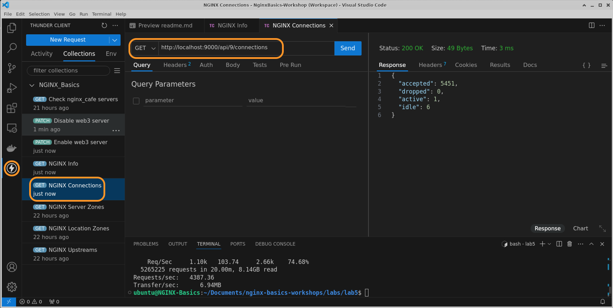

# NGINX Plus Logs, Logging and Troubleshooting

## Introduction

You will now build the Plus version of NGINX, using a license.  You will need a subscription license, and both SSL .crt and .key files.  These files provide access to the `NGINX Plus repository` where the Plus binary files are located.  These are not publicly accessible, you must have a valid Certificate and Key for repo access.  This new NGINX Plus container will be used for the rest of the Lab exercises, adding Plus features and options to your environment.

## Learning Objectives

By the end of the lab you will be able to:

- Run an `NGINX Plus Docker` image
- Run NGINX Webserver image, adding it to your lab environment
- Verify all containers are working
- Enable and test Nginx Plus Active Healthchecks
- Test Dynamic Configuration Reloads
- Test Dynamic Upstreams with the Plus API

NGINX Plus | Docker
:-------------------------:|:-------------------------:
  |

## What is NGINX Plus?  

NGINX Plus is the `Commercial version of NGINX`, adding additional Enterprise features on top of the base NGINX OSS build. Here is a Summary list of the Plus features:

- Dynamic reconfiguration reloads with no downtime
- Dynamic NGINX software updates with no downtime
- Dynamic DNS resolution and DNS Service discovery
- NGINX Plus API w/statistics and dashboard, over 240 metrics for TCP/HTTPS
- NGINX JavaScript Prometheus exporter libraries
- Dynamic Upstreams
- Key Value store
- Cache Purge API controls
- NGINX Clustering for High Availability
- JWT processing with OIDC for user authentication
- App Protect Firewall WAF

## Prerequisites

- Nginx-Plus container from Lab1
- You must have Docker installed and running
- You must have Docker-compose installed
- (Optional) You should have `Visual Studio Thunder Client` extension tool to make calls to NGINX Plus API.
- (Optional) You should have Visual Studio Code installed to work through the NGINX configuration files.
- See `Lab0` for instructions on setting up your system for this Workshop

<br/>

## Run NGINX Plus and Webservers with Docker

1. Open the Workshop folder with Visual Studio Code, or an IDE / text editor of your choice, so you can read and edit the files provided.

1. Inspect the `docker-compose.yml` file, located in the /lab5 folder. Notice you are running the NGINX-Plus container that you built in Lab1.

   ```bash
    # NGINX Plus Proxy with tools build
    # NGINX webservers with ingress-demo pages
    # NGINX Basics, Nov 2024
    # Chris Akker, Shouvik Dutta, Adam Currier
    #
    services:
    nginx-plus:                  # NGINX Plus Web / Load Balancer
        hostname: nginx-plus
        container_name: nginx-plus
        image: nginx-plus:workshop  # From Lab1
        volumes:                    # Sync these folders to container
            - ./nginx-plus/etc/nginx/nginx.conf:/etc/nginx/nginx.conf
            - ./nginx-plus/etc/nginx/conf.d:/etc/nginx/conf.d
            - ./nginx-plus/etc/nginx/includes:/etc/nginx/includes
            - ./nginx-plus/usr/share/nginx/html:/usr/share/nginx/html
        links:
            - web1:web1
            - web2:web2
            - web3:web3
        ports:
            - 80:80       # Open for HTTP
            - 443:443     # Open for HTTPS
            - 9000:9000   # Open for API / dashboard page
        restart: always 

   ```

1. Also in the `docker-compose.yml` file you will run three other Docker NGINX webserver containers. These will be your upstream backend webservers for this lab.

```bash
    web1:
        hostname: web1
        container_name: web1
        image: nginxinc/ingress-demo            # Image from Docker Hub
        ports:
            - "80"                                # Open for HTTP
            - "443"                               # Open for HTTPS
    web2:
        hostname: web2
        container_name: web2
        image: nginxinc/ingress-demo
        ports:
            - "80"
            - "433"
    web3:
        hostname: web3
        container_name: web3
        image: nginxinc/ingress-demo
        ports:
            - "80"
            - "443" 

```

1. Ensure you are in the `lab5` folder.  Using a Terminal, run Docker Compose to build and run all the above containers.  *Make sure you stop all the containers from Lab4 before running Lab5.*

   ```bash
    cd lab5
    docker compose up --force-recreate -d

   ```

1. Verify all four containers are running:

    ```bash
    docker ps

    ```

    ```bash
    ## Sample output ##
    CONTAINER ID   IMAGE                   COMMAND                  CREATED          STATUS          PORTS                                                                        NAMES
    c02c7b066c21   nginx-plus:workshop     "nginx -g 'daemon of…"   12 seconds ago   Up 10 seconds   0.0.0.0:80->80/tcp, 0.0.0.0:443->443/tcp, 8080/tcp, 0.0.0.0:9000->9000/tcp, 9113/tcp   nginx-plus
    817fcd05c9d5   nginxinc/ingress-demo   "/docker-entrypoint.…"   12 seconds ago   Up 11 seconds   443/tcp, 0.0.0.0:55027->80/tcp, 0.0.0.0:55026->433/tcp                                 web2
    b3931d09864f   nginxinc/ingress-demo   "/docker-entrypoint.…"   12 seconds ago   Up 11 seconds   0.0.0.0:55029->80/tcp, 0.0.0.0:55028->443/tcp                                          web1
    aa96cc59222a   nginxinc/ingress-demo   "/docker-entrypoint.…"   12 seconds ago   Up 11 seconds   0.0.0.0:55031->80/tcp, 0.0.0.0:55030->443/tcp

    ```

1. Test the NGINX Plus load balancing to the containers for the default webpage.

   **Note:** Run this command atleast 3 times. You can see in output that the response is coming from `web1`,`web2` and `web3` backend servers respectively.

    ```bash
    curl -is http://localhost |  grep "Server Name"
    ```

    ```bash
    ## Sample output ##
    # Output of 1st test
    <p class="smaller"><span>Server Name:</span> <span>web1</span></p>
    # Output of 2nd test
    <p class="smaller"><span>Server Name:</span> <span>web2</span></p>
    # Output of 3rd test
    <p class="smaller"><span>Server Name:</span> <span>web3</span></p>

    ```

1. Test NGINX Plus container with a browser:

    Launch your browser, go to <http://localhost>

    You should see the default Cafe App web page. If you refresh 3-4 times then you will see server name change to `web1`,`web2` and `web3` as NGINX is load balancing between your three nginx cafe backends using round-robin algorithm. Notice the server address matches each backend container as well.

    

1. These backend application do have the following multiple paths which can also be used for testing:
   - [http://cafe.example.com/coffee](http://cafe.example.com/coffee)
   - [http://cafe.example.com/tea](http://cafe.example.com/tea)
   - [http://cafe.example.com/icetea](http://cafe.example.com/icetea)
   - [http://cafe.example.com/beer](http://cafe.example.com/beer)
   - [http://cafe.example.com/wine](http://cafe.example.com/wine)
   - [http://cafe.example.com/cosmo](http://cafe.example.com/cosmo)
   - [http://cafe.example.com/mojito](http://cafe.example.com/mojito)
   - [http://cafe.example.com/daiquiri](http://cafe.example.com/daiquiri)
  
    You will be using these urls in later sections/exercise. You should verify these are working correctly using curl or browser.

    /coffee | /tea
    :-------: | :-------:
     | 

1. Test Terminal access to the NGINX Plus container with Docker Exec command:

    ```bash
    docker exec -it nginx-plus /bin/bash

    ```

1. Run some commands inside the NGINX Plus Container:

    ```bash
    # Look around the nginx folders
    ls -l /etc/nginx

    ls -l /etc/nginx/conf.d

    ```

    ```bash
    # Check NGINX help page
    nginx -h
    ```

    ```bash
    ##Sample Output##
    nginx version: nginx/1.25.3 (nginx-plus-r31)
    Usage: nginx [-?hvVtTq] [-s signal] [-p prefix]
             [-e filename] [-c filename] [-g directives]

    Options:
      -?,-h         : this help
      -v            : show version and exit
      -V            : show version and configure options then exit
      -t            : test configuration and exit
      -T            : test configuration, dump it and exit
      -q            : suppress non-error messages during configuration testing
      -s signal     : send signal to a master process: stop, quit, reopen, reload
      -d dancing    : help not available
      -p prefix     : set prefix path (default: /etc/nginx/)
      -e filename   : set error log file (default: /var/log/nginx/error.log)
      -c filename   : set configuration file (default: /etc/nginx/nginx.conf)
      -g directives : set global directives out of configuration file

    ```

    ```bash
    # Display the entire NGINX configuration, includes all files
    nginx -T

    ```

    When you are satisfied nginx-plus is working properly, Exit the container by typing `exit` in the shell.

    ```bash
    exit

    ```

1. Verify your Nginx Plus Dashboard is working, at http://localhost:9000/dashboard.html.

1. Verify your Plus Dashboard contains the HTTP Zones and HTTP Upstream data you expect.

   It should look something like below screenshot.
   

   In the NGINX Plus dashboard, within the HTTP Zones tab, you should see the aggregated statistics that comes from all the clients connecting to your virtual servers. Beneath the Server Zones are the Location zones which provides aggregated statistics for your location blocks.

   
   In the Http upsteams tab, you should be able to see stats that are unique for each backend server. It also provides the following detailed metrics:
    - Total and per second HTTP requests
    - All HTTP response codes
    - Active TCP connections
    - Total and per second Bytes sent and received
    - Health checks success and failures
    - HTTP Header and full response times
    - SSL Handshake success and failure, session counters
  
    These upstream metrics are very valuable to monitor your backend servers to troubleshoot issues.

    

    In the Workers tab, you can see the stats like process id, active connections, idle connections, total request, request per second etc. for each worker process.

    To see these metrics open a new tab in browser to <http://cafe.example.com/coffee> and tick the refresh checkbox at bottom center of the page.

    Go back to the NGINX Plus Dashboard, to observe the metrics changing.

<br/>

## Nginx Plus Active HealthChecks

In this section, you will enable active Plus Healthchecks. Active healthchecks probe your backend applications with requests in a timely fashion to check if they are up and healthy. If the upstream fails the healthchecks, it is marked Down, and will not be used for NEW connections.  Existing connections/requests are left intact.  These checks can be completely customized to match the backend application.

1. Inspect and edit the `cafe.example.com.conf` file. At the bottom of the file, uncomment lines ~34-45 to enable the active healthchecks.

   ```nginx
    # cafe.example.com HTTP
    server {
        ...

        # Active Healthchecks
        location @health_check {
                internal;            # Requests by NGINX only
                proxy_set_header Host cafe.example.com;
                proxy_pass http://nginx_cafe;
                health_check interval=5s fails=3 passes=2 uri=/ match=status_ok;    

                # Health check logs are boring but errors are interesting
                access_log  /var/log/nginx/health_check.log  main;
                access_log off;
                error_log  /var/log/nginx/error.log error;
        }
    }

   ```

   In the above config, the health_check parameters mean the following:

   - location @health_check : internal named location, not exposed externally
   - internal : only accessible by Nginx itself
   - proxy_set_header : set the Host Header in the health check
   - proxy_pass : which upstreams to check
   - interval=5s : check every 5 secs
   - fails=3 :  mark server down after 3 failures
   - passes=2 : mark server up after 2 success
   - uri=/ : uri to check is the root (/)
   - match=status_ok : match condition is using a custom response check that is defined in the `status_ok.conf` file.  *The Upstream Response must contain an HTTP 200 status code, and must also return the Content-Type header with `text/html`.*

    ```nginx
    # Simple health check expecting http 200 and correct Content-Type
    match status_ok {
        status 200;
        header Content-Type = "text/html; charset=utf-8"; # For the nginx-cafe html
    }
    ```

1. Once you have edited the config file, reload your NGINX config:

   ```bash
   nginx -t
   nginx -s reload

   ```

1. Inspect your dashboard: [http://localhost:9000/dashboard.html](http://localhost:9000/dashboard.html). You will find the healthcheck status and metrics under the HTTP Upstreams tab.
     

1. Using terminal on your local machine, issue the following docker command to stop one of the backend nginx cafe containers to trigger a health check failure.

   ```bash
   docker ps
   docker stop web3 

   ```

1. Once you have stopped the container, switch back to the browser and check the status of the backend servers.
   

    In the above screenshot, `DT` column specifies the down time for a particular backend server. `x` in `Last` column within the `Health monitors` section indicate that the last health check failed and Nginx is not sending any active traffic to this backend server.

    Refresh your browser at http://cafe.example.com several times, you will not see web3 responding, because Nginx is not load balancing any request to it.

1. NGINX also records health check failures in the `/var/log/nginx/error.log` file, go take a look

   ```bash
   docker exec -it nginx-plus more /var/log/nginx/error.log

   ```

   ```bash
   ## Sample Output ##
   2024/02/13 17:16:07 [error] 70-70: upstream timed out (110: Connection timed out) while connecting to upstream, health check "status_ok" of peer 192.168.96.4:80 in upstream "nginx_cafe"

    2024/02/13 17:16:15 [error] 70-70: connect() failed (113: No route to host) while connecting to upstream, health check "status_ok" of peer 192.168.96.4:80 in upstream "nginx_cafe"

   ```

   Notice there are two errors. One for TCP connection error and the other one is for failed HTTP health check request.  These two Nginx Errors, #110 and #113, are the `first` thing you should look for when troubleshooting upstreams, if you have healthchecks enabled.

1. Once you have investigated and resolved the issues with `web3` backend server you can start it again using below command.

   ```bash
    docker start web3

   ```

   After 2 successive health checks, NGINX will detect `web3` backend server is healthy again and begin sending active traffic to it. Observe the NGINX Plus dashboard. You can see that the status of `web3` backend server is now green.
   

<br/>

## NGINX Dynamic Reconfiguration

In this section, you will explore how NGINX Plus can be reconfigured without dropping any traffic. You will run an HTTP load generation tool (wrk) that will simulate a live website with a high volume of traffic. You will make several changes and reload NGINX while observing the NGINX Plus real-time dashboard.

1. Keep NGINX Plus dashboard open in your browser. You will be looking at this Dashboard often in this section.

1. Start the `wrk` load generation tool by downloading and running the following docker container.

   ```bash
    docker run --network=lab5_default --rm williamyeh/wrk -t4 -c200 -d5m -H 'Host: cafe.example.com' --timeout 2s http://nginx-plus/coffee

   ```

    The above command will run the wrk load generation tool for 5 minutes with 200 active connections hitting the `/coffee` path.

1. Inspect and edit the `upstreams.conf` file, uncomment the `least_time last_byte` load balancing algorithm which is an advance algorithm available in NGINX Plus, that monitors the response time of each backend application server and then selects the fastest backend server for serving new request coming to NGINX proxy. This is a popular feature when there is a large difference in response time for your backend servers, like when you are using different performance hardware types.

   ```nginx
    # nginx-cafe servers 
    upstream nginx_cafe {

        # Load Balancing Algorithms supported by NGINX
        # - Round Robin (Default if nothing specified)
        # - Least Connections
        # - IP Hash
        # - Hash (Any generic Hash)     
        # - Least Time (NGINX Plus only)
        
        # Uncomment to enable least_time load balancing algorithm
        least_time last_byte; # Other Options: header|last_byte|last_byte inflight

        ...
    }

   ```

1. Once you have edited the config file save and test your NGINX config:

   ```bash
   nginx -t

   ```

1. While watching the NGINX Plus dashboard `Workers` Tab, reload NGINX:

   ```bash
   nginx -s reload

   ```

   What did you observe?
   - You will observe that Nginx created New Workers (the PIDs changed) and `no traffic is dropped`. The statistics are reset to zero. Using the new algorithm, NGINX should now be sending more traffic to faster backends.

        (**NOTE:** In lab environment, this is difficult to demonstrate as all the containers are on the same network with same resource allocation)

    There is detailed explanation of what happens when you perform a reload in lab2. To recap, with NGINX Plus, new Worker processes are created, and begin using the new configuration immediately for all new connections and requests. The old Workers are **allowed to complete their previous task**, and then close their TCP connections naturally, **traffic in flight is not dropped!** The Nginx Master process terminates the old Workers after they finish their work and close all their connections.

    Optional BONUX Exercise:  Change the number of Nginx Workers from 4 to 2, and reload Nginx while under load.   What happens?  Change it back to 4 and reload again, what happens?  Did your wrk loadtest complete without any errors?

    >This is an Enterprise Plus feature, you must have this for high-volume production workloads.  Very few other Load Balancers can do this Dynamic Reloading without dropping any traffic.

<br/>

## NGINX Dynamic Upstream Management

In this section, you will manage your backend servers dynamically using the NGINX Plus API. `Web3` server in your workshop environment needs to undergo emergency maintainance - oh crap! But it is currently handling live active traffic. In this section you are tasked to remove it from load balancing without dropping any active traffic. And once maintainance is done, add it back so that it can handle live traffic again.

1. Keep NGINX Plus dashboard open in your browser. You will be looking at the dashboard often in this section.

1. Start the `wrk` load generation tool by downloading and running the following docker container.

   ```bash
    docker run --network=lab5_default --rm williamyeh/wrk -t4 -c200 -d20m -H 'Host: cafe.example.com' --timeout 2s http://nginx-plus/coffee

   ```

    The above command will run the wrk load generation tool for 20 minutes with 200 active connections hitting `/coffee` path.

1. If you look at the `HTTP Upstreams` tab within NGINX Plus dashboard you can clearly see all three backend servers are serving the incoming requests from the load generation tool.

   

1. Open `Thunder Client` extension tool within visual studio and look into the `NGINX_Basics` collection.

    

   (**Note:** You can find the `NGINX_Basics.API_collection.json` file within the `lab5` directory. If you are not familiar with Thunder Client and would prefer running commands on terminal then please use the `curl` equivalent command provided in each step).

1. Open `Check nginx_cafe servers` request and execute the call by clicking on `Send` button. You can confirm from the response that the upstream, nginx_cafe, has three backend servers. Also note that server `web3` has `id=2`. You will use this `id` in subsequent API calls in this section.

    

    ```bash
     #[Optional] curl command if not using Thunder Client
     curl 'http://localhost:9000/api/9/http/upstreams/nginx_cafe' | jq

    ```

1. You will now set `web3` server as `down` which would inform the NGINX Master process to not direct any traffic to that server. Within Thunder Client extension, open `Disable web3 server` request and execute the call by clicking on `Send` button.

    

    ```bash
     #[Optional] curl command if not using Thunder Client
     curl --request PATCH 'http://localhost:9000/api/9/http/upstreams/nginx_cafe/servers/2' \
    --header 'Content-Type: application/json' \
    --data '{
        "down": true
    }' | jq

    ```

1. If you check your NGINX Plus Dashboard, you will notice the `web3` server has turned `grey` and also is marked as `down`. You will also notice that it is not taking any active traffic.

   
  
1. You are notified that the `web3` server has been patched and the maintenance has finished. It can now be added back to the load balancer to serve client traffic. You will now set `web3` server as `down=false` which would inform the NGINX Master process to again resume sending traffic to that server. Within Thunder Client extension, open `Enable web3 server` request and execute the call by clicking on `Send` button.

   

   ```bash
     #[Optional] curl command if not using Thunder Client
     curl --request PATCH 'http://localhost:9000/api/9/http/upstreams/nginx_cafe/servers/2' \
    --header 'Content-Type: application/json' \
    --data '{
        "down": false
    }' | jq

    ```

1. If you check your NGINX Plus Dashboard, you will notice the `web3` server has turned back `green` and is also marked as `up`. You will also notice that it is now again taking equal amount of active traffic.
   
   

### NGINX Live Activity Monitoring JSON feed

In this section, you will make use of NGINX Plus API to get current statistics returned in a JSON-formatted document. You can request complete statistics at `/api/[api-version]/`, where `[api-version]` is the version number of the NGINX Plus API. This API is extremely useful, as it contains all NGINX Plus metrics(over 240 metrics), which you can pull into a central monitoring tool of your choice. You will do this in future lab exercise.

1. Open `Thunder Client` extension tool within visual studio and look into the `NGINX_Basics` collection.

   (**Note:** You can find the `NGINX_Basics.API_collection.json` file within the `lab5` directory. If you are not familiar with Thunder Client and would prefer running commands on terminal then please use the `curl` equivalent command provided in each step.)

1. Open `NGINX Info` request and execute the call by clicking on `Send` button.`/api/[api-version]/nginx` is used to retrieve basic version, uptime and identification information.

    

    ```bash
     #[Optional] curl command if not using Thunder Client
     curl 'http://localhost:9000/api/9/nginx' | jq

    ```

    ```json
    ## Sample output ##
    {
    "version": "1.25.5",
    "build": "nginx-plus-r32-p1",
    "address": "172.18.0.5",
    "generation": 14,
    "load_timestamp": "2024-11-15T02:04:48.991Z",
    "timestamp": "2024-11-15T02:07:09.277Z",
    "pid": 167,
    "ppid": 1
    }

    ```

1. Open `NGINX Connections` request and execute the call by clicking on `Send` button.`/api/[api-version]/connections` is used to retrieve total active and idle connections

    

    ```bash
     #[Optional] curl command if not using Thunder Client
     curl 'http://localhost:9000/api/9/connections' | jq

    ```

    ```json
    ## Sample output ##
    {
    "accepted": 32190,
    "dropped": 0,
    "active": 1,
    "idle": 6
    }

    ```

1. Open `NGINX Server Zones` request and execute the call by clicking on `Send` button.`/api/[api-version]/http/server_zones` is used to retrieve request and response counts for each HTTP Server group.

    

    ```bash
     #[Optional] curl command if not using Thunder Client
     curl 'http://localhost:9000/api/9/http/server_zones' | jq

    ```

1. Open `NGINX Location Zones` request and execute the call by clicking on `Send` button.`/api/[api-version]/http/location_zones` is used to retrieve request and response counts for each HTTP Location group.

    

    ```bash
     #[Optional] curl command if not using Thunder Client
     curl 'http://localhost:9000/api/9/http/location_zones' | jq

    ```

1. Open `NGINX Upstreams` request and execute the call by clicking on `Send` button.`/api/[api-version]/http/upstreams` is used to retrieve request and response counts, response time, health‑check status, and uptime statistics per server in each HTTP upstream group.

    

    ```bash
     #[Optional] curl command if not using Thunder Client
     curl 'http://localhost:9000/api/9/http/upstreams' | jq

    ```

> If `wrk` load generation tool is still running, then you can stop it by pressing `Ctrl + C`.

>If you are finished with this lab, you can use Docker Compose to shut down your test environment. Make sure you are in the `lab5` folder:

```bash
cd lab5
docker compose down
```

```bash
##Sample output##
Running 5/5
Container nginx-plus         Removed
Container web2               Removed
Container web3               Removed
Container web1               Removed                            
Network lab5_default         Removed

```

**This completes Lab 5.**

## References

- [NGINX Plus](https://docs.nginx.com/nginx/)
- [NGINX Admin Guide](https://docs.nginx.com/nginx/admin-guide/)
- [NGINX Technical Specs](https://docs.nginx.com/nginx/technical-specs/)
- [NGINX Plus API Module](https://nginx.org/en/docs/http/ngx_http_api_module.html)
- [NGINX Plus Dynamic Upstreams]( https://docs.nginx.com/nginx/admin-guide/load-balancer/dynamic-configuration-api/)

### Authors

- Chris Akker - Solutions Architect - Community and Alliances @ F5, Inc.
- Shouvik Dutta - Solutions Architect - Community and Alliances @ F5, Inc.
- Adam Currier - Solutions Architect - Community and Alliances @ F5, Inc.

-------------

Navigate to ([Lab6](../lab6/readme.md) | [Main Menu](../readme.md))
