# Using the Nginx One Console

## Introduction

In this lab, you will be exploring the **Nginx One Console**, part of the F5 Networks Distributed Cloud ecosystem.

This Overview will show the different features of the Console, and allow you to explore adding, removing, configuring, updating, and monitoring various instances of Nginx OSS and Nginx Plus Docker containers.

NGINX Plus | NGINX One| NGINX OSS
:-------------------------:|:-------------------------:|:---------------:
 | |
  
## Learning Objectives

By the end of the lab you will be able to:

- Login into the Nginx One Console
- Add Nginx OSS and Nginx Plus containers to your inventory
- Explore and review the Nginx Versions
- Explore and review the Linux OS Versions
- Explore and review the TLS Certificates
- Explore and review the Security CVEs
- Explore the Nginx One Metrics
- Explore and follow the Nginx One Recommendations
- Optional - Explore the Nginx One Console API

## Prerequisites

- You must have an F5 Distributed Cloud account, with access to the Nginx One Service.
- You must have your Nginx Plus license files from Lab1
- You must have Docker installed and running
- You must have Docker-compose installed
- See `Lab0` for instructions on setting up your system for this Workshop
- Familiarity with basic Linux commands and commandline tools
- Familiarity with Docker concepts and commands
- Familiarity with the HTTP protocol

<br/>

## How it Works

The **`Nginx One Console`**, is part of the F5 Networks Distributed Cloud Software as a Service (SaaS) product. This Service provides a Web Console, inventory and storage, and features needed by Nginx administrators.  The Nginx One Service is under constant development and service delivery, as new features are added, enhanced, updated and explanded.  Nginx admins can use the One Console for many kinds of routine opertional and administrative tasks.  This lab exercise is provided as an Overview and Test Drive of most of these features.

 

The Nginx One Console requires `nginx-agent`, an open source software module written by Nginx that connects and communicates with Nginx One.  This nginx-agent must be installed and running on every Nginx instance that you wish to manage with Nginx One.  You will use the publicly available Nginx with Agent images from Docker Hub for your Nginx OSS containers.  In addition, as part of your Docker Compose file, your NGINX Plus containers already have the required `NGINX Agent` installed for you.  Nginx-agent can also be installed using regular Linux package managers like `apt` and `yum`.  Refer to the References Section for links to the Nginx Agent installation guides.

<br/>

## Login to F5 Distributed Cloud, Nginx One Service

1. Login into the Nginx One Service, using your F5 Distributed Cloud credentials.  The login page can be found at: https://console.ves.volterra.io/login/start

 

1. Click on on the `Nginx One` tile, which will bring you to the Nginx One Console Service Description page.  


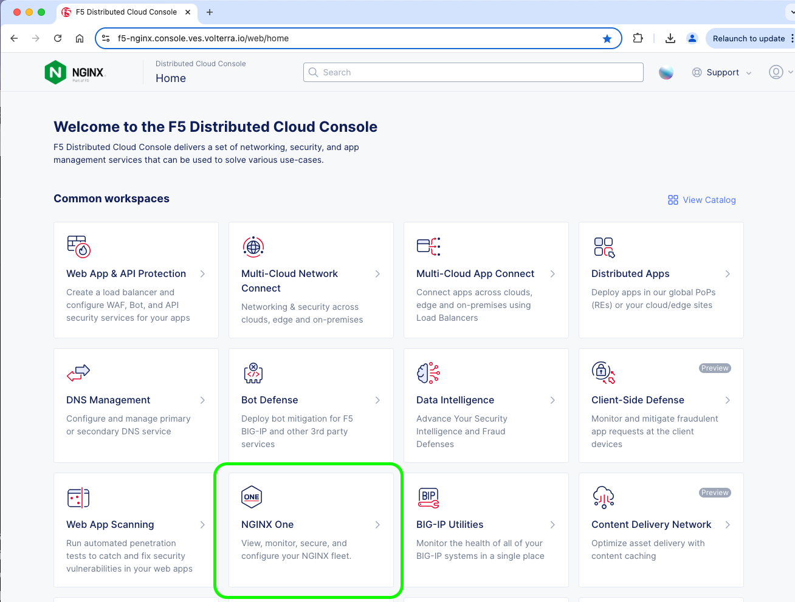 

Make sure the Nginx One Console status shows `green - Enabled`.  Click on `Visit Service`.  If it is not enabled, you must request access from your Distributed Cloud admin.


 
 
This will bring you to the Nginx Console `Overview Dashboard` page - it will show you a collection of Nginx instances, and some Details and Summary panels.


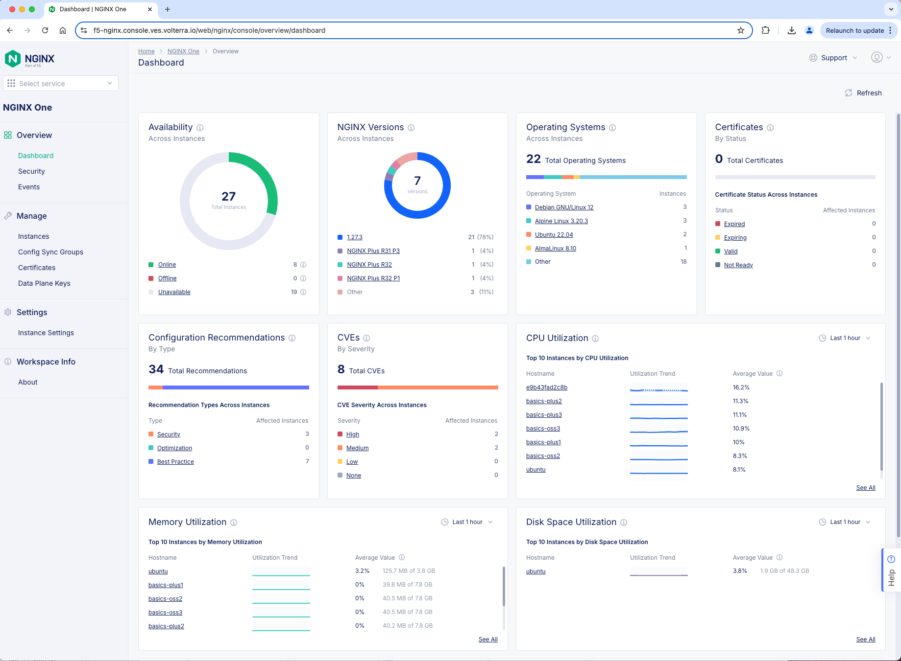 

>If this is your first time logging in or using the Nginx One Console, your Nginx Inventory will be empty.  *Have no fear - follow the instructions below to fire up several Nginx containers, which will be added to the Inventory for you:*

<br/>

## Create a new Dataplane Key for these lab exercises.

1. Using the Nginx One Console, click on Manage > Instances, then ` + Add instance`.

1. Click on `Generate Dataplane Key`, then copy the value of this key to the clipboard using the `Copy` icon on the right side.  NOTE:  This Dataplane Key is only show here, one time!  Save it locally if you plan to use it again.  You can Register as many Nginx Instances are you like with the same Dataplane Key.  If you lose the Key, just create a new one.

1. After Saving your Key somewhere, scroll down, then click the `Done` button on the bottom right.

## Run Nginx Containers with Docker

NGINX Plus | Docker| NGINX OSS
:-------------------------:|:-------------------------:|:---------------:
 | |

Now that you have a Dataplane Key, you can run some Docker containers, using the provided `docker-compose.yml` file.  This Docker Compose will pull and run 9 different Docker Containers, as follows:

- 3 Nginx OSS Containers, with different OS and Nginx versions, connecting to the Nginx One Console
- 3 Nginx Plus Containers, with different OS and Nginx versions, connecting to the Nginx One Console
- 3 nginxinc/ingress-demo Containers, used for the backend web servers, but NOT connected to the Nginx One Console

1. Inspect the `lab7/docker-compose.yml` file.  You will see the details of each container being pulled and run.

>Before you can pull and run these containers, you must set several Environment variables correctly, *before running docker compose*.

1. Using the Visual Studio Terminal, set the `TOKEN` environment variable with the Dataplane Key from the One Console, as follows:

```bash
export TOKEN=paste-your-dataplane-key-from-clipboard-here

```

And verify it was set:

```bash
#check it
echo $TOKEN

```

```bash
## Sample output ##
vJ+ADwlFXKf58bX0Qk/...6N38Al4fdxXDefT6J2iiM=

```

1. Using the same Terminal, set the `JWT` environment variable from your `nginx-repo.jwt` license file.  This is required to pull the Nginx Plus container images from the Nginx Private Registry.   If you do not have an Nginx Plus license, you can request a free 30-Day Trial license from here:  https://www.f5.com/trials/nginx-one 

```bash
export JWT=$(cat nginx-repo.jwt)

```
And verify it was set:

```bash
#check it
echo $JWT

```

1. Using Docker, Login to to the Nginx Private Registry, using the $JWT ENV variable for the username, as follows.  (Your system may require sudo):

```bash
docker login private-registry.nginx.com --username=$JWT --password=none

```
You should see a `Login Suceeded` message, like this:

```bash
## Sample output ##
WARNING! Using --password via the CLI is insecure. Use --password-stdin.
WARNING! Your password will be stored unencrypted in /home/ubuntu/.docker/config.json.
Configure a credential helper to remove this warning. See
https://docs.docker.com/engine/reference/commandline/login/#credentials-store

Login Succeeded

```

1. If both ENV variables are set correctly && you are logged into the Nginx Private Registry, you can now run Docker Compose to pull and run the images.  Ensure you are in the `/lab7` folder:

```bash
docker compose up --force-recreate -d

```

You will see Docker pulling the images, and then starting the containers.

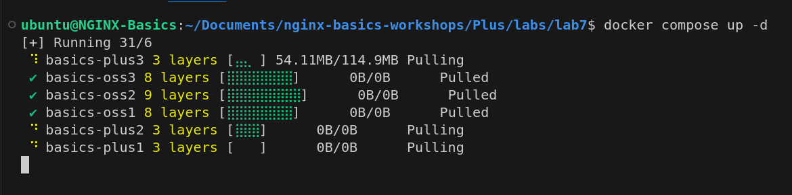 

```bash
## Sample output ##
[+] Running 9/10
 ⠙ Network lab7_default    Created                                                               2.1s 
 ✔ Container basics-plus3  Started                                                               0.9s 
 ✔ Container web1          Started                                                               1.4s 
 ✔ Container basics-plus1  Started                                                               2.1s 
 ✔ Container web2          Started                                                               1.8s 
 ✔ Container basics-oss3   Started                                                               2.0s 
 ✔ Container basics-oss1   Started                                                               1.9s 
 ✔ Container basics-oss2   Started                                                               1.6s 
 ✔ Container basics-plus2  Started                                                               1.2s 
 ✔ Container web3          Started                                                               1.2s 

```

1. Verify that all 9 containers started:

```bash
docker ps

```

```bash
## Sample output ##
CONTAINER ID   IMAGE                                                                             COMMAND                  CREATED          STATUS          PORTS                                                                                                                                                                          NAMES
# Nginx OSS containers
00ee8c9e4326   docker-registry.nginx.com/nginx/agent:mainline                                    "/docker-entrypoint.…"   44 minutes ago   Up 44 minutes   0.0.0.0:33396->80/tcp, :::33395->80/tcp, 0.0.0.0:33393->443/tcp, :::33392->443/tcp, 0.0.0.0:33388->9000/tcp, :::33387->9000/tcp, 0.0.0.0:33381->9113/tcp, :::33380->9113/tcp   basics-oss1
34b871d50d1b   docker-registry.nginx.com/nginx/agent:alpine                                      "/docker-entrypoint.…"   44 minutes ago   Up 44 minutes   0.0.0.0:33391->80/tcp, :::33390->80/tcp, 0.0.0.0:33385->443/tcp, :::33384->443/tcp, 0.0.0.0:33378->9000/tcp, :::33377->9000/tcp, 0.0.0.0:33375->9113/tcp, :::33374->9113/tcp   basics-oss2
022d79ce886c   docker-registry.nginx.com/nginx/agent:1.26-alpine                                 "/docker-entrypoint.…"   44 minutes ago   Up 44 minutes   0.0.0.0:33398->80/tcp, :::33397->80/tcp, 0.0.0.0:33395->443/tcp, :::33394->443/tcp, 0.0.0.0:33392->9000/tcp, :::33391->9000/tcp, 0.0.0.0:33386->9113/tcp, :::33385->9113/tcp   basics-oss3

# Nginx Plus containers
9770a4169e19   private-registry.nginx.com/nginx-plus/agent:nginx-plus-r32-alpine-3.20-20240613   "/usr/bin/supervisor…"   44 minutes ago   Up 44 minutes   0.0.0.0:33397->80/tcp, :::33396->80/tcp, 0.0.0.0:33394->443/tcp, :::33393->443/tcp, 0.0.0.0:33389->9000/tcp, :::33388->9000/tcp, 0.0.0.0:33383->9113/tcp, :::33382->9113/tcp   basics-plus1
852667e29280   private-registry.nginx.com/nginx-plus/agent:nginx-plus-r31-alpine-3.19-20240522   "/usr/bin/supervisor…"   44 minutes ago   Up 44 minutes   0.0.0.0:33382->80/tcp, :::33381->80/tcp, 0.0.0.0:33377->443/tcp, :::33376->443/tcp, 0.0.0.0:33374->9000/tcp, :::33373->9000/tcp, 0.0.0.0:33372->9113/tcp, :::33371->9113/tcp   basics-plus2
ffa65b04e03b   private-registry.nginx.com/nginx-plus/agent:nginx-plus-r31-ubi-9-20240522         "/usr/bin/supervisor…"   44 minutes ago   Up 44 minutes   0.0.0.0:33373->80/tcp, :::33372->80/tcp, 0.0.0.0:33371->443/tcp, :::33370->443/tcp, 0.0.0.0:33370->9000/tcp, :::33369->9000/tcp, 0.0.0.0:33369->9113/tcp, :::33368->9113/tcp   basics-plus3

# Nginx Ingress Demo containers (not Registered with One Console)
37c2777c8598   nginxinc/ingress-demo                                                             "/docker-entrypoint.…"   44 minutes ago   Up 44 minutes   0.0.0.0:33387->80/tcp, :::33386->80/tcp, 0.0.0.0:33379->443/tcp, :::33378->443/tcp                                                                                             web1
dba569e76e36   nginxinc/ingress-demo                                                             "/docker-entrypoint.…"   44 minutes ago   Up 44 minutes   443/tcp, 0.0.0.0:33390->80/tcp, :::33389->80/tcp, 0.0.0.0:33384->433/tcp, :::33383->433/tcp                                                                                    web2
5cde3c462a27   nginxinc/ingress-demo                                                             "/docker-entrypoint.…"   44 minutes ago   Up 44 minutes   0.0.0.0:33380->80/tcp, :::33379->80/tcp, 0.0.0.0:33376->443/tcp, :::33375->443/tcp                                                                                             web3

```

Go back to your One Console Instance page, and click `Refresh`.  You should see all 6 of your `basics-`  instances appear in the list, and the Online icon should be `green`.  If they did not Register with the One Console, it is likely you have an issue with the $TOKEN used, create a new Dataplane Key and try again.  It should look similar to this:


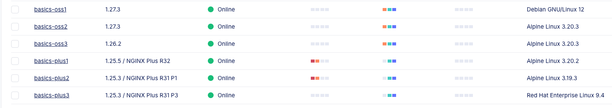 

>Now that the Nginx OSS and Plus containers are running and Registered with the One Console, you can explore the various features of the One Console, and manage your Nginx Instances!

<br/>

## Explore the Nginx One Console Overview Dashboard

 

Click on the Overview Dashboard, to see the Summary Panels of your Nginx fleet:  

- Availability of your Instances to the Console
- Different Versions of Nginx OSS / Plus being used
- Different Versions of Linux Distros being used 
- The Expiration dates/status of your TLS Certificates
- Expert analysis of your Nginx configurations - and YES!! Nginx AI is coming here :-)
- Any CVEs detected, either with Nginx or the Linux OS
- CPU, RAM, and Disk utilization
- Network Throughput metrics
- Summary of HTTP 400/500 Response Codes

### Availability

This Panel is pretty self explanatory, which of your Nginx Instances is online and communicating with the Console.  Click on the `Online, Offline, or Unavailable` links for more details.  You can add a `Filter` to assist with sorting/displaying your Instances.  Notice there is a `Last Reported Time` column, so you know when the instance last did a handshake with the Console.  Under `Actions`, you can go directly to the Configuration tool, or Delete the Instance.

 

### Nginx Versions

This Panel shows a Summary of which Nginx Versions are in use and by how many instances.  Sure, you could write a `bash script to SSH into every Instance`, and query `nginx -v` and collect this data yourself ... but why not use the Console instead?  Do you even *have* `root privileges` to SSH in the first place?  This makes it easy to know what versions of Nginx are running on your Instances - do they need a patch or an upgrade??

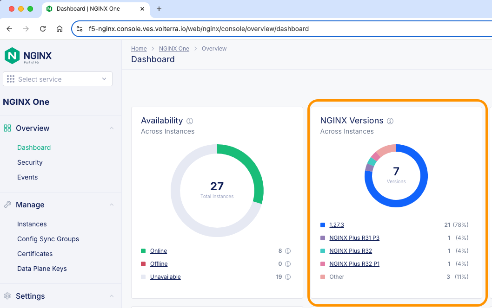 

### Operating Systems

This Panel shows a Summary of which Linux Distros are in use and by how many instances.  Sure, you could write YABS - yet another bash script - to SSH into every Instance, and query `uname` and collect the versions yourself ... but why not use the Console's Easy Button instead ?  As the number of people, teams, and projects grow using Nginx, the Version sprawl can become an issue.  The Console lets you see this level of detail quite easily.  And it makes it easy to find Linux versions that may not be approved by Security for Production, or need a patch applied.

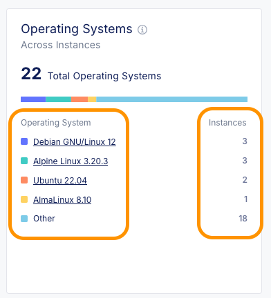 

### Certificates Overview

This Panel shows a Summary of the TLS Certificate expiration Status, using each certificate's expiry date as reported with openssl on each Instance.  Nginx Agent scans the Nginx config files, then uses openssl to query each Certificate file, and reports this information up to the Nginx Console.  If you click on the `Expired, Expiring, Valid, or Not Ready` links, you get additional details on the name of the certificate and on which Instance it can be found.  Once again, this saves you writing another bash script, you can see this TLS metadata at your fingertips.  You will update an expired certificate in the next Exercise.

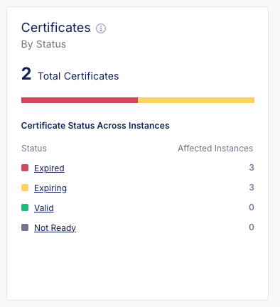 

### Configuration Recommendations Overview

This Panel shows some possible improvements that could be made to your current running Nginx configs.  Some are Security related, or an Optimization, or a Best Practice from the experts that built Nginx.  Clicking on each of these will give you additional details and provide an easy way to edit / update your Nginx configs.  You will do this in the next Exercise.

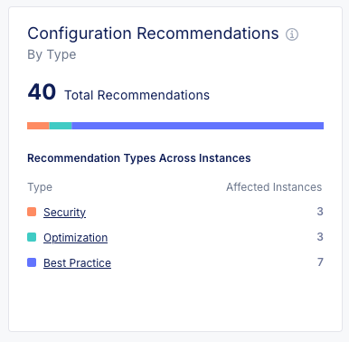 

### CVEs Overview

This Panel is a great tool to show you the CVEs that you might have in your Nginx fleet, with `High-Medium-Low Severity` classes, and which Instances are affected.  Even better, click on the CVE hyperlink takes you directly to the CVE website for detailed information, and possible remediations.

 

Click on the `basics-plus2` Instance, you should see a list of all the CVEs identified by Ngine One CVE scanner.  NOTE:  *This list may not include ALL CVEs*, rather just the list that Nginx One knows about at the time of the last scan.

Basics Plus1 | Basics Plus2
:-------------------------:|:-------------------------:
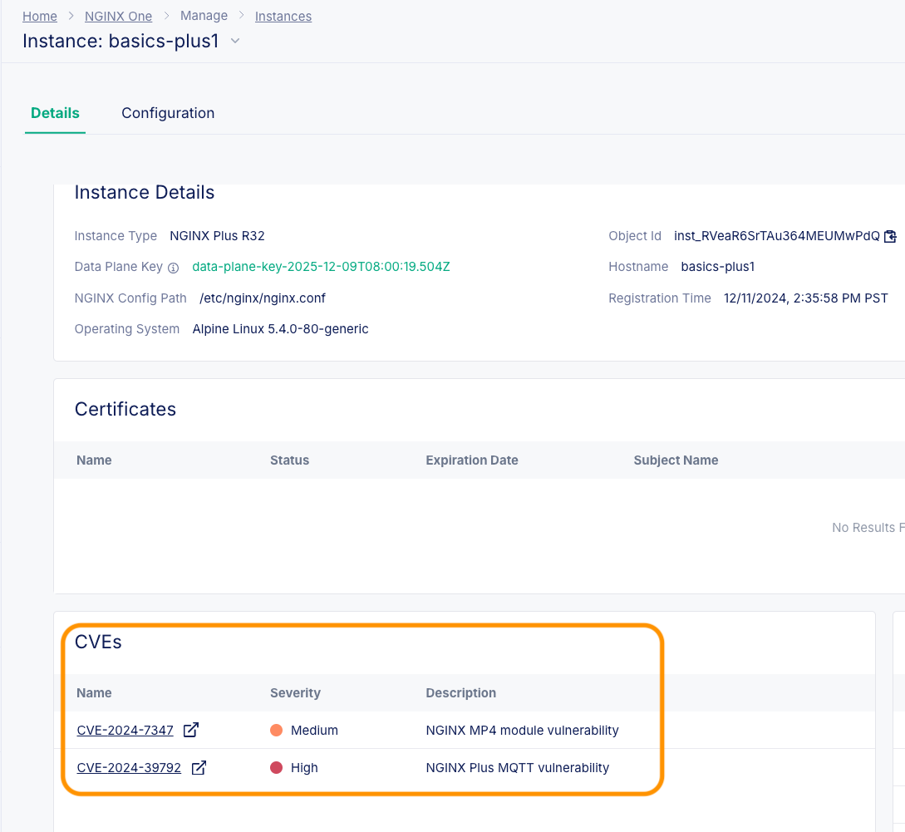 | 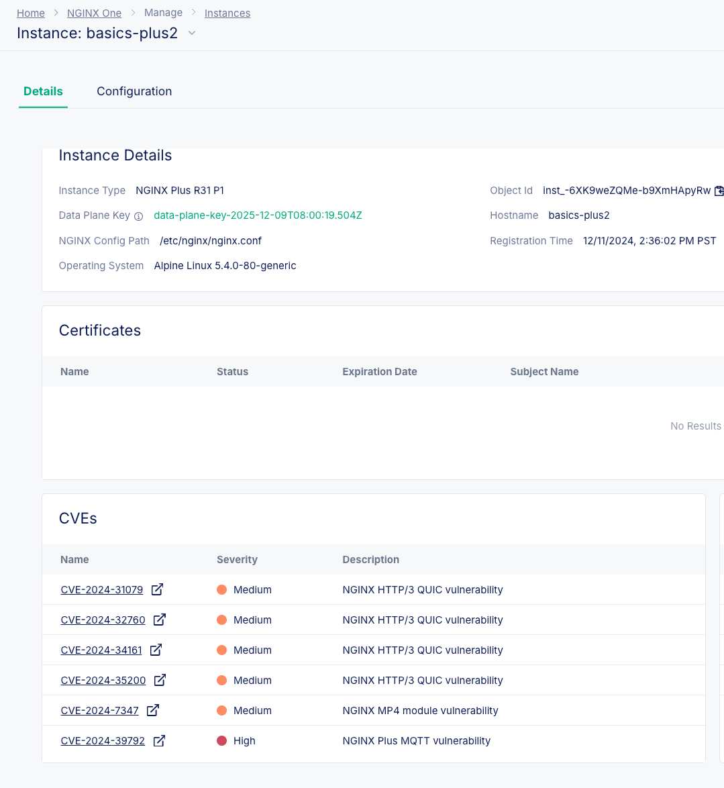

### CPU, RAM, Disk Utilization

These Panels show Host level information from the Linux OS about the consumption of hardware resources that the Nginx Agent reports to the One Console.  There is a `time selector` to show these metrics over different periods of time, with a history graph plotted for you.  Click the `See All` button for a columnar list, which you can Filter and Sort.  
*NOTE:  Docker containers do not report Disk usage.*

CPU | RAM | Disk
:-------------------------:|:-------------------------:|:---------------:
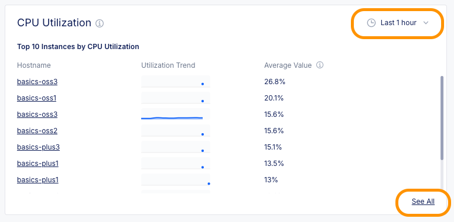 | 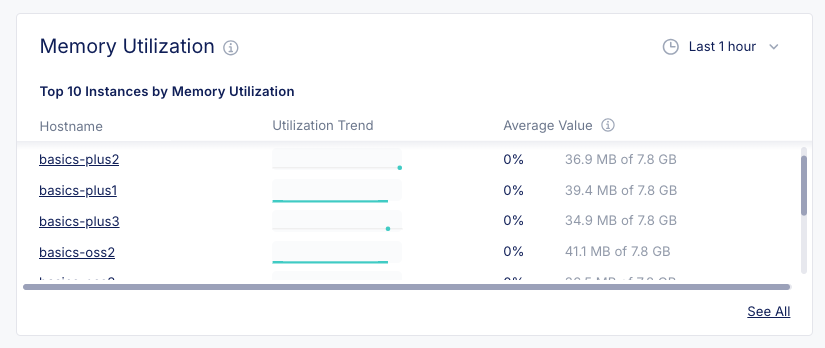 | 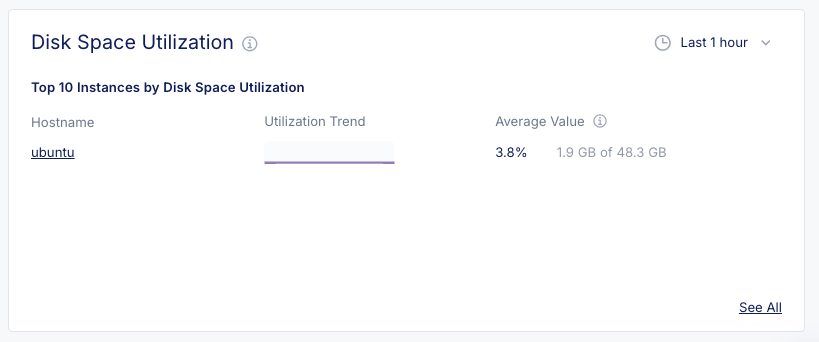 

### Unsuccessful Response Codes

The Nginx Agent scans the Access logs and summarizes the number of 4xx and 5xx HTTP Return codes found, and reports this information the One Console.  There is time selector, and a See All button for this Panel as well. 

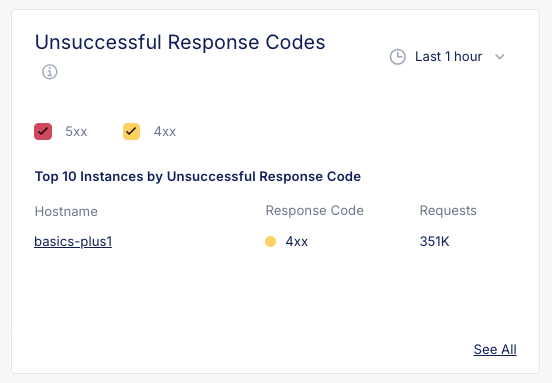 

### Top Network Usage

This Panel shows basic Network level information from the Linux OS about the network traffic that the Nginx Agent reports to the One Console.  There is a `time selector` to show these metrics over different periods of time, with a history graph plotted for you.  Click the `See All` button for a columnar list, which you can Filter and Sort.

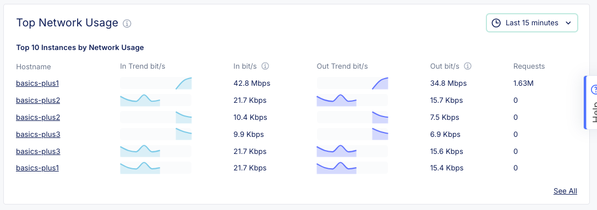 

#### Optional:  How to Pull and Run individual containers

If you would like to just run a few containers without Docker Compose, here are some examples to try.  Notice that the `$TOKEN with Dataplane Key` must be set and used for Registration with the Nginx One Console:

1. Run an OSS container, with Debian Linux, called `workshop1` using the $TOKEN variable, as follows.

    ```bash
    sudo docker run --name=workshop1 --hostname=workshop1 --env=NGINX_AGENT_SERVER_GRPCPORT=443 --env=NGINX_AGENT_SERVER_HOST=agent.connect.nginx.com --env=NGINX_AGENT_SERVER_TOKEN=$TOKEN --env=NGINX_AGENT_TLS_ENABLE=true --restart=always --runtime=runc -d docker-registry.nginx.com/nginx/agent:mainline

    ```

1. Run a second OSS container running Alpine Linux called `workshop2`, as follows:

    ```bash
    sudo docker run --name=workshop2 --hostname=workshop2 --env=NGINX_AGENT_SERVER_GRPCPORT=443 --env=NGINX_AGENT_SERVER_HOST=agent.connect.nginx.com --env=NGINX_AGENT_SERVER_TOKEN=$TOKEN --env=NGINX_AGENT_TLS_ENABLE=true --restart=always --runtime=runc -d docker-registry.nginx.com/nginx/agent:alpine

    ```

1. Run a third OSS container running Nginx 1.26 / Alpine Linux called `workshop3`, as follows:

    ```bash
    sudo docker run --name=workshop3 --hostname=workshop3 --env=NGINX_AGENT_SERVER_GRPCPORT=443 --env=NGINX_AGENT_SERVER_HOST=agent.connect.nginx.com --env=NGINX_AGENT_SERVER_TOKEN=$TOKEN --env=NGINX_AGENT_TLS_ENABLE=true --restart=always --runtime=runc -d docker-registry.nginx.com/nginx/agent:1.26-alpine

    ```

### Nginx Container Images with Nginx Agent installed for Nginx One Console

For Reference:  Find all the currently available `Nginx OSS` containers with Agent installed.  Curl the `Docker Registry`:

```bash
curl https://docker-registry.nginx.com/v2/nginx/agent/tags/list  | jq

```

For Reference:  Find all the currently available `NginxPlus` containers with Agent installed.  Curl the `Nginx Private Registry`, you will need your `nginx-repo Certificate and Key` files for this command:

```bash
curl https://private-registry.nginx.com/v2/nginx-plus/agent/tags/list --key nginx-repo.key --cert nginx-repo.crt | jq

```

<br/>

## Nginx One Certificates Deep Dive

 

Another nice feature of the Nginx One Console is the ability to quickly see the `Expiration Dates of the TLS Certificates` being used by your Nginx Instances.  When the nginx-agent reads the Nginx configuration, it looks for the TLS certificate path/name, and uses openssl to collect the Certificate Expiration date and Subject Name, and sends this information to the One Console.  It provides both a Summary of all the certificates, and the details on each one.  Sure, you can write an bash script to login with root privileges to every Nginx Server, and collect this information yourself.  But using the Nginx One Console makes this easy to see and help plan appropriate actions.  

>There is one small caveat to this feature, it only scans the TLS certificates that are part of the running Nginx configuration of the Instance, *it does not check additional TLS certificates*, even if they are in the same location on disk.

- **Expired** means the current date is past the certificate's Expiration Date.
- **Expiring** means the current data is within 31 days of the certificate's Expiration Date.

1. Using the Overview Dashboard Certificates Panel, Click on the `Expiring` link.  This will provide a List View of the Instances affected, with metadata about the Instances using the Certificate.

1. Click on the `basics-oss1` Instance.  This will provide the Instance level Details, you will see a `Certificates` Section, this time with the Name, Status, `Expiration Date`, and Subject Name for each certificate file.

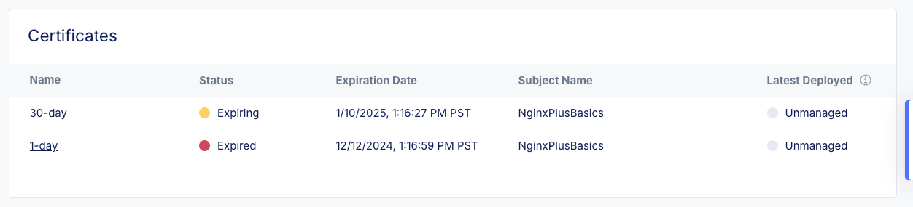 

1. If you Click on the actual certifcate file, for example `30-day.crt`, it will give you a List of all the Instances that are using that same certificate.

 

**Optional Lab Exercise:**

Fix the Expired Certificate!  If you want to create a new certificate, say with a 91-day expiration, follow these instructions to use `openssl` to create a Self-Signed certificate/key pair, and update your Nginx config files to use the new Certficate.

1. Create a new 91-day SSL certificate/key, and apply it to your configuration:

    ```bash
    openssl req -x509 -nodes -days 91 -newkey rsa:2048 -keyout 91-day.key -out 91-day.crt -subj "/CN=NginxPlusBasics"

    ```

1. Copy the 91.* files to the appropriate directory, in this workshop, that would be `lab7/nginx-oss/etc/ssl/nginx`.

1. Edit the `tls-cars.example.com.conf` file, changing the names of the crt/key from `1-day.crt and 1-day.key` to `90-day.crt and 90-day.key`; Lines #13-14.

    ```nginx
    ...
    # Update the following 2 lines for NGINX cert and key directives and file locations

        ssl_certificate /etc/ssl/nginx/1-day.crt;
        ssl_certificate_key /etc/ssl/nginx/1-day.key;

    ...

    ```


1. You will have to `docker exec login` to each container, and reload Nginx ( nginx -s reload ) for Nginx to pick up the configuration changes.

<br/>

## Nginx One Configuration Recommendations Deep Dive

One of the Best Features of the Nginx ONE Console is the Configuration analysis and recommendations that it provides.  The Nginx Product Management and Development teams are experts at Nginx, and they have collaborated to create these valuable insights.  There are three types of Recommendations:
- Security:  Nginx configurations to provide the best levels of security.
- Optimization: Nginx configurations known to provide optimal performance.
- Best Practices: Common configurations that follow standards and conform to ideal configs.

1. Click on the `Security` and then Click on the `basics-oss1` Instance, then on Configuration to see the details.  The Recommendations are at the bottom of the screen, and if you look at the config file list, you see small numbers next to each config file that is affected.  These are `color-coded`: the Orange numbers are for Security, Blue numbers are for Optimizations, and the Green numbers for for Optimizations.

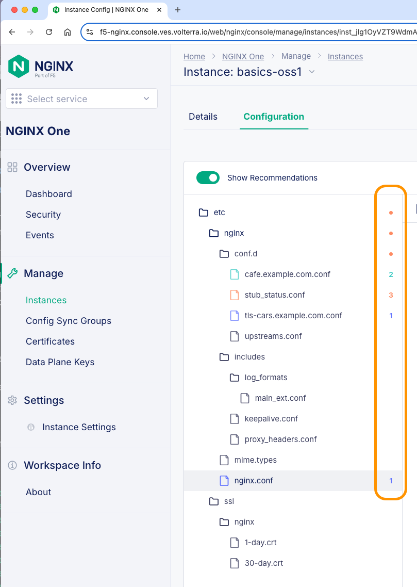 

1. If you click on the `cafe.example.com.conf` file, the Recommendations will be shown on the bottom, with details and Line Numbers, so you know which ones are being highlighted.

 

1. Now Click on `stub_status.conf`.  The details at the bottom are highlighting *Security - Error: stub_status should have access control list defined on Line 11*.  This advises that you should consider adding an ACL to the stub_status module, which provides metrics about your Nginx instance.  With no access list defined, anyone can see it.

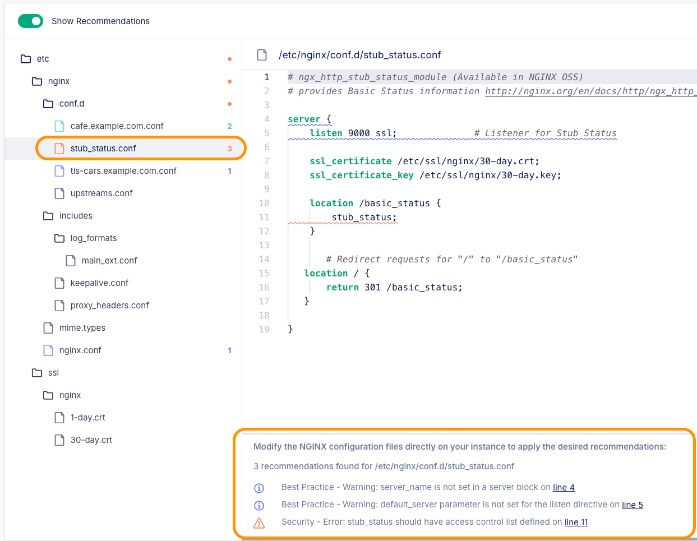 

1. Now Click on the `nginx.conf` file, it will show you Recommendations about the `worker_processes` Directive.

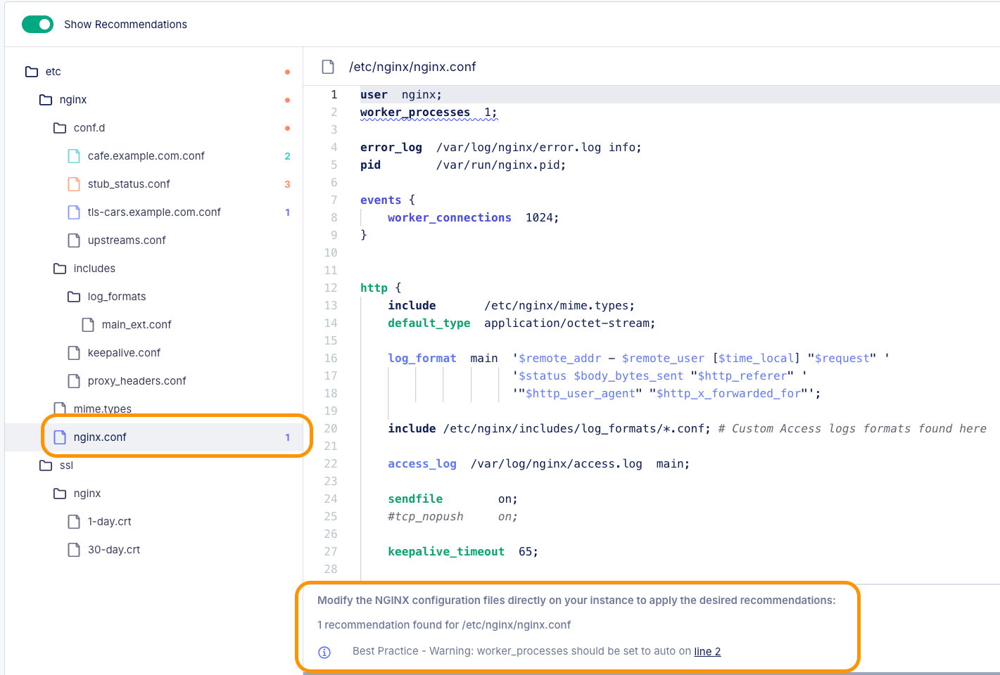 

Ok, so now what??  You can fix all these.  Just Click the `Edit Configuration` Pencil icon at the top, and now you can edit the Nginx config files directly.

1. Try this on the `cafe.example.com.conf` file.  At the bottom, Click the link for `line 4`.  It will take you directly to the file's config line, and also display an explanation with details about the parameter.  ADD the `default_server` directive to Line4, so it reads `listen 80 default_server;`.  

>And another Great Feature of the One Console, **Nginx Mice!!**  If you `mouse-over` any of the `colored words` in your config, you will see a pop-up with details about the Directive, Variable, or Parameter.  No more Googling to try and find details about Nginx configurations, it's at your finger/mouse tips!

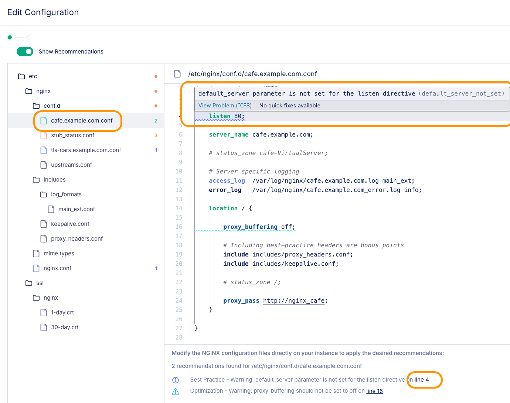 

1. Now do the same for Line #16, the `proxy_buffering off` Directive, change it to `on`.

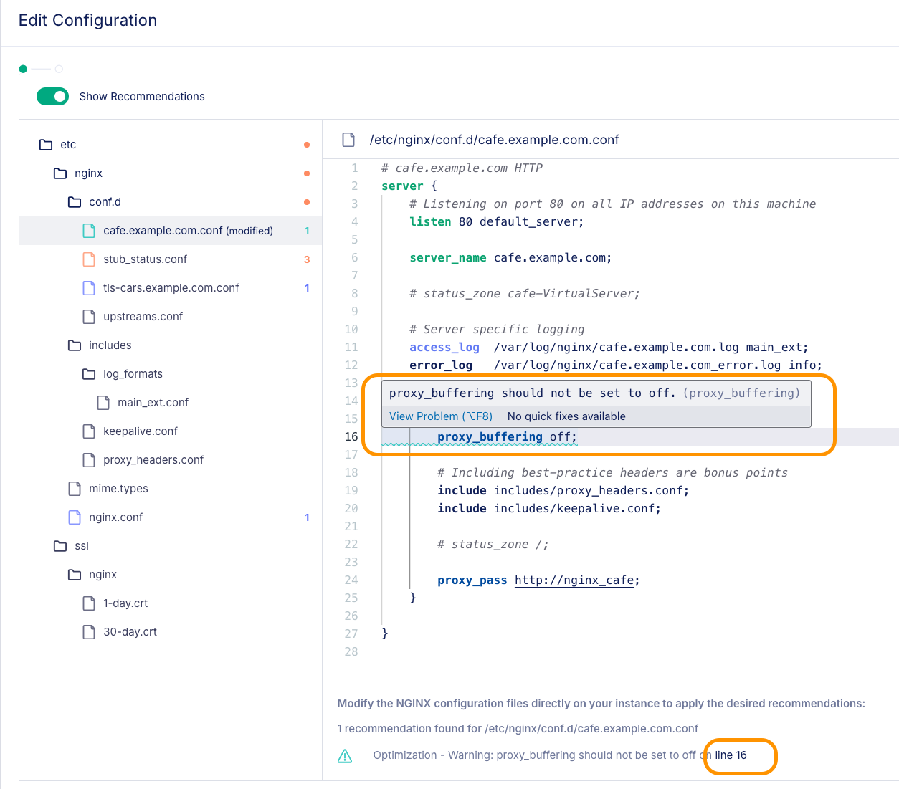 

1. When finished with your Edits, Click the Green `Next` button.  This will show you a side-by-side `DIFF` of the before/after configuration changes that you made.

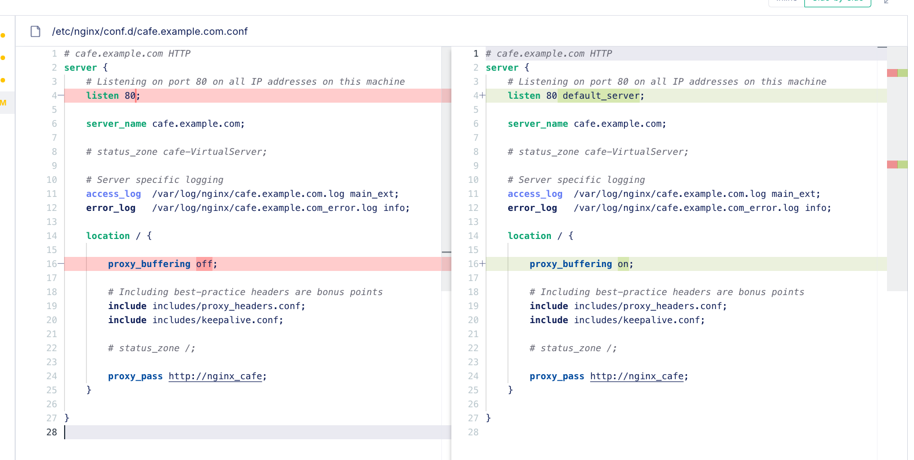 

1. Now you can click the Green `Publish` button to commit your changes to the Nginx Instance.  The Nginx-agent on the Instance will re-test and then apply your configuration changes.  You will see two pop-ups for Publishing Status and `Success`.


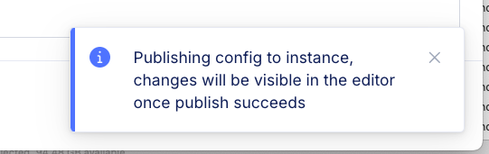 
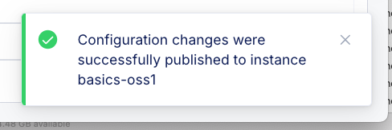 

1. You can follow this same procedure for your other Nginx config files, making the edits and Publish your changes.

>You can even add `new` files to your Nginx configurations, and Publish those as well!  Just click on `Add file` while you are in Edit mode.

<br/>

## Nginx One CVEs Deep Dive


One of the nice security feature of the NGINX One Console is the ability to provide a CVE summary with `High-Medium-Low Severity` classes. Clicking those classes reveals which Instances fall under them.

1. Using the Overview Dashboard CVEs Panel, Click on the `High` Severity link. This will provide a List View of the Instances that have CVEs that are classified under `High` Severity.

    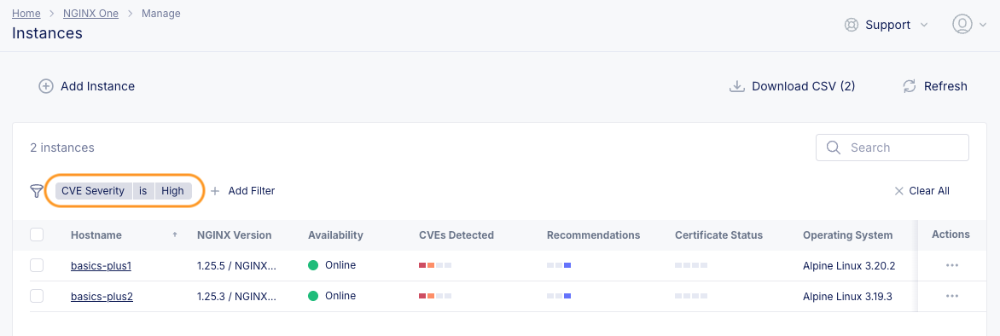

1. Click on the `basics-plus1` Instance. This will provide the Instance level Details, you will see a `CVEs` Section, this time with the Name, Severity and Description for each CVEs applicable to the instance.

    

1. If you click on one of the CVEs name hyperlink, for example `CVE-2024-39792`, it will directly open the CVE website on a new tab with detailed information and possible remediations.

    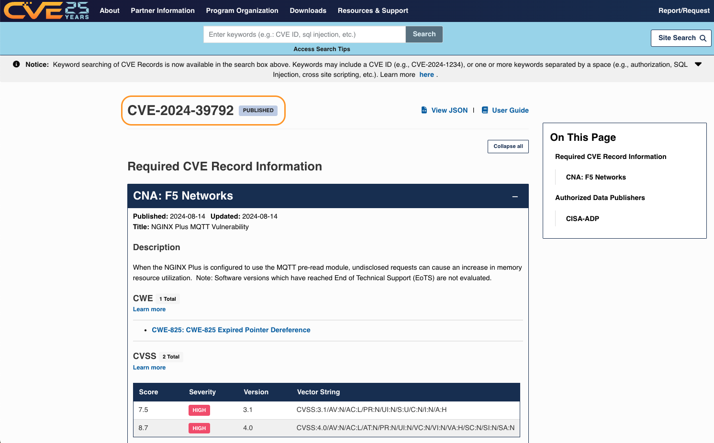

1. In similar fashion explore, click on the `Medium` Severity link within the Overview Dashboard and explore all the other CVEs that are classified under `Medium` Severity.

<br/>

## Nginx One Config Sync Groups

You can create and manage `Config Sync Groups` in the NGINX One Console. Config sync groups synchronize NGINX configurations across multiple NGINX instances, ensuring consistency and ease of management. If you’ve used instance groups in NGINX Instance Manager, you’ll find config sync groups in NGINX One similar. Let's go ahead and create one then add some instances to it.

### Create a Config Sync Group

- Under the `Manage` heading in the left hand column, click on `Config Sync Groups`.<br/>
  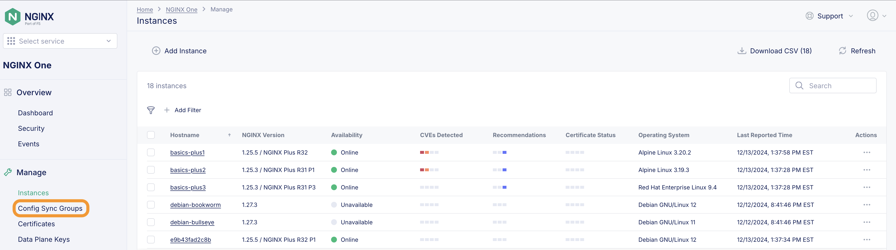<br/><br/>

- In the resulting panel at the top, click on the `Add Config Sync Group` button.<br/>
  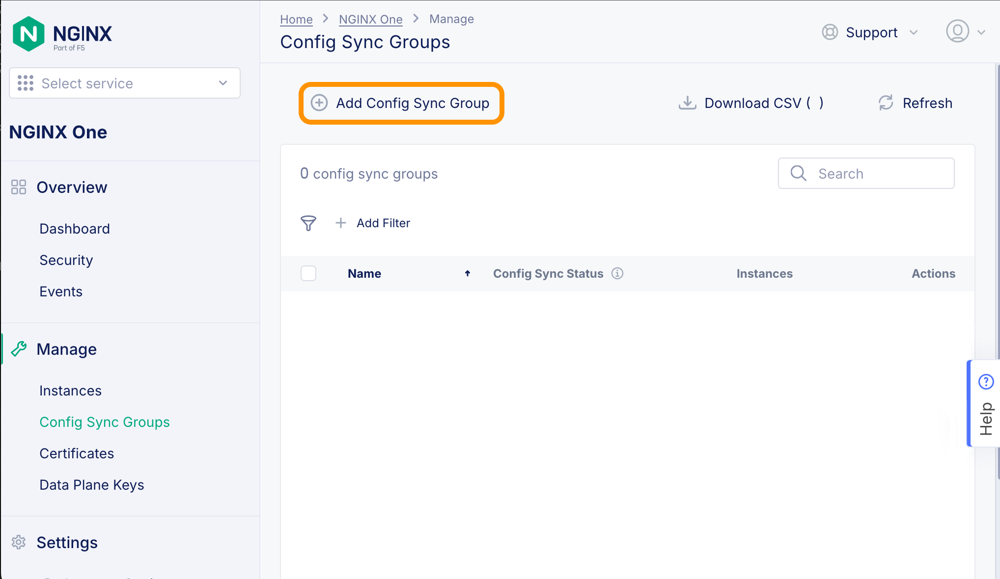<br/><br/>

- A modal window will pop up and ask you to give a name for the Config Sync Group. Here we will use the name:
  `basics-workshop-plus`<br/>
  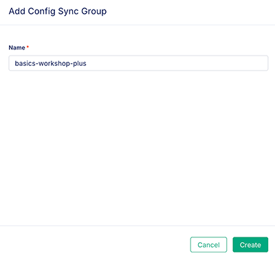<br/><br/>

### Create and add an instance to the group

On this page is a button that says `Add Instance to Config Sync Group`

<br/>

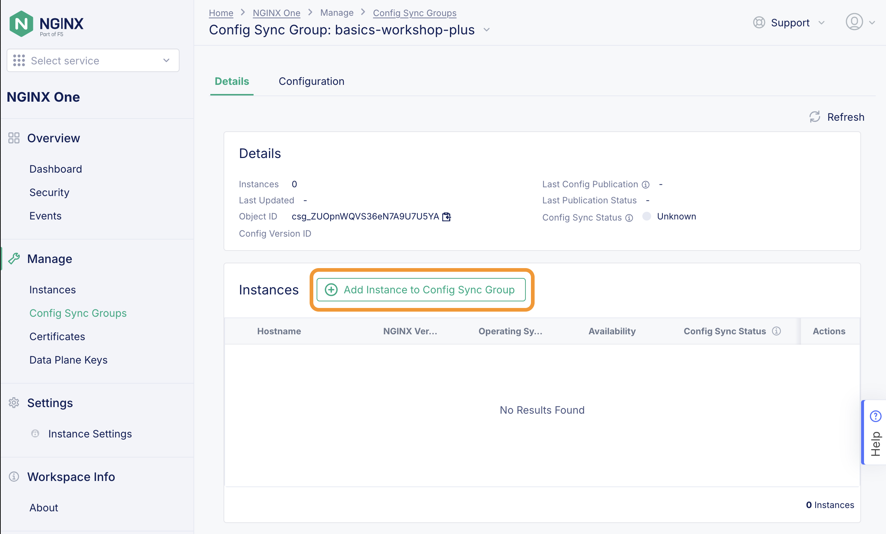

<br/>

This will pop up another modal window on the right. We will choose the second option that says: `Register a new instance with NGINX One and then add it to the config sync group`. Then proceed to click on the `Next` button.

<br/>

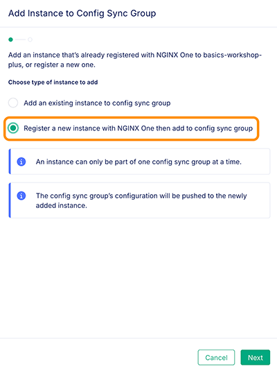

<br/>

The next option is to generate a dataplane key or use an existing one. We will choose `Use existing Key` and enter `$TOKEN` so that we can use the variable that we created earlier (you can also paste the value of the key itself should you choose).

<br/>

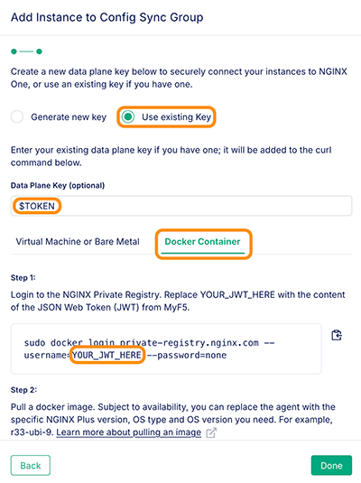

<br/>

If you are testing on bare metal, there is a curl command listed to register things. We are going to choose the `Docker Container` option which will list the steps we need to perform. There are three of them as shown in the image below. We are going to modify them a bit (you may need sudo in your environment):

<br/>

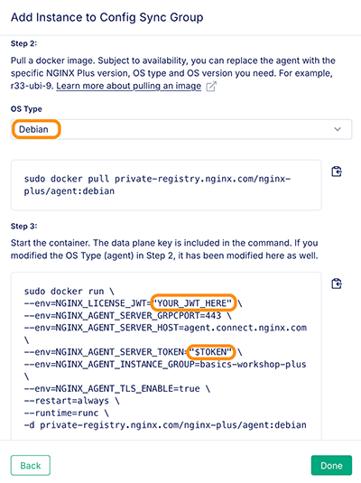

<br/>

Now that we saw the process as outlined in the NGINX One console, let's go over this again and run the provided commands in the terminal (with some modifications):

### Step 1

Confirm you are still logged in to the NGINX Private Registry. Replace `YOUR_JWT_HERE` with the content of the JSON Web Token (JWT) from MyF5 or you can use the environment variable you previously set: `$JWT`.

```bash
docker login private-registry.nginx.com --username=$JWT --password=none
```

### Step 2

Pull a docker image. Subject to availability, you can replace the agent with the specific NGINX Plus version, OS type and OS version you need. For example, r33-ubi-9. Here we are going to pull the r31 version of NGINX+ on alpine to demonstrate that.

```bash
docker pull private-registry.nginx.com/nginx-plus/agent:nginx-plus-r31-alpine-3.19-20240522
```

### Step 3

Start the container. We are going to modify the command shown in the console to use our environment variables. We are also going to add a `hostname` for the container as well as a `name` for it (to make it easier to work with).

```bash
docker run \
--hostname=basics-manual \
--name=basics-manual \
--env=NGINX_LICENSE_JWT="$JWT" \
--env=NGINX_AGENT_SERVER_GRPCPORT=443 \
--env=NGINX_AGENT_SERVER_HOST=agent.connect.nginx.com \
--env=NGINX_AGENT_SERVER_TOKEN="$TOKEN" \
--env=NGINX_AGENT_INSTANCE_GROUP=basics-workshop-plus \
--env=NGINX_AGENT_TLS_ENABLE=true \
--restart=always \
--runtime=runc \
-d private-registry.nginx.com/nginx-plus/agent:nginx-plus-r31-alpine-3.19-20240522
```

You can see that the container starts up. With a refresh on the Config Sync Groups page, you will see that the basics-workshop-plus Config Sync Group now has 1 instance in it.

<br/>

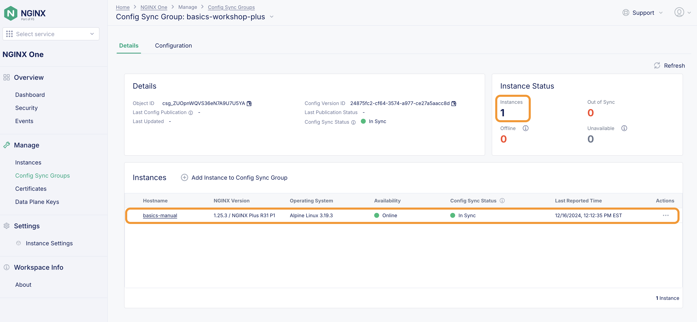

<br/>

Hey, didn't we use docker compose to start our containers before? We can add instances to this `Config Sync Group` even easier than what we did above - automatically!

Let's stop our running containers by running:

```bash
docker compose down
```

Now open up the docker-compose.yml. You can uncomment the lines numbered 14, 36, & 58. This NGINX variable is all you need to add these to the instance group:

```bash
NGINX_AGENT_INSTANCE_GROUP: basics-workshop-plus
```

Let's launch the containers again and then watch the Nginx One console to see the instances added to the Config Sync Group.

```bash
docker compose up
```

Use the refresh button and you should see the three original instances added to our config group. These will only be the Plus instances as they were the instances to which we added the variable line.

<br/>

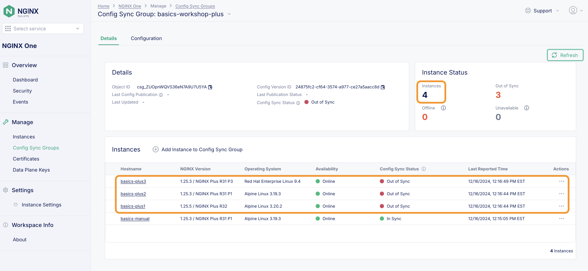

<br/>

Upon being added to the Config Instance group, NGINX One will attempt to apply the configuration of the group to the instances in it. Here we can see the config was immediately applied to **basics-plus-2**:

<br/>

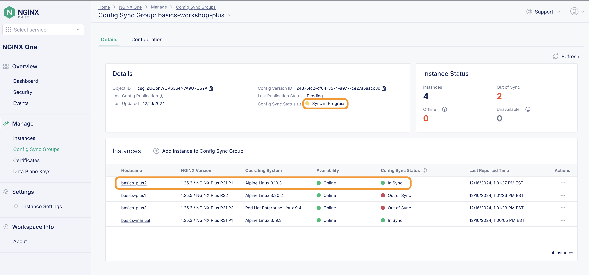

<br/>

Before this finishes, let's show we can push a change to the whole group! Click on the `Configuration` button next to the `Details`. Then click the `Edit Config` button:
<br/>

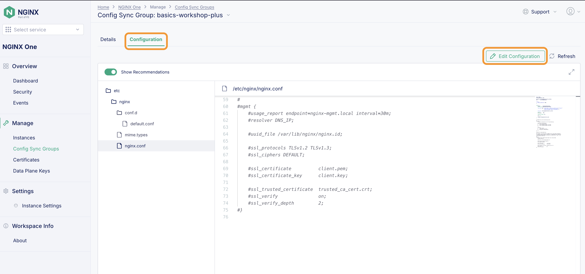

<br/>

On line 76, Let's simply add a comment, a trivial change. Then click the `Next` button.

<br/>

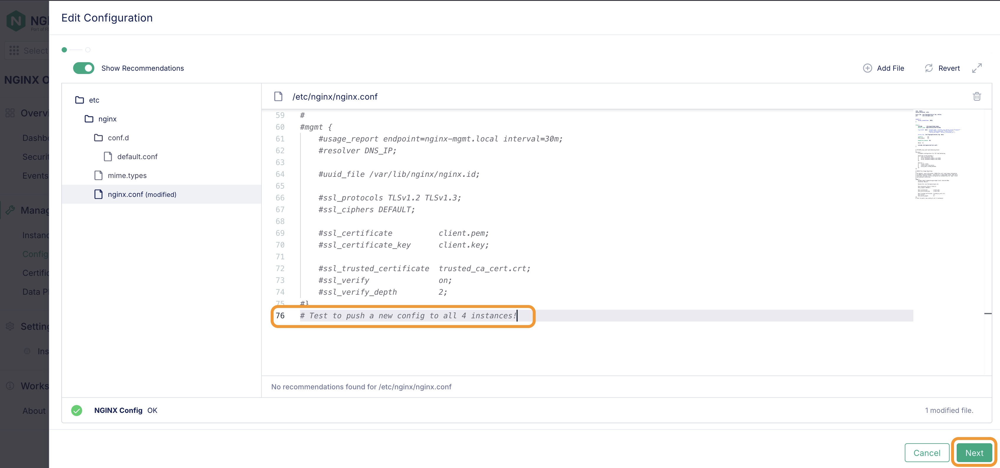

<br/>

The next screen allows you to see a diff between the two configs. After reviewing you can click `Save and Publish`.

<br>

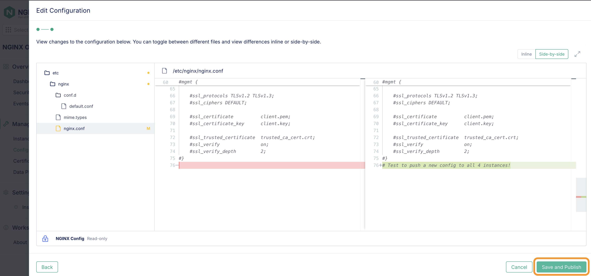

<br>

NGINX One will indicate the change was a success and push it to all of our instances. Click on the `Details` button of the group to see the status of the instances.

<br>

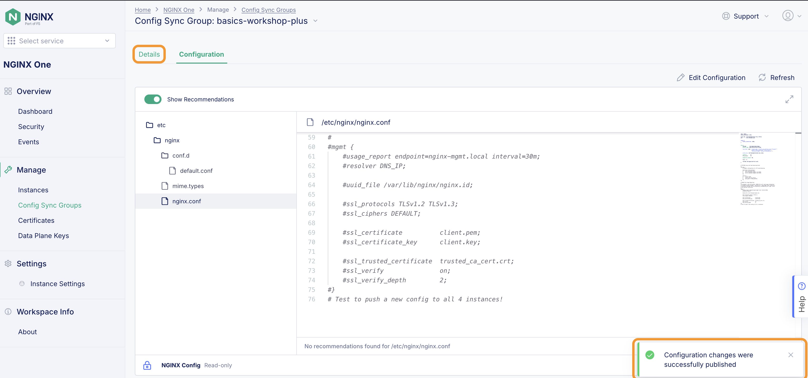

<br>

We can now see all the instances are in sync!

<br>

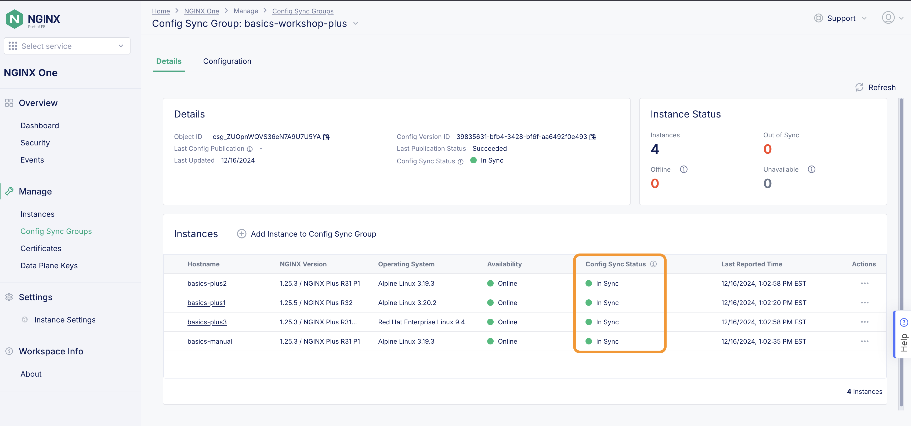

<br>

---

**NOTE**

A final note... you can `mix OSS and Plus instances` in the same group! The important caveat is that the config features must be available to all instances. If you are going to be working with NGINX Plus specific configurations, you are better off putting those into their own Config Sync Group.

---

## Wrap UP

>If you are finished with this lab, you can use Docker Compose to shut down your test environment. Make sure you are in the `lab7` folder:

```bash
docker compose down

```

```bash
##Sample output##
[+] Running 10/10
 ✔ Container basics-oss3   Removed                                                               6.4s 
 ✔ Container basics-plus2  Removed                                                              10.7s 
 ✔ Container web1          Removed                                                               0.5s 
 ✔ Container basics-oss1   Removed                                                               5.5s 
 ✔ Container web2          Removed                                                               0.4s 
 ✔ Container basics-plus1  Removed                                                              10.7s 
 ✔ Container web3          Removed                                                               0.5s 
 ✔ Container basics-oss2   Removed                                                               6.2s 
 ✔ Container basics-plus3  Removed                                                              10.6s 
 ✔ Network lab7_default    Removed                                                               0.1s 

```

To clean up the manual container we added:
```bash
docker ps | grep manual
f8a5fb797615   private-registry.nginx.com/nginx-plus/agent:nginx-plus-r31-alpine-3.19-20240522   "/usr/bin/supervisor…"   About an hour ago   Up About an hour   80/tcp                                                                                                                                                                         basics-manual
```

```bash
docker stop f8a
f8a
```

```bash
docker rm f8a
f8a
```

Don't forget to stop all of the Nginx containers if you are finished with them, and Delete them from the Nginx One Instance inventory.

<br/>

**This completes Lab7.**

<br/>

## References:

- [Nginx One Console](https://docs.nginx.com/nginx-one/)
- [Nginx Agent](https://docs.nginx.com/nginx-agent/overview/)
- [NGINX Plus](https://www.nginx.com/products/nginx/)
- [NGINX Admin Guide](https://docs.nginx.com/nginx/admin-guide/)
- [NGINX Technical Specs](https://docs.nginx.com/nginx/technical-specs/)

<br/>

### Authors

- Chris Akker - Solutions Architect - Community and Alliances @ F5, Inc.
- Shouvik Dutta - Solutions Architect - Community and Alliances @ F5, Inc.
- Adam Currier - Solutions Architect - Community and Alliances @ F5, Inc.

-------------

Navigate to ([Main Menu](../readme.md))
