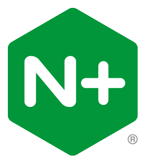
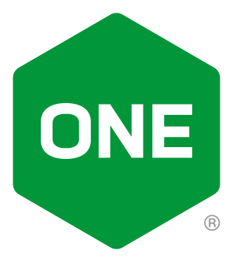
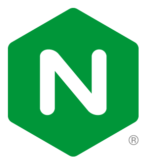
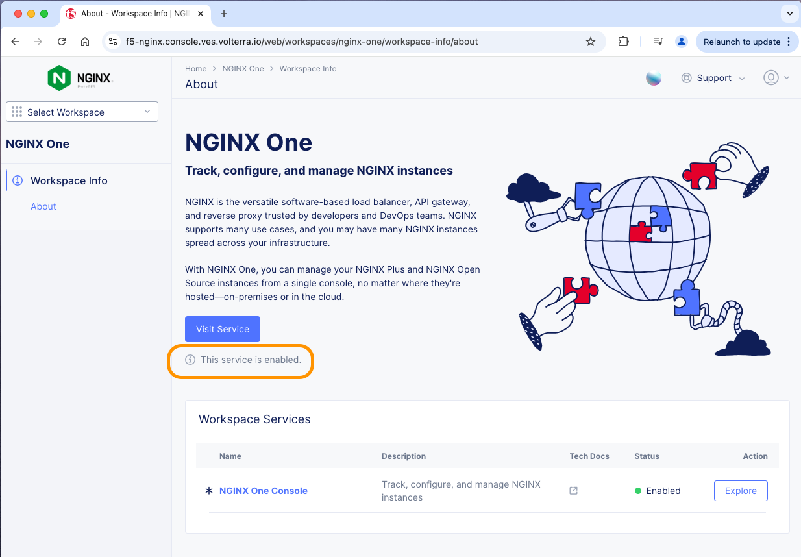

# Using the Nginx One Console

## Introduction

In this lab, you will be exploring the Nginx One Console, part of the F5 Networks Distributed Cloud ecosystem.

This Overview will show the different features of the Console, and allow you to explore adding, removing, configuring, updating, and monitoring various instances of Nginx OSS, Nginx Plus, and Docker containers.

NGINX Plus | NGINX One| NGINX OSS
:-------------------------:|:-------------------------:|:-----:
  | |
  
## Learning Objectives

By the end of the lab you will be able to:

- Login into the Nginx One Console
- Add Nginx OSS and Nginx Plus containers to your inventory
- Explore and review the Nginx and OS Versions
- Explore and review the TLS Certificates
- Explore and follow the Nginx One Recommendations to update your Nginx configurations
- Explore and review the CVEs
- Explore the Nginx One Metrics
- Optional - Explore the Nginx One Console API

## Pre-Requisites

- You must an F5 Distributed Cloud account, with access to the Nginx One Service.
- You must have the NginxPlus image from Lab1
- You must have Docker installed and running
- You must have Docker-compose installed
- See `Lab0` for instructions on setting up your system for this Workshop
- Familiarity with basic Linux commands and commandline tools
- Familiarity with basic Docker concepts and commands
- Familiarity with basic HTTP protocol
- Familiarity with Prometheus
- Familiartiy with Grafana

<br/>

## How it Works

The `**Nginx One Console**`, is part of the F5 Networks Distributed Cloud Software as a Service (SaaS) product. This Service provides a Web Console, inventory and storage, and features needed by Nginx administrators.  The Nginx One Service is under constant development and service delivery, as new features are added, enhanced, updated and explanded.  Nginx admins can use the One Console for many kinds of routine opertional and administrative tasks.  This lab exercise is offered as a Test Drive of most of these features.

NGINX Agent
:-------------------------:|
 

The Nginx One Console requires `nginx-agent`, an open source software module written by Nginx that connects and communicates with Nginx One.  This nginx-agent must be installed and running on every Nginx instance that you wish to manage with Nginx One.  You will use the publicly avialable Nginx with Agent images from Docker Hub for your Nginx OSS containers.  In addition, as part of your Dockerfile, your NGINX Plus containers already have the required `NGINX Agent` installed during the build process for you.  Refer to the /lab7 Dockerfiles if you want to check it out, use them as templates for adding Nginx Agent to your own fleet of Nginx containers.  Nginx-agent can also be installed using regular Linux package manager like `apt` and `yum`.  Refer to the References Section for links to the Nginx Agent installation guides.

<br/>

## Login to F5 Distributed Cloud, Nginx One Service

1. Login into your Nginx One Service, using your F5 Distributed Cloud credentials.  The login page can be found at: https://console.ves.volterra.io/login/start

F5 Distributed Cloud Login
:-------------------------:|
 

1. Click on on the `Nginx One` tile, which will bring you to the Nginx One Console Service description page.  

Nginx One Console Service
:-------------------------:|
 

Make sure the Nginx One Console status shows `green - Enabled`.  Click on `Visit Service`.  If it is not enabled, you must request access from your Distributed Cloud admin.
 
This will bring you to the Nginx Console `Overview Dashboard` page - it will show you a collection of Nginx instances, and some Details and Summary panels.

Nginx One Overview Dashboard
:-------------------------:|
 

If this is your first time logging in or using the Nginx One Console, your Nginx Inventory will be empty.  Follow the instructions below to fire up several Nginx containers, which will be added to the Inventory for you:

<br/>

## Create a new Datakey for these lab exercises.

1. Using the Nginx One Console, click on Manage > Instances, then ` + Add instance`.

1. Click on `Generate Dataplane Key`, then copy the value of this key to the clipboard using the `Copy` icon on this right side.

1. Scroll down, then click the `Done` button on the bottom right.

## Run an Nginx OSS Container

Now that you have a Dataplane Key, you can run a Docker container, passing this Dataplane Key as an `ENV` variable to Docker runtime, as follows.  Notice there are other `ENV` variables set as well, which tell the Nginx Agent how to connect to the Nginx One Console:

Optional:  Find all the currently available OSS Nginx containers with Agent installed.  Curl the Docker Registry:

```bash
curl https://docker-registry.nginx.com/v2/nginx/agent/tags/list  | jq

```

1. Create an environment variable for the Dataplane Token:

```bash
export TOKEN=<paste-your-token-from-clipboard>

````

```bash
#check it
echo $TOKEN

```

Run the first OSS container, with Debian Linux, called `workshop1` using the $TOKEN variable, as follows.

```bash
sudo docker run \
--name=workshop1
--hostname=workshop1
--env=NGINX_AGENT_SERVER_GRPCPORT=443 \
--env=NGINX_AGENT_SERVER_HOST=agent.connect.nginx.com \
--env=NGINX_AGENT_SERVER_TOKEN=$TOKEN \
--env=NGINX_AGENT_TLS_ENABLE=true \
--restart=always \
--runtime=runc \
-d docker-registry.nginx.com/nginx/agent:mainline

```

Run a second OSS container running Alpine Linux called `workshop2`, as follows:

```bash
sudo docker run --name=workshop2 --hostname=workshop2 --env=NGINX_AGENT_SERVER_GRPCPORT=443 --env=NGINX_AGENT_SERVER_HOST=agent.connect.nginx.com --env=NGINX_AGENT_SERVER_TOKEN=$TOKEN --env=NGINX_AGENT_TLS_ENABLE=true --restart=always --runtime=runc -d docker-registry.nginx.com/nginx/agent:alpine

```

Run a third OSS container running Nginx 1.26 / Alpine Linux called `workshop3`, as follows:

```bash
sudo docker run --name=workshop3 --hostname=workshop3 --env=NGINX_AGENT_SERVER_GRPCPORT=443 --env=NGINX_AGENT_SERVER_HOST=agent.connect.nginx.com --env=NGINX_AGENT_SERVER_TOKEN=$TOKEN --env=NGINX_AGENT_TLS_ENABLE=true --restart=always --runtime=runc -d docker-registry.nginx.com/nginx/agent:1.26-alpine

```

Go back to your One Console Instance page, and click `Refresh`.  You should see your workshopX instances appear in the list, and the Online icon should be `green`.

Nginx OSS Instances
:-------------------------:|
 


## Add Nginx Plus Containers to Nginx One

1. Inspect the lab7/docker-compse.yml file.  You will see several Nginx OSS and Plus containers being started for you, and added to your Nginx One inventory.

1. Ensure you are in the `lab7` folder.  Using a Terminal, run Docker Compose to build and run all the containers.

    ```bash
     cd lab7
     docker compose up --force-recreate -d

    ```


<br/>

## Wrap UP

>If you are finished with this lab, you can use Docker Compose to shut down your test environment. Make sure you are in the `lab7` folder:

```bash
cd lab7
docker compose down

```

```bash
##Sample output##
Running 5/5
Container nginx-plus         Removed
Container web2               Removed
Container prometheus         Removed
Container web3               Removed
Container web1               Removed
Container grafana            Removed                            
Network lab7_default         Removed

```

Don't forget to stop all of the OSS Nginx containers if you are finished with them, and Delete them from the Nginx One Instance inventory.

<br/>

**This completes Lab7.**

<br/>

## References:

- [NGINX Plus](https://www.nginx.com/products/nginx/)
- [NGINX Admin Guide](https://docs.nginx.com/nginx/admin-guide/)
- [NGINX Technical Specs](https://docs.nginx.com/nginx/technical-specs/)

<br/>

### Authors

- Chris Akker - Solutions Architect - Community and Alliances @ F5, Inc.
- Shouvik Dutta - Solutions Architect - Community and Alliances @ F5, Inc.
- Adam Currier - Solutions Architect - Community and Alliances @ F5, Inc.

-------------

Navigate to ([Main Menu](../readme.md))