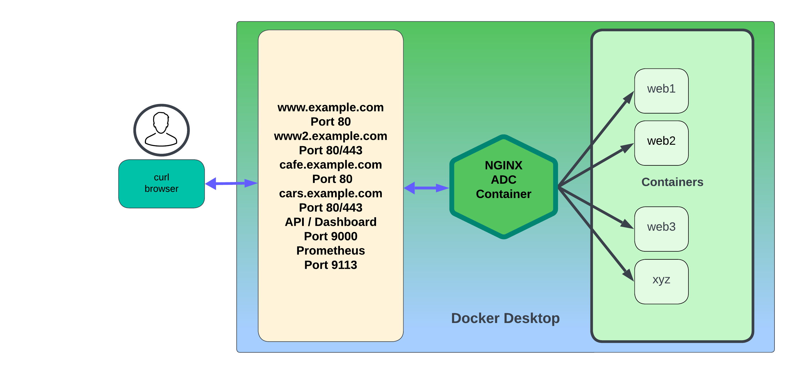

# NGINX Basics Workshop

## Welcome to the NGINX OSS and Plus Basics Workshop

<br/>

This Workshop will introduce `NGINX Webserver and Reverse Proxy` with hands-on practice through self-paced lab exercises.

You will learn about `NGINX` Opensource Software (OSS) and `NGINX Plus`, the Commerical version of NGINX, with no prior experience required.  The lab exercises provided will teach you by example how to install, configure, test, operate, troubleshoot, and fix NGINX; using common commands, tools, and applications.  There are dozens of use cases for NGINX, this Basics Workshop will focus on the most common ones for new users and deployments.  This Workshop content is designed to run in almost any environment that can host Docker and Linux containers, for broad appeal and consumption by users.

You will learn how to configure NGINX Webserver, deploy it with Docker, configure basic and some advanced NGINX features, loadtest it, and monitor it in realtime. You will deploy new apps and services, terminate SSL, route HTTP traffic, configure redirects, set up healthchecks, and load balance traffic to running servers.  You will add some Security features, follow Best Practices, and become proficient with basic NGINX configurations.  These Hands-On Lab Exercises are designed to be independent, with later labs adding additional services and features as you progress through them. Completing the labs in sequential order is highly recommended.

By the end of this Workshop, you will have a working, operational NGINX OSS or Plus Docker environment, routing traffic to and from backend web application servers, with the necessary skills to deploy and operate NGINX for your own Modern Applications. Thank You for taking the time to attend this NGINXpert Workshop!


## Goals

- Overview of NGINX History and Architecture
- How to build and setup NGINX OSS and NGINX Plus on Docker
- How to configure NGINX for basic web server functions
- How to configure NGINX for Proxy functions
- How to monitor, log, troubleshoot, and fix common issues
- Provide examples of NGINX configurations best practices
- Provide an overview of NGINX Plus
- Introduction to third party integrations like Prometheus and Grafana
- Introduction to more Advanced Topics

## Prerequisites

To successfully complete the Hands On exercises for this Workshop, there are both knowledge and technical requirements.

### Knowledge Requirements

- You should be familiar with the Linux command line, copying, editing, and saving files.
- You should be familiar with TCP, HTTP, SSL, and basic networking concepts.
- You should be familiar with basic Docker and container commands and concepts.
- You should be familiar with Computer Desktop apps like Chrome, Visual Studio Code, Postman, Terminal.
- Optional, you should be familiar with load balancing concepts and terminology.

### Technical Requirements

The Hands On lab exercises are written for users with a host running multiple Docker containers.  These containers are quite small, and should all run easily on most modern computer hardware.  You will need to provide the following components, prior to starting the exercises:

1. A Docker host, with [Docker](https://docs.docker.com/get-docker/) and [Docker Compose](https://docs.docker.com/compose/install/) installed and running.

2. Admin access to your local computer to install and run various software packages.  See the  [OSS prerequisites.md](OSS/labs/lab0/prerequisites.md) file, or [Plus prerequisites.md](Plus/labs/lab0/prerequisites.md) file in the `lab0 folder` for details on setting up your computer for this Workshop.

3. Admin access to your local `/etc/hosts` file is also needed. The lab uses the FQDN hostnames: `www.example.com`,`www2.example.com`,`cars.example.com`,`cafe.example.com`. For hostname resolution you will need to add these hostnames to your local DNS hosts file.

   For example, on Linux/macOS the host file is located at `/etc/hosts`:

   ```bash
    # NGINX OSS/Plus Basics lab hostnames (local docker hosts)
    127.0.0.1 example.com www.example.com www2.example.com cars.example.com cafe.example.com

   ```

     > **Note on Docker DNS:**
     >
     > DNS resolution between containers is provided by default using the bridged network by docker networking, and NGINX has been pre-configured to use the Docker internal DNS server (127.0.0.11) to provide DNS resolution between the containers.  Your Docker environment may be different.

4. An NGINX Plus subscription or Trial license will be required to complete the NGINX PLUS lab exercises. You can request a free 30-day Trial from [NGINX Plus Trial](https://www.f5.com/trials/free-trial-nginx-plus-and-nginx-app-protect).  An email with download links to the license files will normally arrive within a few hours of submitting a request.

### How to use the Lab Guides

To ensure understanding of every step, take the time to read and understand what each line is doing in the Docker and Nginx files, they are there for a reason.  If you do not understand it, ask questions, use Google, ask your instructor.  It is highly recommended that you type ALL the commands yourself, to facilitate better understanding and retention of this content.  (Insert Mavin typing memory retention study results here).

## The Workshop environment

1. This Workshop is built to only require the user's computer, no servers or VMs are needed.

1. The user's computer, which will host all the Docker containers, and provide a Desktop UI for using various apps, like Chrome, Visual Studio Code, Postman, Terminal.

1. See [OSS prerequisites.md](OSS/labs/lab0/prerequisites.md) file within`labs/lab0` folder, or the [Plus prerequisites.md](Plus/labs/lab0/prerequisites.md) file within`labs/lab0` folder for details on installing the required software for your platform.  You will likely need full administrative privleges to properly install and configure the software.

1. As you progress through the lab exercises, you will be adding more containers, and more features and options to NGINX.  **It is important that you complete the lab exercises in the order presented in this Workshop, so that you can see and learn how to configure NGINX properly, and complete all exercises successfully.**

   >**For Nginx Plus labs, you must start at Lab1, as the Nginx Plus container is built in Lab1, and re-used for the additional labs.**

1. The docker containers used are as follows:
   - NGINX Opensource ADC/load balancer, named `nginx-oss`
   - NGINX Plus ADC/load balancer, named `nginx-plus`
   - Web servers #1, 2, and 3; named `web1`, `web2` and `web3` respectively.
   - Prometheus and Grafana, named as such.

1. Further details of the docker containers:

   - **NGINX OSS** `(Latest)` based on Alpine Linux.
   - **NGINX Plus** `(Latest)` based on Debian Linux.
   - **NGINX Web#** `(Latest)` is based on
   [**nginxinc/ingress-demo**](https://hub.docker.com/r/nginxinc/ingress-demo).

     (NGINX web servers that serve simple HTML pages containing the Hostname, IP address and port, request URI, local time, request id, and other metadata.)

1. **Lab Summary page** can be read with a web browser starting at [OSS labs/readme.md](OSS/labs/readme.md) or [Plus labs/readme.md](Plus/labs/readme.md).

>NOTE:  All the container images are built on your computer, so they will be available `after` the Workshop, so you can use them for further learning, testing and as reference material. All the documentation and sample config files, including the Lab Guides, will also be available on NGINX's `GitHub` repo.  As you make changes to your config files, you will need to make copies or back them up yourself.

### Topology

This is the workshop Docker environment for the lab exercises:



<br/>

## Build and run the Workshop environment

Please make sure all the Prerequisites have been met before running the steps below.

### Build the Lab containers at the beginning of each LabX.

As outlined above, you will have one NGINX OSS or NGINX Plus ADC/load balancer (`nginx-oss`or`nginx-plus`) and three NGINX OSS webservers (`web1`, `web2` and `web3`), and a Prometheus and a Grafana container.

If using the NGINX Plus ADC/load balancer, `before` you start the build, you need to copy your NGINX Plus repo key and certificate files (`nginx-repo.key` and `nginx-repo.crt` and `nginx-repo.jwt`) into the proper directory,  `nginx-plus/etc/ssl/nginx/`.  Docker Compose will use these files to download the appropriate NGINX Plus files, then build your stack:

```bash
# Enter working directory (Replace lab x with the lab that you plan to run) 
$> cd nginx-basics/labs/[lab x]

# *Next check only applicable for NGINX Plus related labs
# Make sure your Nginx Plus repo key and certificate exist here
$> ls nginx-plus/etc/ssl/nginx/nginx-*
nginx-repo.crt nginx-repo.key nginx-repo.jwt

# Downloaded docker images and build
$> docker-compose pull
$> docker-compose build --no-cache

```

-----------------------
> See other other useful [`docker`](Plus/labs/useful-docker-commands.md) and
> [`docker-compose`](Plus/labs/useful-docker-compose-commands.md) commands.

-----------------------

#### Start the Demo stack

Change to the labX folder, and run `docker-compose` in the foreground so you can see real-time log output to the terminal:

```bash
$> docker-compose up

```

Or, if you made changes to any of the Docker containers or NGINX configurations, run:

```bash
# Recreate containers and start demo
$> docker-compose up --force-recreate

```

**Confirm** all the containers are running by executing below command.

```bash
$> docker ps

```

For NGINX Plus related labs, you can access the NGINX Dashboard or API on **HTTP / Port 9000**
([`http://localhost:9000`](http://localhost:9000))

**This completes the Introduction.**

<br/>

## References

- [NGINX Plus](https://docs.nginx.com/nginx/)
- [NGINX Admin Guide](https://docs.nginx.com/nginx/admin-guide/)
- [NGINX Technical Specs](https://docs.nginx.com/nginx/technical-specs/)
- [NGINX Resources](https://www.nginx.com/resources/)
- [NGINX Blogs](https://www.nginx.com/blog/)
- [Docker](https://www.docker.com/)
- [Docker Compose](https://docs.docker.com/compose/)

<br/>

### Authors

- Chris Akker - Solutions Architect - Modern Apps Team @ F5, Inc.
- Shouvik Dutta - Solutions Architect - Modern Apps Team @ F5, Inc.
- Adam Currier - Solutions Architect - Modern Apps Team @ F5, Inc.

-----------------------

Click either lab summary Readme to get started ([OSS labs](OSS/labs/readme.md) or [Plus labs](Plus/labs/readme.md)).
