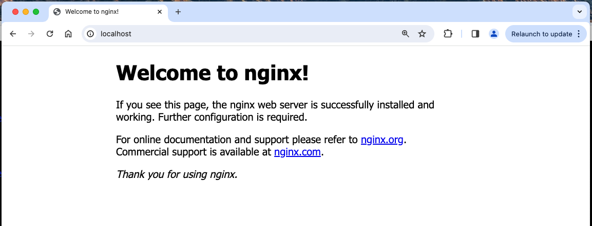

# Installing NGINX on Docker

## Introduction

In this lab, you will build and run NGINX OSS and Plus in Docker containers.  Then you will run an NGINX demo web server.  After all are running, you will verify that all containers, web servers, and NGINX are up and running.  All of these NGINX containers will be used during the rest of this Workshop to complete the remaining Lab Exercises.  It is important to build this Workshop correctly to receive the most benefit from the labs.

## Learning Objectives 

By the end of the lab you will be able to: 
 * Build an `NGINX Opensource Docker` image
 * Run this NGINX OSS image
 * Run demo NGINX web containers
 * Verify initial container build and NGINX tests

## Pre-Requisites

- You must have Docker installed and running
- You must have Docker-compose installed
- See `Lab0` for instructions on setting up your system for this Workshop

## Build and Run NGINX OSS with Docker

1. Clone the NGINX Docker repo.  This will download all the files needed to build and run NGINX OSS as a Docker container:

    ```bash
    sudo su -
    mkdir basics
    cd basics
    git clone https://github.com/nginxinc/docker-nginx.git

    ```

1. Edit the Dockerfile to add some common Linux tools to the Docker image, to make it easier to see/edit and test various NGINX features:

    ```bash
    cd docker-nginx
    cd mainline
    cd alpine
    vi Dockerfile
    ```

    Add the following block below the ENV variables:

    ```bash
    # install tools
    RUN apk update && \
    apk upgrade && \
    apk add bash bash-completion curl jq wget vim    # added tools 

    ```

1. Build the OSS NGINX Docker image

    ```bash
    docker build --no-cache -t nginx:alpine_v1.0 .

    ```

1. List the Docker images

    ```bash
    docker images
    ```

    ```bash
    #Sample output

    REPOSITORY          TAG                 IMAGE ID            CREATED             SIZE
    nginx               alpine_v1.0         b5a01460bac3        2 hours ago         50.8MB
    alpine              3.9                 055936d39205        5 weeks ago         5.53MB

    ```

1. Run the NGINX OSS container

    ```bash
    docker run --name nginxoss -d -p 80:80 nginx:alpine_v1.0

    ```

1. Verify it is running

    ```bash
    docker ps -a

    ```

    ```bash
    #Sample output
    CONTAINER ID        IMAGE               COMMAND                  CREATED             STATUS              PORTS                NAMES
    41ec967f9f9f        nginx:alpine_v1.0        "nginx -g 'daemon of..."   20 seconds ago      Up 19 seconds       0.0.0.0:80->80/tcp   nginxoss

    ```

1. Test the NGINX container for the default webpage

    ```bash
    curl -I http://localhost

    ```

    ```bash
    #Sample output

    HTTP/1.1 200 OK
    Server: nginx/1.17.0
    Date: Tue, 25 Dec 2024 18:17:17 GMT
    Content-Type: text/html
    Content-Length: 612
    Last-Modified: Tue, 21 May 2019 15:33:12 GMT
    Connection: keep-alive
    ETag: "5ce41a38-264"
    Accept-Ranges: bytes

    ```

1. Test NGINX container with a browser

    Launch your browser, go to http://localhost

    You should see the default NGINX Welcome web page.

    

1. Test access to NGINX container with Docker Exec

    ```bash
    docker exec -it <CONTAINER ID> /bin/bash

    ```

1. Run some commands inside the NGINX Container

    ```bash
    # Look around the nginx folders
    ls -l /etc/nginx

    ls -l /etc/nginx/.conf

    # Check for nginx packages installed
    apk info -vv |grep nginx

    # What nginx processes are running?
    ps aux |grep nginx

    # Check Linux TOP for resource usage
    top -n 1

    # Which TCP Ports are being used by NGINX ?
    netstat -alpn

    ```

    ```bash
    #Sample outputs

    #apk

    nginx-1.17.0-r1 - High performance web server
    nginx-module-geoip-1.17.0-r1 - nginx GeoIP dynamic modules
    nginx-module-image-filter-1.17.0-r1 - nginx image filter dynamic module
    nginx-module-njs-1.17.0.0.3.2-r1 - nginx njs dynamic modules
    nginx-module-xslt-1.17.0-r1 - nginx xslt dynamic module

    #ps

    1 root      0:00 nginx: master process nginx -g daemon off;
    6 nginx     0:00 nginx: worker process
    13 root      0:00 grep nginx

    #top

    Mem: 808920K used, 205464K free, 3396K shrd, 53072K buff, 513860K cached
    CPU:   0% usr   0% sys   0% nic 100% idle   0% io   0% irq   0% sirq
    Load average: 0.00 0.00 0.00 2/187 30
    PID  PPID USER     STAT   VSZ %VSZ CPU %CPU COMMAND
    23     1 nginx    S     6460   1%   0   0% nginx: worker process
    1     0 root     S     6104   1%   0   0% nginx: master process nginx -g daemon off;
    7     0 root     S     2308   0%   0   0% /bin/bash
    30     7 root     R     1528   0%   0   0% top -n 1

    #netstat

    Active Internet connections (servers and established)
    Proto Recv-Q Send-Q Local Address           Foreign Address         State       PID/Program name    
    tcp        0      0 0.0.0.0:80              0.0.0.0:*               LISTEN      1/nginx: master pro
    Active UNIX domain sockets (servers and established)
    Proto RefCnt Flags       Type       State         I-Node PID/Program name    Path
    unix  3      [ ]         STREAM     CONNECTED      97546 1/nginx: master pro
    unix  3      [ ]         STREAM     CONNECTED      97545 1/nginx: master pro

    ```

    - Ask NGINX for help

    ```bash
    /usr/sbin/nginx -h

    ```
    ```bash
    #Sample output
    nginx version: nginx/1.17.0
    Usage: nginx [-?hvVtTq] [-s signal] [-c filename] [-p prefix] [-g directives]

    Options:
    -?,-h         : this help
    -v            : show version and exit
    -V            : show version and configure options then exit
    -t            : test configuration and exit
    -T            : test configuration, dump it and exit
    -q            : suppress non-error messages during configuration testing
    -s signal     : send signal to a master process: stop, quit, reopen, reload
    -p prefix     : set prefix path (default: /etc/nginx/)
    -c filename   : set configuration file (default: /etc/nginx/nginx.conf)
    -g directives : set global directives out of configuration file

    ```

    - Verify what version of NGINX is running

    ```bash
    /usr/sbin/nginx -V

    ```

    ```bash
    #Sample output
    nginx version: nginx/1.17.0
    built by gcc 8.2.0 (Alpine 8.2.0)
    built with OpenSSL 1.1.1b  26 Feb 2019
    TLS SNI support enabled
    configure arguments: --prefix=/etc/nginx --sbin-path=/usr/sbin/nginx --modules-path=/usr/lib/nginx/modules --conf-path=/etc/nginx/nginx.conf --error-log-path=/var/log/nginx/error.log --http-log-path=/var/log/nginx/access.log --pid-path=/var/run/nginx.pid --lock-path=/var/run/nginx.lock --http-client-body-temp-path=/var/cache/nginx/client_temp --http-proxy-temp-path=/var/cache/nginx/proxy_temp --http-fastcgi-temp-path=/var/cache/nginx/fastcgi_temp --http-uwsgi-temp-path=/var/cache/nginx/uwsgi_temp --http-scgi-temp-path=/var/cache/nginx/scgi_temp --with-perl_modules_path=/usr/lib/perl5/vendor_perl --user=nginx --group=nginx --with-compat --with-file-aio --with-threads --with-http_addition_module --with-http_auth_request_module --with-http_dav_module --with-http_flv_module --with-http_gunzip_module --with-http_gzip_static_module --with-http_mp4_module --with-http_random_index_module --with-http_realip_module --with-http_secure_link_module --with-http_slice_module --with-http_ssl_module --with-http_stub_status_module --with-http_sub_module --with-http_v2_module --with-mail --with-mail_ssl_module --with-stream --with-stream_realip_module --with-stream_ssl_module --with-stream_ssl_preread_module --with-cc-opt='-Os -fomit-frame-pointer' --with-ld-opt=-Wl,--as-needed

    ```

1. Test the current NGINX configuration

    ```bash
    /usr/sbin/nginx -t

    ```

    ```bash
    #Sample output
    nginx: the configuration file /etc/nginx/nginx.conf syntax is ok
    nginx: configuration file /etc/nginx/nginx.conf test is successful

    ```

1. Display the entire NGINX configuration, includes all files

    ```bash
    more /usr/sbin/nginx -T

    ```

1. When you are done looking around, Exit the container.

    ```bash
    exit

    ```

1. Check the logs for the NGINX container

    ```bash
    docker logs <CONTAINER ID>

    ```

    ```bash
    #Sample output
    172.17.0.1 - - [18/Jun/2019:18:41:32 +0000] "GET / HTTP/1.1" 200 612 "-" "curl/7.47.0" "-"
    172.17.0.1 - - [18/Jun/2019:18:41:45 +0000] "HEAD / HTTP/1.1" 200 0 "-" "curl/7.47.0" "-"
    35.240.46.11 - - [18/Jun/2019:18:46:13 +0000] "GET / HTTP/1.1" 200 612 "-" "Mozilla/5.0 zgrab/0.x" "-"
    127.0.0.1 - - [18/Jun/2019:19:07:12 +0000] "GET / HTTP/1.1" 200 612 "-" "curl/7.64.0" "-"
    127.0.0.1 - - [18/Jun/2019:19:07:16 +0000] "HEAD / HTTP/1.1" 200 0 "-" "curl/7.64.0" "-"

    ```

**Congratulations, you are now a member of Team NGINX !**
 

## Test and Verify all containers and NGINX

1.
2.
3.
4.


**This completes this Lab.**

<br/>

## References:

- [NGINX Plus](https://docs.nginx.com/nginx/)
- [NGINX Admin Guide](https://docs.nginx.com/nginx/admin-guide/)
- [NGINX Technical Specs](https://docs.nginx.com/nginx/technical-specs/)
- [Docker](https://www.docker.com/)
- [Docker Compose](https://docs.docker.com/compose/)

<br/>

### Authors
- Chris Akker - Solutions Architect - Community and Alliances @ F5, Inc.
- Shouvik Dutta - Solutions Architect - Community and Alliances @ F5, Inc.
- Kevin Jones - Technical Evanglist - Community and Alliances @ F5, Inc.

-------------

Navigate to ([Lab2](../lab2/readme.md) | [Main Menu](../LabGuide.md))
