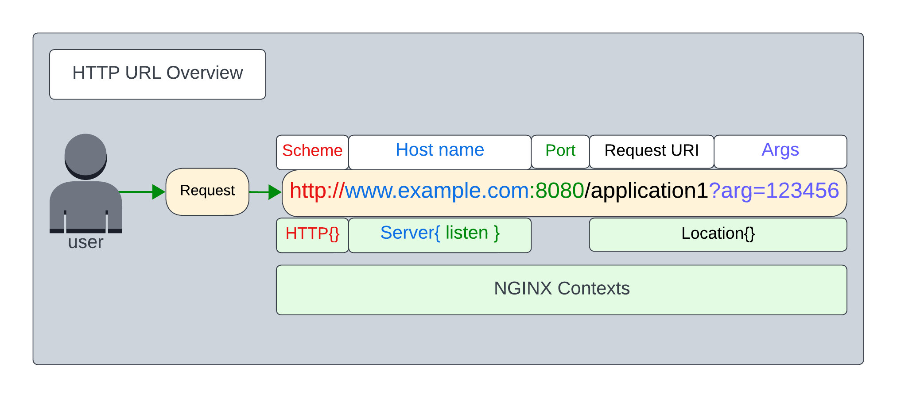

# Introduction to NGINX Web Server

## Introduction

In this lab, NGINX as a web server will be introduced, basic web and content serving concepts will be covered.  A quick review of HTTP and URLs is presented, as your NGINX configurations will follow these HTTP principles.

## Learning Objectives 

By the end of the lab you will be able to: 
* Describe NGINX web server operations
* Have a basic understanding of HTTP Requests and URLs
* Create NGINX configurations for basic web content
* Create and edit simple NGINX configs following best practices
* Be proficient with NGINX logging files, formats, variables

## Prerequisites

You will use the `nginx-oss` Docker container from Lab1, start the container if needed:

```bash
docker-compose up

```

Verify it is running, get the Container ID:

```bash
docker ps -a

```

Log into the container, and run some NGINX commands:

```bash
docker exec -it < nginx-oss Container ID > /bin/bash

```

### NGINX Commands

```bash

#displays NGINX version detauls
$ nginx -v

#graceful shutdown
$ nginx -s quit

#terminates all NGINX processes
$ nginx -s stop

#configuration syntax and file test
$ nginx -t

#dumps the current running configurations
$ nginx -T

#reloads configurations
$ nginx -s reload

#start nginx
$ systemctl start nginx

```

### NGINX Reloads

What does NGINX do, when you change the configuration and request a reload?  At a high level, this is what happens:

- The `nginx -s reload` command sends a SIGHUP signal to the Linux Kernel.
- The master process reads all the config files, and validates the syntax, configuration commands, variables, and many other dependencies.  It also validates that any dependent Linux system level objects are correct, like folder/file names and paths, file permissions, networking objects like IP addresses, sockets, etc.  If there are any errors, it prints out the configuration filename and the line number where the error exists, and some helpful information, like "path /cahce not found" (you have a typo: /cahce should be spelled /cache).  The validation STOPS on the first error encountered.  So you must address the error, and run `nginx -t` again to further check for errors.
- Once the master process configuration validation is successful, then NGINX will do the following:
1. With NGINX OSS, the Worker processes are immediately shutdown, along with all existing TCP connections.  The master process then spawns new Worker processes, and they begin handling new connections and traffic based on the new configuration.  Any traffic in flight is dropped.
2. With NGINX Plus, new Worker processes are created, and begin using the new configuration immediately for all new connections and requests.  The old Workers are allowed to complete their previous task, and then close their TCP connections naturally, traffic in flight is not dropped!  The master process terminates the old Workers after they close all their connections.  This is called Dynamic Reconfiguration in NGINX Plus documentation.
- The nginx master process writes log information about the reload to the error.log so you can see what happened when.

< NGINX start, stop, reload while watching the error.log lab exercises here - top, ps aux, etc >


### NGINX Configuration - Contexts, Includes, Directives, Blocks

- Contexts
- Includes
- Directives
- Blocks

`Contexts` refer to which SECTION of the NGINX configuration you are working with.

`Includes` refer to additional files that NGINX should use for configuration.

`Directives` refer to NGINX configurations consisting of 2 types:

- Simple directives - these are single line commands with some parameters that end in a semi-colon;

- Block directives - these are multiple line commands, with an opening and closing curly brace **`{}`**.   A block directive will contain single line directives, and also can contain other block directives, called nested blocks.

Let's take a look at some examples, using the default `nginx.conf` that comes installed with NGINX.

Inspect the nginx.conf file, here are some explanations:

```nginx
# This is the "main" NGINX context, where NGINX gets its start up parameters
# Notice main does NOT have curly braces {} !
#

user  nginx;                               #Linux user
worker_processes  auto;                    #Number of Workers

error_log  /var/log/nginx/error.log warn;  #set NGINX error log path and name and level
pid        /var/run/nginx.pid;             #set NGINX master process PID file

```

```nginx
# This is the block and context called "events"
# Configures NGINX Workers and other core parameters
#

events {                                   
    worker_connections  1024;              #each Worker should handle 1024 connections
}

```

```nginx
# This is the "http" context, used for all http configurations
# Notice both "include" commands, which tells NGINX to use these files
#

http {
    include       /etc/nginx/mime.types;
    default_type  application/octet-stream;

    # Set the access logging format
    log_format  main  '$remote_addr - $remote_user [$time_local] "$request" '
                      '$status $body_bytes_sent "$http_referer" '
                      '"$http_user_agent" "$http_x_forwarded_for"';

    # Set the path and name and format for the access log
    access_log  /var/log/nginx/access.log  main;

    sendfile        on;

    keepalive_timeout  65;

    # Use all .conf files located in the in /etc/nginx/conf.d folder
    include /etc/nginx/conf.d/*.conf;  

}

```

```nginx
# This is a "server" and "location" block, used for creating the http virtual server
# And creating the URL paths 
#
# NOTICE:  the location blocks are nested within the server block
#

server {
    listen       80;                  # TCP port to listen on
    server_name  localhost;           # HTTP hostname matching

    access_log  /var/log/nginx/localhost.access.log  main;    # Notice the custom filename

    location / {                         # URL to look for "/", the base
        root   /usr/share/nginx/html;    # folder for content to be served
        index  index.html index.htm;     # default html page to use
    }

    location /images/ {                   # URL path for "/images" 
        root   /data;                     # folder for images
    }
)

```


In general, the contexts and blocks are in a logical hierarchy that follows the construction of an HTTP URL, as follows.

- main and events > nginx start up parameters
- http > high level http parameters - logging, data types, timers, include files
- server > virtual server parameters - listen port, hostname, access log, include files
- location > URL path, object type

http://www.example.com:8080/images/smile.png

schema://hostname:port/path/file.type


### NGINX Linux File Structure

The hierarchy of these contexts also maps to the folders/files layout on disk. This is how the folders and files are laid out for these lab exercises, following NGINX guidelines and best practices.

```
< /etc/nginx tee here >

```

### HTTP URL Review

In order to understand how NGINX works as web server, a basic understanding of the HTTP protocol, and how URLS work is neccessary.  This is not a lab on HTTP, but the principle objects and definitions are breifly reviewed here as they relate to NGINX.  You will find a link to more information on HTTP in the References section.

So what is a URL??  URL stands for `Uniform Resource Location` - an Internet standard that describes a web object that is globally unique.



Every URL consists of 4 or 5 distinct fields.

Given:   http://www.example.com/app1?arg=23972df

Scheme  | Hostname        | URI    | Argument
:------:|:--------:|:--------:|:--------:
http:// | www.example.com | /app1 | ?arg=23972df

>If the TCP port used by the webserver is `not` 80 or 443, it must be included in the URL request, like this example using port 8443:

Given:  https://www.example.com:8443/app1?arg=23972df

Scheme  | Hostname        | Port  | URI    | Argument
:------:|:--------:|:--------:|:--------:|:--------:
https:// | www.example.com | :8443 | /app1 | ?arg=23972df

In the examples above: 
- the Scheme is the protocol to use, usually either `HTTP` or `HTTPS`.  It must be followed by a colon, and two forward slashs.
- The Hostname is a fully qualified DNS name, often with a subdomain like `www` in this example.  It must contain the root level Domain name.  It must follow DNS standards based naming conventions.
- The Port is only required, if you are not using Port 80 for HTTP, or Port 443 for HTTPS.  The Hostname and Port must be separated by a colon `:`. These are the two standard ports used by all modern browsers, and does not appear in the URL if using the standard port 80 or 443.
- The URI, `Uniform Resource Identifier`, is often called the `path`, because it often refers to a matching folder name on the web server's disk system.  It must start with a forward slash `/`, just like a Linux folder does.
- The Argument, is an optional extension of the URI, and adds additional information the web server needs to understand the request properly.  It must start with a question mark, and each argument has a unique name followed by an equal sign. Multiple arguments are allowed, each separated by another question mark `?`.

As you configure NGINX, you will see that it uses these HTTP standards and definitions to determine how to handle incoming requests, where to route them, and how to respond correctly.

Now you can configure the NGINX contexts to handle an HTTP request properly.  Let's overly the NGINX configuration contexts with the example URL.

Given:   http://www.example.com/app1

Scheme  | Hostname        | URI    
:------:|:--------:|:--------:
http:// | www.example.com | /app1

Would require the following NGINX configuration Contexts:

URL Field | Context
:--------:|:---------------:
scheme  | http{}
hostname | server{}
URI | location{}


```nginx
# Note:  the use of indenting the nested contexts makes it easy to read
#
http {

  server {
    listen 80;
    server_name www.example.com;
    
      location /app1 {
      try_files $uri $uri/;
      }
   }
}

```


### NGINX static web content

Now that you have a basic understanding of the NGINX binary, contexts, and configuration files, let's configure NGINX as a web server following HTTP standards.  You will configure some HTML pages, and create NGINX configs to serve some content based on the URL in the HTTP request.


**This completes this Lab.**

<br/>

## References:

- [NGINX Beginner's Guide](https://nginx.org/en/docs/beginners_guide.html)
- [NGINX OSS](https://nginx.org/en/docs/)
- [NGINX Admin Guide](https://docs.nginx.com/nginx/admin-guide/)
- [HTTP URL Overview](https://en.wikipedia.org/wiki/URL)
- [NGINX on Floppy disk](https://www.youtube.com/watch?v=IjjiTD-1Cvg)


<br/>

### Authors
- Chris Akker - Solutions Architect - Community and Alliances @ F5, Inc.
- Shouvik Dutta - Solutions Architect - Community and Alliances @ F5, Inc.

-------------

Navigate to ([Lab3](../lab3/readme.md) | [Main Menu](../LabGuide.md))
