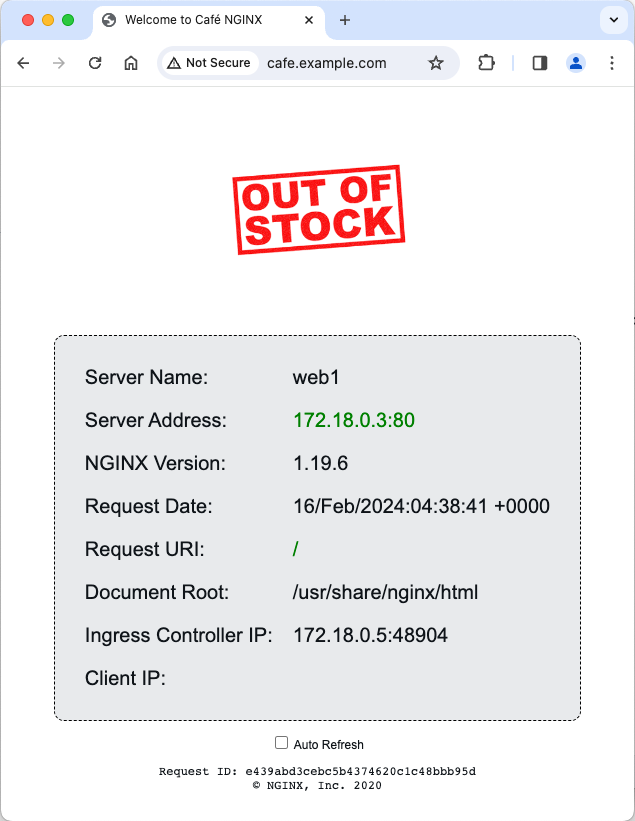
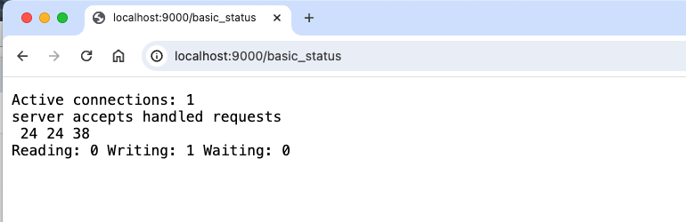

# NGINX Reverse Proxy and Load Balancing

## Introduction

In this lab, you will build a test lab environment using NGINX and Docker.  This will require that you build and run NGINX Opensource as a `Reverse Proxy Load Balancer` in a Docker container.  Then you will run several NGINX demo web servers.  After all the containers are running, you will test and verify each container, the NGINX Proxy and the web servers.  All of these NGINX containers will be used as a learning platform for this Workshop to complete the remaining Lab Exercises.  It is important to build and run these NGINX containers correctly to complete the exercises and receive the most benefit from the Workshop.

NGINX OSS | Docker
:-------------------------:|:-------------------------:
  |
  
## Learning Objectives 

By the end of the lab you will be able to: 
 * Build an `NGINX Opensource Docker` image
 * Build your Workshop enviroment with Docker Compose
 * Run the NGINX OSS image
 * Verify initial container build and NGINX tests
 * Review the History and Architectrure of NGINX

## Pre-Requisites

- You must have Docker installed and running
- You must have Docker-compose installed
- See `Lab0` for instructions on setting up your system for this Workshop
- Familiarity with basic Linux commands and commandline tools
- Familiarity with basic Docker concepts and commands
- Familiarity with basic HTTP protocol

## Build the Workshop Environment with Docker Compose

For this lab you will build/run 4 Docker containers.  The first one will be used as an NGINX-OSS reverse proxy, and other 3 will be used for upstream backend web servers.

< diagram needed here >

### Build and Run NGINX OSS with Docker

1. Inspect the Dockerfile, located in the `/lab4/nginx-oss folder`.  Notice the `FROM` directive uses the NGINX Alpine base image, and also the `RUN apk add` command, which installs additional tool libraries to the image.  These tools are needed for copy/edit of files, and to run various tests while using the container in the exercises.

```bash
FROM nginx:mainline-alpine                                                     # use the Alpine base image
RUN apk add --no-cache curl ca-certificates bash bash-completion jq wget vim   # Add common tools

```

1. Inspect the `docker-compose.yml` file, located in the /lab4 folder.  Notice you are building the NGINX-OSS web and Proxy container, (using the modified `/nginx-oss/Dockerfile` from the previous step).  

    ```bash
    ...
    nginx-oss:                  # NGINX OSS Web / Load Balancer
        hostname: nginx-oss
        build: nginx-oss        # Build new container, using /nginx-oss/Dockerfile
        links:
        - web1:web1
        - web2:web2
        - web3:web3
        volumes:
            - ./nginx-oss/etc/nginx/conf.d:/etc/nginx/conf.d   # Copy these folders to container
            - ./nginx-oss/etc/nginx/includes:/etc/nginx/includes
            - ./nginx-oss/etc/nginx/nginx.conf:/etc/nginx/nginx.conf
        ports:
            - 9000:9000        # Open for stub status page
            - 80:80            # Open for HTTP
            - 443:443          # Open for HTTPS
        restart: always

    ```

    Also in the `docker-compose.yml` you are running three Docker NGINX webserver containers, using an image from Docker Hub.  These will be your upstream, backend webservers for the exercises.

    ```bash
    ...
    web1:
        hostname: web1
        image: nginxinc/ingress-demo       # Image from Docker Hub
        ports:
            - "80"                           # Open for HTTP
            - "443"                          # Open for HTTPS
    web2:
        hostname: web2
        image: nginxinc/ingress-demo
        ports:
            - "80"
            - "433"
    web3:
        hostname: web3
        image: nginxinc/ingress-demo
        ports:
            - "80"
            - "443"   

    ```

1. Verify all four containers are running:

    ```bash
    docker ps -a

    ```

    ```bash
    #Sample output

    CONTAINER ID   IMAGE                   COMMAND                  CREATED          STATUS          PORTS                                                              NAMES
    28df738bd4bb   lab1-nginx-oss          "/docker-entrypoint.…"   34 minutes ago   Up 34 minutes   0.0.0.0:80->80/tcp, 0.0.0.0:443->443/tcp, 0.0.0.0:9000->9000/tcp   lab1-nginx-oss-1
    49c0ffe31abf   nginxinc/ingress-demo   "/docker-entrypoint.…"   34 minutes ago   Up 34 minutes   0.0.0.0:56906->80/tcp, 0.0.0.0:56907->443/tcp                      lab1-web1-1
    f600f082cae3   nginxinc/ingress-demo   "/docker-entrypoint.…"   34 minutes ago   Up 34 minutes   0.0.0.0:56902->80/tcp, 0.0.0.0:56903->443/tcp                      lab1-web3-1
    642129dd20fc   nginxinc/ingress-demo   "/docker-entrypoint.…"   34 minutes ago   Up 34 minutes   443/tcp, 0.0.0.0:56905->80/tcp, 0.0.0.0:56904->433/tcp             lab1-web2-1

    ```

    >> < **ISSUE - we don't have a default.conf, so the Nginx Welcome page is missing on nginx-oss image**  Or do we test the nginx-oss image with Welcome first, then add the backends and test a second time in Proxy mode ? >


1. Test the NGINX load balancing to the containers for the default webpage, run this command at least 3 times:

    ```bash
    curl -is http://localhost |grep Server

    ```

    ```bash
    #Sample output

      Server: nginx/1.25.3
      <p class="smaller"><span>Server Name:</span> <span>web1</span></p>
      <p class="smaller"><span>Server Address:</span> <span><font color="green">172.28.0.4:80</font></span></p>

      Server: nginx/1.25.3
      <p class="smaller"><span>Server Name:</span> <span>web2</span></p>
      <p class="smaller"><span>Server Address:</span> <span><font color="green">172.28.0.3:80</font></span></p>

      Server: nginx/1.25.3
      <p class="smaller"><span>Server Name:</span> <span>web3</span></p>
      <p class="smaller"><span>Server Address:</span> <span><font color="green">172.28.0.2:80</font></span></p>

    ```

    You should see `Server Names` like `web1`, `web2`, and `web3` as NGINX load balances all three backends - your NGINX-OSS is now a Reverse Proxy, and load balancing traffic to 3 web containers! Notice the `Server Address`, with the IP address of each upstream container.  Note:  Your IP addresses will likely be different.

1. Test again, this time using a browser, click `Refresh` at least 3 times:

    Launch your browser, go to http://localhost

    You should see the Welcome to nginx page, or the `Out of Stock` web page.

    < new screenshot needed here >
    
    

    or

    NGINX Web1 | NGINX Web2 | NGINX Web3 
    :-------------------------:|:-------------------------:|:-------------------------:
      | | 

1. Test access to the `NGINX stub status` page.  This page provides basic metrics for NGINX TCP connections and HTTP requests.

    ```bash
    curl http://localhost:9000/basic_status

    ```

    ```bash
    #Sample Output

    Active connections: 1
    server accepts handled requests
    23 23 37
    Reading: 0 Writing: 1 Waiting: 0

    ```

    Try it in a browser, copy/paste the previous URL:
    
    

1. NGINX under the Hood.  Log into the NGINX-OSS container with Docker Exec:

    ```bash
    docker exec -it <nginx-oss CONTAINER ID> /bin/bash

    ```

1. Run some commands inside the NGINX-OSS Container:

    ```bash
    # Look around the nginx folders
    ls -l /etc/nginx

    ls -l /etc/nginx/.conf

    # Check for nginx packages installed
    apk info -vv |grep nginx

    # What nginx processes are running?
    ps aux |grep nginx

    # Check Linux TOP for resource usage
    top -n 1

    # Which TCP Ports are being used by NGINX ?
    netstat -alpn

    ```

    ```bash
    #Sample outputs

    #apk

    nginx-1.25.3-r1 - High performance web server
    nginx-module-geoip-1.25.3-r1 - nginx GeoIP dynamic modules
    nginx-module-image-filter-1.25.3-r1 - nginx image filter dynamic module
    nginx-module-njs-1.25.3.0.8.2-r1 - nginx njs dynamic modules
    nginx-module-xslt-1.25.3-r1 - nginx xslt dynamic module

    #ps

    1 root      0:00 nginx: master process nginx -g daemon off;
    6 nginx     0:00 nginx: worker process
    13 root      0:00 grep nginx

    #top

    Mem: 808920K used, 205464K free, 3396K shrd, 53072K buff, 513860K cached
    CPU:   0% usr   0% sys   0% nic 100% idle   0% io   0% irq   0% sirq
    Load average: 0.00 0.00 0.00 2/187 30
    PID  PPID USER     STAT   VSZ %VSZ CPU %CPU COMMAND
    23     1 nginx    S     6460   1%   0   0% nginx: worker process
    1     0 root     S     6104   1%   0   0% nginx: master process nginx -g daemon off;
    7     0 root     S     2308   0%   0   0% /bin/bash
    30     7 root     R     1528   0%   0   0% top -n 1

    #netstat

    Active Internet connections (servers and established)
    Proto Recv-Q Send-Q Local Address           Foreign Address         State       PID/Program name    
    tcp        0      0 0.0.0.0:80              0.0.0.0:*               LISTEN      1/nginx: master pro
    tcp        0      0 0.0.0.0:9000            0.0.0.0:*               LISTEN      1/nginx: master pro
    tcp        0      0 127.0.0.11:43055        0.0.0.0:*               LISTEN      -
    udp        0      0 127.0.0.11:44125        0.0.0.0:*                           -
    Active UNIX domain sockets (servers and established)
    Proto RefCnt Flags       Type       State         I-Node PID/Program name    Path
    unix  3      [ ]         STREAM     CONNECTED     188317 1/nginx: master pro 
    unix  3      [ ]         STREAM     CONNECTED     188318 1/nginx: master pro

    ```

    - Ask NGINX for help, (with NGINX, not dancing)

    ```bash
    /usr/sbin/nginx -h

    ```
    ```bash
    #Sample output
    nginx version: nginx/1.25.3
    Usage: nginx [-?hvVtTq] [-s signal] [-c filename] [-p prefix] [-g directives]

    Options:
    -?,-h         : this help
    -v            : show version and exit
    -V            : show version and configure options then exit
    -t            : test configuration and exit
    -T            : test configuration, dump it and exit
    -q            : suppress non-error messages during configuration testing
    -s signal     : send signal to a master process: stop, quit, reopen, reload
    -p prefix     : set prefix path (default: /etc/nginx/)
    -e filename   : set error log file (default: /var/log/nginx/error.log)
    -c filename   : set configuration file (default: /etc/nginx/nginx.conf)
    -g directives : set global directives out of configuration file

    ```

    - Verify what version of NGINX is running

    ```bash
    /usr/sbin/nginx -V

    ```

    ```bash
    #Sample output
    nginx version: nginx/1.25.3
    built by gcc 12.2.1 20220924 (Alpine 12.2.1_git20220924-r10) 
    built with OpenSSL 3.1.3 19 Sep 2023 (running with OpenSSL 3.1.4 24 Oct 2023)
    TLS SNI support enabled
    configure arguments: --prefix=/etc/nginx --sbin-path=/usr/sbin/nginx --modules-path=/usr/lib/nginx/modules --conf-path=/etc/nginx/nginx.conf --error-log-path=/var/log/nginx/error.log --http-log-path=/var/log/nginx/access.log --pid-path=/var/run/nginx.pid --lock-path=/var/run/nginx.lock --http-client-body-temp-path=/var/cache/nginx/client_temp --http-proxy-temp-path=/var/cache/nginx/proxy_temp --http-fastcgi-temp-path=/var/cache/nginx/fastcgi_temp --http-uwsgi-temp-path=/var/cache/nginx/uwsgi_temp --http-scgi-temp-path=/var/cache/nginx/scgi_temp --with-perl_modules_path=/usr/lib/perl5/vendor_perl --user=nginx --group=nginx --with-compat --with-file-aio --with-threads --with-http_addition_module --with-http_auth_request_module --with-http_dav_module --with-http_flv_module --with-http_gunzip_module --with-http_gzip_static_module --with-http_mp4_module --with-http_random_index_module --with-http_realip_module --with-http_secure_link_module --with-http_slice_module --with-http_ssl_module --with-http_stub_status_module --with-http_sub_module --with-http_v2_module --with-http_v3_module --with-mail --with-mail_ssl_module --with-stream --with-stream_realip_module --with-stream_ssl_module --with-stream_ssl_preread_module --with-cc-opt='-Os -Wformat -Werror=format-security -g' --with-ld-opt='-Wl,--as-needed,-O1,--sort-common -Wl,-z,pack-relative-relocs'

    ```

1. Test the current NGINX configuration

    ```bash
    /usr/sbin/nginx -t

    ```

    ```bash
    #Sample output
    nginx: the configuration file /etc/nginx/nginx.conf syntax is ok
    nginx: configuration file /etc/nginx/nginx.conf test is successful

    ```

1. Dump the entire NGINX configuration, includes all files.

    ```bash
    more /usr/sbin/nginx -T

    ```

1. When you are done looking around, Exit the container.

    ```bash
    exit

    ```

1. Check the logs for the NGINX-OSS container.

    ```bash
    docker logs <CONTAINER ID>

    ```

    ```bash
    #Sample output
    172.17.0.1 - - [18/Jun/2019:18:41:32 +0000] "GET / HTTP/1.1" 200 612 "-" "curl/7.47.0" "-"
    172.17.0.1 - - [18/Jun/2019:18:41:45 +0000] "HEAD / HTTP/1.1" 200 0 "-" "curl/7.47.0" "-"
    35.240.46.11 - - [18/Jun/2019:18:46:13 +0000] "GET / HTTP/1.1" 200 612 "-" "Mozilla/5.0 zgrab/0.x" "-"
    127.0.0.1 - - [18/Jun/2019:19:07:12 +0000] "GET / HTTP/1.1" 200 612 "-" "curl/7.64.0" "-"
    127.0.0.1 - - [18/Jun/2019:19:07:16 +0000] "HEAD / HTTP/1.1" 200 0 "-" "curl/7.64.0" "-"

    ```

>**Congratulations, you are now a member of Team NGINX !**


**This completes this Lab.**

<br/>

## References:

- [NGINX OSS](https://nginx.org/en/docs/)
- [NGINX Admin Guide](https://docs.nginx.com/nginx/admin-guide/)
- [NGINX Technical Specs](https://docs.nginx.com/nginx/technical-specs/)
- [Docker](https://www.docker.com/)
- [Docker Compose](https://docs.docker.com/compose/)

<br/>

### Authors
- Chris Akker - Solutions Architect - Community and Alliances @ F5, Inc.
- Shouvik Dutta - Solutions Architect - Community and Alliances @ F5, Inc.

-------------

Navigate to ([Lab5](../lab5/readme.md) | [Main Menu](../LabGuide.md))
