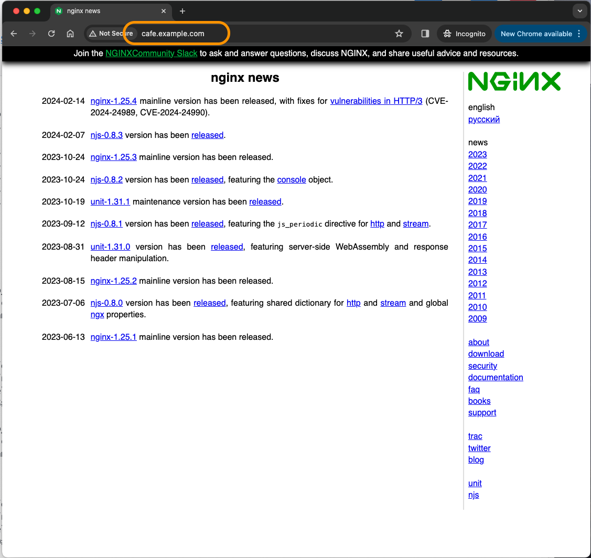

# NGINX Reverse Proxy and HTTP Load Balancing

## Introduction

In this lab, you will build a test lab environment using NGINX and Docker.  This will require that you build and run NGINX Opensource as a `Reverse Proxy Load Balancer` in a Docker container.  Then you will run three NGINX demo web servers, to be used as your `backend` web servers.  After all the containers are running, you will test and verify each container, the NGINX Proxy and the web servers.  All of these NGINX containers will be used as a learning platform to complete the remaining Lab Exercises.  It is important to build and run these NGINX containers correctly to complete the exercises and receive the most benefit from the Workshop.

NGINX OSS | Docker
:-------------------------:|:-------------------------:
  |
  
## Learning Objectives 

By the end of the lab you will be able to: 
 * Build and run an `NGINX Opensource Docker` image
 * Build your Workshop enviroment with Docker Compose
 * Verify Container build with NGINX tests
 * Configure NGINX for Load Balancing
 * Add NGINX features following Best Practices
 * Configure NGINX Extended Access Logging

## Pre-Requisites

- You must have Docker installed and running
- You must have Docker-compose installed
- See `Lab0` for instructions on setting up your system for this Workshop
- Familiarity with basic Linux commands and commandline tools
- Familiarity with basic Docker concepts and commands
- Familiarity with basic HTTP and HTTPS protocol

## Build the Workshop Environment with Docker Compose

For this lab you will build/run 4 Docker containers.  The first one will be used as an NGINX-OSS reverse proxy, and other 3 will be used for upstream backend web servers.

 

### Configure the NGINX-OSS Docker build parameters

1. Inspect the Dockerfile, located in the `/lab4/nginx-oss folder`.  Notice the `FROM` build parameter uses the `NGINX Alpine mainline` image, and also the `RUN apk add` command, which installs additional tool libraries in the image.  These tools are needed for copy/edit of files, and to run various tests while using the container in the exercises.  NOTE: you can choose a different NGINX base image if you like, but these lab exercises are written to use the Alpine image.

    ```bash
    FROM nginx:mainline-alpine
    RUN apk add --no-cache curl ca-certificates bash bash-completion jq wget vim

    # Copy certificate files and dhparams
    COPY etc/ssl /etc/ssl

    # Copy nginx config files
    COPY /etc/nginx /etc/nginx
    RUN chown -R nginx:nginx /etc/nginx

    # EXPOSE ports, HTTP 80, HTTPS 443, Nginx stub_status page 9000
    EXPOSE 80 443 9000
    STOPSIGNAL SIGTERM
    CMD ["nginx", "-g", "daemon off;"]

    ```

1. Inspect the `docker-compose.yml` file, located in the /lab4 folder.  Notice you are building and running the NGINX-OSS web and Proxy container, (using the modified `/nginx-oss/Dockerfile` from the previous step).  

    ```bash
    ...
    nginx-oss:                  # NGINX OSS Web / Load Balancer
        hostname: nginx-oss
        build: nginx-oss          # Build new container, using /nginx-oss/Dockerfile
        links:
            - web1:web1
            - web2:web2
            - web3:web3
        ports:
            - 80:80       # Open for HTTP
            - 443:443     # Open for HTTPS
            - 9000:9000   # Open for stub status page
        restart: always 

    ```

    Also notice in the `docker-compose.yml` you are running three Docker NGINX webserver containers, using an image from Docker Hub.  These will be your upstreams, backend webservers for the exercises.

    ```bash
    ...
    web1:
        hostname: web1
        image: nginxinc/ingress-demo       # Image from Docker Hub
        ports:
            - "80"                           # Open for HTTP
            - "443"                          # Open for HTTPS
    web2:
        hostname: web2
        image: nginxinc/ingress-demo
        ports:
            - "80"
            - "433"
    web3:
        hostname: web3
        image: nginxinc/ingress-demo
        ports:
            - "80"
            - "443"   

    ```

1. Verify all four containers are running:

    ```bash
    docker ps -a

    ```

    ```bash
    #Sample output
    CONTAINER ID   IMAGE                   COMMAND                  CREATED       STATUS       PORTS                                                              NAMES
    6ede3846edc3   lab4-nginx-oss          "/docker-entrypoint.…"   3 hours ago   Up 3 hours   0.0.0.0:80->80/tcp, 0.0.0.0:443->443/tcp, 0.0.0.0:9000->9000/tcp   nginx-oss
    e4887e475a14   nginxinc/ingress-demo   "/docker-entrypoint.…"   3 hours ago   Up 3 hours   0.0.0.0:56086->80/tcp, 0.0.0.0:56087->443/tcp                      web1
    a0a5b33bcf68   nginxinc/ingress-demo   "/docker-entrypoint.…"   3 hours ago   Up 3 hours   443/tcp, 0.0.0.0:56084->80/tcp, 0.0.0.0:56085->433/tcp             web2
    51dec7d94c6f   nginxinc/ingress-demo   "/docker-entrypoint.…"   3 hours ago   Up 3 hours   0.0.0.0:56082->80/tcp, 0.0.0.0:56081->443/tcp                      web3

    ```

1. Verify `all` of your three web backend servers are working.  Using a Terminal, Docker exec into each one, and verify you get a response to a curl request.  The `Name` should be `web1`, `web2`, and `web3` respectively for each container.

    ```bash
    docker exec -it web1 bin/sh   # log into web1 container, then web2, then web3

    ```
   
    ```bash
    curl -s http://localhost |grep Name

    ```

    ```bash
    #Sample outputs

    <p class="smaller"><span>Server Name:</span> <span>web1</span></p>   # web1

    <p class="smaller"><span>Server Name:</span> <span>web2</span></p>   # web2

    <p class="smaller"><span>Server Name:</span> <span>web3</span></p>   # web3

    ```
    Check all three, just to be sure.  Exit the Docker Exec when you are finished.

1. Test the NGINX OSS container, verify it also sends back a response to a curl request:

    ```bash
    docker exec -it nginx-oss bin/sh   # log into nginx-oss container

    ```
   
    ```bash
    curl http://localhost

    ```

    ```bash
    #Sample outputs
   <!DOCTYPE html>
    <html>
    <head>
    <title>Welcome to nginx!</title>
    <style>
    html { color-scheme: light dark; }
    body { width: 35em; margin: 0 auto;
    font-family: Tahoma, Verdana, Arial, sans-serif; }
    </style>
    </head>
    <body>
    <h1>Welcome to nginx!</h1>
    <p>If you see this page, the nginx web server is successfully installed and
    working. Further configuration is required.</p>

    <p>For online documentation and support please refer to
    <a href="http://nginx.org/">nginx.org</a>.<br/>
    Commercial support is available at
    <a href="http://nginx.com/">nginx.com</a>.</p>

    <p><em>Thank you for using nginx.</em></p>
    </body>
    </html>

    ```
    Congrats - you should see the `Welcome to nginx!` page.

<br/>

### NGINX Status Page

<br/>

1. NGINX also includes a status page, which shows some basic metrics about the traffic going through NGINX, such as:
    - Active Connections
    - Connections Accepted, Handled
    - Total number of Requests
    - Reading, writing, and waiting counters.
 
    These are helpful when looking at if/how NGINX is handling traffic.
    
    Inspect the `stub_status.conf` file located in the `/etc/nginx/conf.d` folder.  You will see that it is listening on port 9000, and using the URL of `/basic_status`.  This has been provided for you to monitor your traffic, there is a link in the References section with more information on the `stub_status module`.

    ```nginx
    # ngx_http_stub_status_module (available in NGINX OSS)
    # provides Basic Status information

    server {
        listen 9000;              # Listener for Stub Status
        
        location /basic_status {
            stub_status;
        }

        # Redirect requests for "/" to "/basic_status"
    location / {
        return 301 /basic_status;
        }

    }

    ```

    Give that a try, test access to the NGINX `stub_status` page, on port 9000: 

    ```bash
    curl http://localhost:9000/basic_status

    ```

    ```bash
    #Sample output
    Active connections: 1
    server accepts handled requests
    56 56 136
    Reading: 0 Writing: 1 Waiting: 0

    ```

    Try it in a browser at http://localhost:9000/basic_status 

    It should looks similar to this:
    
    

<br/>

### NGINX Reverse Proxy

<br/>

Now that you know all 4 containers are working with the NGINX Welcome page, and the stub_status page, you can build and test the **NGINX OSS Proxy and Load Balancing** functions.  You will use a new `NGINX proxy_pass Directive` - you will start with Reverse Proxy configuration, test it out.  Then add the Upstream backends and test out Load Balancing.

    - Using your previous lab exercise experience, you will configure a new NGINX configuration for the `cafe.example.com` website.  It will be very similar to http://cars.example.com from lab3.  
    
    - This will require a new NGINX config file, for the Server and Location Blocks.
    
1. In the /`etc/nginx/conf.d folder`, create a new file named `cafe.example.com.conf`, which will be the config file for the Server and Location blocks for this new website.  

    However, instead of a Location block that points to a folder with html content on disk, you will tell NGINX to `proxy_pass` the request to one of your three web containers instead.  

    >This will show you how to unlock the amazing power of NGINX...
    >>it can serve it's own content, 
    >>> or **content from another web server!**

    Docker Exec into your nginx-oss container.

    ```bash
    docker exec -it nginx-oss bin/sh   # log into nginx-oss container

    ```

    ```bash
    $ cd /etc/nginx/conf.d
    $ vi cafe.example.com.conf

    ```

    ```nginx
    # cafe.example.com HTTP
    # NGINX Basics Workshop
    # Feb 2024, Chris Akker, Shouvik Dutta
    #
    server {
        
        listen 80;      # Listening on port 80 on all IP addresses on this machine

        server_name cafe.example.com;   # Set hostname to match in request

        access_log  /var/log/nginx/cafe.example.com.log main; 
        error_log   /var/log/nginx/cafe.example.com_error.log notice;

        root /usr/share/nginx/html;         # Set the root folder for the HTML and JPG files

        location / {
            
        ### New NGINX Directive, "proxy_pass", tells NGINX to proxy traffic to another server.
            
            proxy_pass http://web1;        # Send requests to web1
        }

    } 
    
    ```
    
    Save the file and Quit VI.  Test and Reload your NGINX config.

1.  Test if your Proxy_pass configuration is working, using curl several times, and your browser.

    ```bash
    curl -s http://cafe.example.com |grep Server

    ```

    ```bash
    #Sample output

      Server: nginx/1.25.4
      <p class="smaller"><span>Server Name:</span> <span>web1</span></p>   # web1
      <p class="smaller"><span>Server Address:</span> <span><font color="green">172.28.0.4:80</font></span></p>

      Server: nginx/1.25.4
      <p class="smaller"><span>Server Name:</span> <span>web1</span></p>   # web1
      <p class="smaller"><span>Server Address:</span> <span><font color="green">172.28.0.4:80</font></span></p>

      Server: nginx/1.25.4
      <p class="smaller"><span>Server Name:</span> <span>web1</span></p>   # web1
      <p class="smaller"><span>Server Address:</span> <span><font color="green">172.28.0.4:80</font></span></p>

    ```

    Likewise, your browser refreshes should show you the "Out of stock" graphic and webpage for web1.  If you like, change the `proxy_pass` to `web2` or `web3`, and see what happens.

    >This is called a `Direct proxy_pass`, where you are telling NGINX to Proxy the request to another server.  You can also use a FQDN name, or an IP:port with proxy_pass.  In this lab environment, Docker is providing the IP for web1.

1. You can even use proxy_pass in front of a public website.  Try that, with `nginx.org`...what do you think, can you use a Docker container on your desktop to deliver someone else's website?  No, that `can't` be that easy, can it ?

    ```bash
    docker exec -it nginx-oss bin/sh   # log into nginx-oss container

    ```

    ```bash
    $ cd /etc/nginx/conf.d
    $ vi cafe.example.com.conf

    ```

    ```nginx
    # cafe.example.com HTTP
    # NGINX Basics Workshop
    # Feb 2024, Chris Akker, Shouvik Dutta
    #
    server {
        
        listen 80;      # Listening on port 80 on all IP addresses on this machine

        server_name cafe.example.com;   # Set hostname to match in request

        access_log  /var/log/nginx/cafe.example.com.log main; 
        error_log   /var/log/nginx/cafe.example.com_error.log notice;

        root /usr/share/nginx/html;         # Set the root folder for the HTML and JPG files

        location / {
            
        # New NGINX Directive, "proxy_pass", tells NGINX to proxy traffic to another website.
            
            proxy_pass http://nginx.org;    # Send all requests to nginx.org website 
        }

    } 
    
    ```
    
    Save the file and Quit VI.  Test and Reload your NGINX config.

1. Try it with Chrome, http://cafe.example.com.  Yes, that works alright, NGINX sends your cafe.example.com request to `nginx.org`.  No WAY, that's cool.

    


<br/>

### NGINX Load Balancing

You see the `proxy_pass` working for one backend webserver, but what about the other 2 backends?  Do you need high availability, and increased capacity for your website? Of course, you want to use multiple backends for this, and load balance them.  This is very easy, as it requires only 2 configuration changes:

- Create a new .conf file for the Upstream Block
- Modify the proxy_pass to use the name of this upstream block

You will now configure the `NGINX Upstream Block`, which is a `list of backend servers` that can be used by NGINX Proxy for load balancing requests.

1. Using Terminal, Docker Exec into the nginx-oss container.  Change to the `/etc/nginx/conf.d` folder, where HTTP config files are kept. Create a new file named `upstreams.conf`, which will be the config file for the Upstream Block with three backends - web1, web2, and web3.

    ```bash
    docker exec -it nginx-oss bin/sh   # log into nginx-oss container

    ```

    ```bash
    $ cd /etc/nginx/conf.d
    $ vi upstreams.conf

    ```

    Place the three backend containers in an "upstream block" as shown:

    ```nginx
    # NGINX Basics, OSS Proxy to three upstream NGINX containers
    # Chris Akker, Shouvik Dutta - Feb 2024
    #
    # nginx_cafe servers

    upstream nginx_cafe {         # Upstream block, the name is "nginx_cafe"

        server web1:80;           # These are the containers from your Docker Compose
        server web2:80;
        server web3:80;

    }

    ```
    Save the file and Quit VI.

1. Modify the `proxy_pass` directive in `cafe.example.com.conf`, to proxy the requests to the `upstream block called nginx_cafe`.  And it goes without saying, you can have literally hundreds of upstream blocks for various backend apps, but each upstream block name must be unique.  (And you can have hundreds of backends, if you need that much capacity for your website).

    ```bash
    $ cd /etc/nginx/conf.d
    $ vi cafe.example.com.conf

    ```

    ```nginx
    # cafe.example.com HTTP
    # NGINX Basics Workshop
    # Feb 2024, Chris Akker, Shouvik Dutta
    #
    server {
        
        listen 80;      # Listening on port 80 on all IP addresses on this machine

        server_name cafe.example.com;   # Set hostname to match in request

        access_log  /var/log/nginx/cafe.example.com.log main; 
        error_log   /var/log/nginx/cafe.example.com_error.log notice;

        root /usr/share/nginx/html;         # Set the root folder for the HTML and JPG files

        location / {
            
        ### Change the "proxy_pass" directive, tell NGINX to proxy traffic to the upstream block.  If there is more than one server, they will be load balanced
            
            proxy_pass http://nginx_cafe;        # Must match the upstream block name
        }

    } 
    
    ```

    Save the file and Quit VI. Test and Reload your NGINX config.

1. Verify that it is load balancing to `all three containers`, run the curl command at least 3 times:

    ```bash
    docker exec -it nginx-oss bin/sh   # log into nginx-oss container

    ```
    
    ```bash
    curl -is http://cafe.example.com |grep Server     # run at least 3 times

    ```

    ```bash
    #Sample output

      Server: nginx/1.25.4
      <p class="smaller"><span>Server Name:</span> <span>web1</span></p>   # web1
      <p class="smaller"><span>Server Address:</span> <span><font color="green">172.28.0.4:80</font></span></p>

      Server: nginx/1.25.4
      <p class="smaller"><span>Server Name:</span> <span>web2</span></p>   # web2
      <p class="smaller"><span>Server Address:</span> <span><font color="green">172.28.0.3:80</font></span></p>

      Server: nginx/1.25.4
      <p class="smaller"><span>Server Name:</span> <span>web3</span></p>   # web3
      <p class="smaller"><span>Server Address:</span> <span><font color="green">172.28.0.2:80</font></span></p>

    ```

    You should see `Server Names` like `web1`, `web2`, and `web3` as NGINX load balances all three backends - your NGINX-OSS is now a Reverse Proxy, and load balancing traffic to 3 web containers! Notice the `Server Address`, with the IP address of each upstream container.  Note:  Your IP addresses will likely be different.

1. Test again, this time using a browser, click `Refresh` at least 3 times:

    Using your browser, go to http://cafe.example.com

    You should see the `Out of Stock` web page, note the `Server Name` and `Server Addresses`.

    NGINX Web1 | NGINX Web2 | NGINX Web3 
    :-------------------------:|:-------------------------:|:-------------------------:
      | |

>This is called an `Upstream proxy_pass`, where you are telling NGINX to Proxy the request to a list of servers in the upstream, and load balance them. 

<br/>

### NGINX Extended Access Logging

Now that you have a working NGINX Proxy, and several backends, you will be adding adn using additional NGINX Directives, Variables, and testing them out.  In order to better see the results of these new Directives on your proxied traffic, you need better and more information in your Access logs.  The default NGINX `main` access log_format only contains a fraction of the information you need, so you will  `extend` it to include much more information, especially about the Upstream backend servers.

1. In this next exercise, you will use a new `log_format` which has additional $variables added the access.log, so you can see this metadata.  You will use the Best Practice of defining the log format ONCE, but potentially use it in many Server blocks.

1. Inspect the `main` access log_format that is the default when you install NGINX.  You will find it in the `/etc/nginx/nginx.conf` file.  As you can see, there is `nothing` in this log format about the Upstreams, Headers, or other details you need.

    ```nginx
    ...snip from /etc/nginx/nginx.conf

    log_format  main  '$remote_addr - $remote_user [$time_local] "$request" '
                    '$status $body_bytes_sent "$http_referer" '
                    '"$http_user_agent" "$http_x_forwarded_for"';

                    # nothing above on Upstreams, how do you even know which server handled the request ???

    ...

    ```

1. Inspect the `main_ext.conf` configuration file, located in the `/etc/nginx/includes/log_formats` folder.  You will see there are many added $variables, some are for the request, some for proxy functions, some for the response, and several are about the Upstream (so you know which backend was chosen and used for a request).  NGINX has `hundreds` of $variables you can use, depending on what you need to see.

    ```nginx
    # Extended Log Format
    # Nginx Basics
    log_format  main_ext    'remote_addr="$remote_addr", '
                            '[time_local=$time_local], '
                            'request="$request", '
                            'status="$status", '
                            'http_referer="$http_referer", '
                            'body_bytes_sent="$body_bytes_sent", '
                            'Host="$host", '
                            'sn="$server_name", '
                            'request_time=$request_time, '
                            'http_user_agent="$http_user_agent", '
                            'http_x_forwarded_for="$http_x_forwarded_for", '
                            'request_length="$request_length", '
                            'upstream_address="$upstream_addr", '
                            'upstream_status="$upstream_status", '
                            'upstream_connect_time="$upstream_connect_time", '
                            'upstream_header_time="$upstream_header_time", '
                            'upstream_response_time="$upstream_response_time", '
                            'upstream_response_length="$upstream_response_length", ';
                            
    ```

1. You will use the Extend log_format for the next few exercises.  Update your `cafe.example.com.conf` to use the `main_ext` log format:

    ```nginx
    # cars.example.com HTTP
    # NGINX Basics Workshop
    # Feb 2024, Chris Akker, Shouvik Dutta
    #
    server {
        
        listen 80;      # Listening on port 80 on all IP addresses on this machine

        server_name cafe.example.com;   # Set hostname to match in request

        access_log  /var/log/nginx/cafe.example.com.log main_ext;         # Change this to "main_ext"
        error_log   /var/log/nginx/cafe.example.com_error.log notice;

    ...snip

    ```

    Save your file.  Test and Reload NGINX.


1. Test your new log format.  Docker Exec into your nginx-oss container.  Cat or Tail the /var/log/nginx/cafe.example.com.log Access log file, and you will see the new Extended Log Format. 

    ```bash
    nginx-oss $ tail -f /var/log/nginx/cafe.example.com.log

    ```

1. Watch your new log format.  Using curl or your browser, hit the `cafe.example.com` website a few times.

    It should look something like this (comments and line breaks added for clarity):

    ```bash
    #Sample output
    remote_addr="192.168.65.1", [time_local=19/Feb/2024:19:14:32 +0000], request="GET / HTTP/1.1", status="200", http_referer="-", body_bytes_sent="651", Host="cafe.example.com", sn="cafe.example.com", request_time=0.001, http_user_agent="Mozilla/5.0 (Macintosh; Intel Mac OS X 10_15_7) AppleWebKit/537.36 (KHTML, like Gecko) Chrome/121.0.0.0 Safari/537.36", http_x_forwarded_for="-", request_length="471",
    # Line Breaks added 
    upstream_address="172.18.0.3:80",  # Nice, now you know what backend was selected
    upstream_status="200", 
    upstream_connect_time="0.000", 
    upstream_header_time="0.000", 
    upstream_response_time="0.000", 
    upstream_response_length="651", 

    ```

    As you can see here, NGINX has `many $variables` that you can use, to customize the Access log_format to meet your needs.  You will find a link to NGINX Access Logging, and ALL the NGINX Variables that are availabe in the References section below.
    
    It should also be pointed out, that you can use different log formats for different Hosts, Server Blocks, or even different Location Blocks, you are not limited to just one log_format.

<br/>

### NGINX Proxy Protocol and Keep-alives

<br/>

Now that you have Reverse Proxy and load balancing working, you need to think about what information should be passed to and from the backend servers.  After all, if you insert a Proxy in between the client and the server, you might lose some important information in the request or the response.  `NGINX proxy_headers` are used to restore this information, and add additional information as well using NGINX $variables.

In this next exercise, you will define these HTTP Headers, and then tell NGINX to use them in your `cafe.example.com` Server block, so that every request and response will now include these new headers.  

    NOTE: When NGINX proxies a request to an Upstream, it uses the HTTP/1.0 protocol by default, for legacy compatibility.  

However, this means a new TCP connection for every request, and is quite inefficient.  Modern apps mostly run HTTP/1.1, so you will tell NGINX to use HTTP/1.1 for Proxied requests, which allow NGINX to re-use TCP connections for multiple requests.  (This is commonly called HTTP keepalives, or HTTP pipelining).

1. Inspect the `keepalive.conf`, located in the /etc/nginx/includes folder.  Notice that three are three Directives and Headers required for HTTP/1.1 to work correctly:

    - HTTP Protocol = Use the `$proxy_protocol_version` variable to set it to `1.1`.
    - HTTP Connection Header = should be blank, `""`, the default is `Close`.
    - HTTP Host = the HTTP/1.1 protocol requires a Host Header be set, `$host`

    ```nginx
    #Nginx Basics - Feb 2024
    #Chris Akker, Shouvik Dutta
    #
    # Default is HTTP/1.0 to upstreams, HTTP keepalives needed for HTTP/1.1
    proxy_http_version 1.1;

    # Set the Connection header to empty 
    proxy_set_header Connection "";

    # Host request header field, or the server name matching a request
    proxy_set_header Host $host;

    ```

1. Using Terminal, Docker Exec into your nginx-oss Proxy, and edit your `cafe.example.com.conf` to use the HTTP/1.1 protocol to the Upstreams with an `include`:

    ```bash
    docker exec -it nginx-oss bin/sh   # log into nginx-oss container

    ```

    ```nginx
    # cafe.example.com HTTP
    # NGINX Basics Workshop
    # Feb 2024, Chris Akker, Shouvik Dutta
    #
    server {
        
        listen 80;      # Listening on port 80 on all IP addresses on this machine

        server_name cafe.example.com;   # Set hostname to match in request

        access_log  /var/log/nginx/cafe.example.com.log main; 
        error_log   /var/log/nginx/cafe.example.com_error.log notice;

        root /usr/share/nginx/html;         # Set the root folder for the HTML and JPG files

        location / {
            
            # Uncomment to enable proxy headers, and keepalives
            # include includes/proxy_headers.conf;

            include includes/keepalive.conf;     # Use HTTP/1.1 keepalives
            
            # proxy_pass http://web1;            # Proxy to another server
            proxy_pass http://nginx_cafe;        # Proxy AND load balance to a list of servers
        }

    } 
    ```

1. Using curl, send a request to your website, and look at the Headers sent back:

    ```bash
    curl -I http://cafe.example.com

    ```

    ```bash
    #Sample output
    HTTP/1.1 200 OK                          # protocol version is 1.1
    Server: nginx/1.25.4
    Date: Sat, 17 Feb 2024 01:41:01 GMT
    Content-Type: text/html; charset=utf-8
    Connection: keep-alive                   # Connection header = keep-alive
    Expires: Sat, 17 Feb 2024 01:41:00 GMT
    Cache-Control: no-cache

    ```

1. Using your browser, open its "Dev Tools", or "Inspect" option, so you can see the browser's debugging metadata.  Visit your website, http://cafe.example.com.  If you click on the Network Tab, and then the first object, you will see the Request and Response Headers, and should find that `Connection:` = `keep-alive`

    

<br/>

### NGINX Request Custom Headers

<br/>

Now you need to enable some HTTP Headers, to be added to the Request.  These are often required, to relay critical information between the HTTP client and the backend server. These Headers are in addition to the HTTP Protocol control headers.

1. Inspect the `proxy_headers.conf` in the `/etc/nginx/includes` folder.  You will see that some custom HTTP Headers are being added.

    ```nginx
    #Nginx Basics - Feb 2024
    #Chris Akker, Shouvik Dutta
    #
    ## Set Headers to the proxied servers ##

    # client address in binary format
    proxy_set_header X-Real-IP $remote_addr;

    # X-Forwarded-For client request header 
    proxy_set_header X-Forwarded-For $proxy_add_x_forwarded_for;

    # request scheme, “http” or “https”
    proxy_set_header X-Forwarded-Proto $scheme;

    # Adding a Testing Variable for Nginx-Basics Lab Exercise
    proxy_set_header X-NGINX-Basics "Lab 4";

    ```


1. Using Terminal, Docker Exec into your nginx-oss Proxy, and edit your `cafe.example.com.conf` to use the `proxy_headers.conf` with an `include`:

    ```bash
    docker exec -it nginx-oss bin/sh   # log into nginx-oss container

    ```

    ```nginx
    # cafe.example.com HTTP
    # NGINX Basics Workshop
    # Feb 2024, Chris Akker, Shouvik Dutta
    #
    server {
        
        listen 80;      # Listening on port 80 on all IP addresses on this machine

        server_name cafe.example.com;   # Set hostname to match in request

        access_log  /var/log/nginx/cafe.example.com.log main; 
        error_log   /var/log/nginx/cafe.example.com_error.log notice;

        root /usr/share/nginx/html;         # Set the root folder for the HTML and JPG files

        location / {
            
            # Uncomment to enable custom headers, and keepalives

            include includes/proxy_headers.conf; # Add Request Headers

            include includes/keepalive.conf;     # Use HTTP/1.1 keepalives
            
            # proxy_pass http://web1;            # Proxy to another server
            proxy_pass http://nginx_cafe;        # Proxy AND load balance to a list of servers
        }

    } 
    ```


<br/>

### NGINX Persistence / Affinity


<br/>

>**Congratulations, you are now a member of Team NGINX !**


**This completes this Lab.**

<br/>

## References:

- [NGINX OSS](https://nginx.org/en/docs/)
- [NGINX Status Module](http://nginx.org/en/docs/http/ngx_http_stub_status_module.html)
- [NGINX Admin Guide](https://docs.nginx.com/nginx/admin-guide/)
- [NGINX Technical Specs](https://docs.nginx.com/nginx/technical-specs/)
- [NGINX Variables](https://nginx.org/en/docs/varindex.html)
- [NGINX Access Logging](https://nginx.org/en/docs/http/ngx_http_log_module.html#access_log)
- [Docker](https://www.docker.com/)
- [Docker Compose](https://docs.docker.com/compose/)

<br/>

### Authors
- Chris Akker - Solutions Architect - Community and Alliances @ F5, Inc.
- Shouvik Dutta - Solutions Architect - Community and Alliances @ F5, Inc.

-------------

Navigate to ([Lab5](../lab5/readme.md) | [Main Menu](../LabGuide.md))
