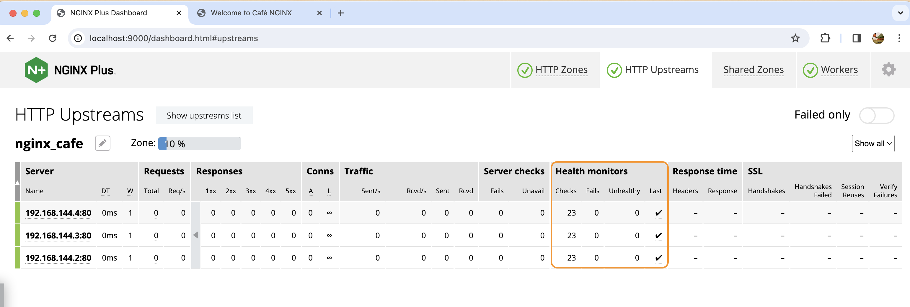
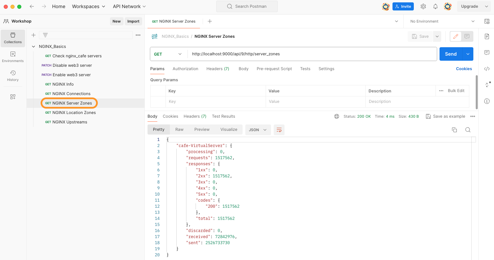

# Build and Run NGINX Plus on Docker

## Introduction

You will now build the Plus version of NGINX, using a license.  You will need a subscription license, and both SSL .crt and .key files.  These files provide access to the `NGINX Plus repository` where the Plus binary files are located.  These are not publicly accessible, you must have a valid Certificate and Key for repo access.  This new NGINX Plus container will be used for the rest of the Lab exercises, adding Plus features and options to your environment.

## Learning Objectives

By the end of the lab you will be able to:

- Build an `NGINX Plus Docker` image
- Run this NGINX Plus image, adding it to your lab environment
- Test the Plus container
- Migrate NGINX OSS configurations to NGINX Plus

NGINX Plus | Docker
:-------------------------:|:-------------------------:
  |

## What is NGINX Plus?  

NGINX Plus is the `Commercial version of NGINX`, adding additional Enterprise features on top of the base NGINX OSS build. Here is a Summary list of the Plus features:

- Dynamic reconfiguration reloads with no downtime
- Dynamic NGINX software updates with no downtime
- Dynamic DNS resolution and DNS Service discovery
- NGINX Plus API w/statistics and dashboard, over 240 metrics for TCP/HTTPS
- NGINX JavaScript Prometheus exporter libraries
- Dynamic Upstreams
- Key Value store
- Cache Purge API controls
- NGINX Clustering for High Availability
- JWT processing with OIDC for user authentication
- App Protect Firewall WAF

## Pre-Requisites

- You must have a license for NGINX Plus
- You must have Docker installed and running
- You must have Docker-compose installed
- (Optional) You should have Postman API tool to make calls to NGINX Plus API.
- (Optional) You should have Visual Studio Code installed to work through the NGINX configuration files.
- See `Lab0` for instructions on setting up your system for this Workshop

## Build and Run NGINX Plus with Docker

1. Open the Workshop folder with Visual Studio Code, or an IDE / text editor of your choice, so you can read and edit the files provided.

1. Download or copy your NGINX Plus license files to your computer.  There are 3 files provided, you only need the .crt and .key files for this Workshop:

    - `nginx-repo.crt`, TLS cert for Plus Repo access
    - `nginx-repo.key`, TLS key for Plus Repo access
    - nginx-repo.jwt, a JWT Token for F5 container registry (not used in this Workshop).

    If you need a Plus Trial license, you can request one here:

    [NGINX Plus Trial](https://www.nginx.com/free-trial-request/)

    >After submitting the Trial Request form, you will receive an Email in a few minutes with links to download your three license files.  The links are only good for a one time download.

1. Copy your subscription license into `lab5/nginx-plus/etc/ssl/nginx` folder within your workshop folder.

1. Copy your Plus TLS nginx-repo.* license files to the `lab5/nginx-plus/etc/ssl/nginx` folder within your workshop folder.

    ```bash
    cp /user/home/nginx-repo.* /user/workshop/lab5/nginx-plus/etc/ssl/nginx

    ```

1. Inspect the `docker-compose.yml` file, located in the /lab5 folder. Notice you are building the NGINX-Plus container.

   ```bash
    nginx-plus:              # NGINX Plus Web / Load Balancer
        hostname: nginx-plus
        container_name: nginx-plus
        build: nginx-plus    # Build new container, using /nginx-plus/Dockerfile
        volumes:
            - ./nginx-plus/etc/nginx/conf.d:/etc/nginx/conf.d        # Copy these folders to container
            - ./nginx-plus/etc/nginx/includes:/etc/nginx/includes
            - ./nginx-plus/etc/nginx/nginx.conf:/etc/nginx/nginx.conf
        ports:
            - 80:80       # Open for HTTP
            - 443:443     # Open for HTTPS
            - 9000:9000   # Open for status api
        restart: always 
   ```

1. Also in the `docker-compose.yml` file you will run three other Docker NGINX webserver containers. These will be your upstream backend webservers for this lab.

    ```bash
    web1:
      hostname: web1
      container_name: web1
      image: nginxinc/ingress-demo   # Image from Docker Hub
      ports:
        - "80"                       # Open for HTTP
        - "443"                      # Open for HTTPS
    web2:
        hostname: web2
        container_name: web2
        image: nginxinc/ingress-demo
        ports:
            - "80"
            - "433"
    web3:
        hostname: web3
        container_name: web3
        image: nginxinc/ingress-demo
        ports:
            - "80"
            - "443"
    ```

1. Build and run all the above containers by using docker compose.

   ```bash
    docker compose up
   ```

1. Verify all four containers are running:

    ```bash
    docker ps
    ```

    ```bash
    ###Sample output###
    CONTAINER ID   IMAGE                   COMMAND                  CREATED          STATUS          PORTS                                                                        NAMES
    717e1d8ff899   nginxinc/ingress-demo   "/docker-entrypoint.…"   13 seconds ago   Up 12 seconds   0.0.0.0:61344->80/tcp, 0.0.0.0:61343->443/tcp                                lab5-web3-1
    031354257db7   nginxinc/ingress-demo   "/docker-entrypoint.…"   13 seconds ago   Up 12 seconds   443/tcp, 0.0.0.0:61342->80/tcp, 0.0.0.0:61341->433/tcp                       lab5-web2-1
    a54a6e1fcda1   nginxinc/ingress-demo   "/docker-entrypoint.…"   13 seconds ago   Up 12 seconds   0.0.0.0:61346->80/tcp, 0.0.0.0:61345->443/tcp                                lab5-web1-1
    8dff0d9e7dce   lab5-nginx-plus         "nginx -g 'daemon of…"   13 seconds ago   Up 12 seconds   0.0.0.0:80->80/tcp, 0.0.0.0:443->443/tcp, 0.0.0.0:9000->9000/tcp, 8080/tcp   lab5-nginx-plus-1
    ```

1. Test the NGINX Plus load balancing to the containers for the default webpage.

   **Note:** Run this command atleast 3 times. You can see in output that the response is coming from `web1`,`web2` and `web3` backend servers respectively.

    ```bash
    curl -is http://localhost |  grep "Server Name"
    ```

    ```bash
    ###Sample output###
    # Output of 1st run
    <p class="smaller"><span>Server Name:</span> <span>web1</span></p>
    # Output of 2nd run
    <p class="smaller"><span>Server Name:</span> <span>web2</span></p>
    # Output of 3rd run
    <p class="smaller"><span>Server Name:</span> <span>web3</span></p>
    ```

1. Test NGINX Plus container with a browser:

    Launch your browser, go to <http://localhost>

    You should see the default Cafe App web page. If you refresh 3-4 times then you will see server name change to `web1`,`web2` and `web3` as NGINX is load balancing between your three nginx cafe backends using round-robin algorithm. Notice the server address matches each backend container as well.

    

1. These backend application do have the following multiple paths which can also be used for testing:
   - [http://cafe.example.com/coffee](http://cafe.example.com/coffee)
   - [http://cafe.example.com/tea](http://cafe.example.com/tea)
   - [http://cafe.example.com/icetea](http://cafe.example.com/icetea)
   - [http://cafe.example.com/beer](http://cafe.example.com/beer)
   - [http://cafe.example.com/wine](http://cafe.example.com/wine)
   - [http://cafe.example.com/cosmo](http://cafe.example.com/cosmo)
   - [http://cafe.example.com/mojito](http://cafe.example.com/mojito)
   - [http://cafe.example.com/daiquiri](http://cafe.example.com/daiquiri)
  
    You would be using these urls in later sections/exercise. You should verify these are working correctly using curl or browser.
    /coffee | /tea
    :-------: | :-------:
     | 

1. Test access to NGINX Plus container with Docker Exec command:

    ```bash
    export CONTAINER_ID=$(docker ps -q --filter "name=nginx-plus")
    
    docker exec -it $CONTAINER_ID /bin/bash
    ```

1. Run some commands inside the NGINX Plus Container:

    ```bash
    # Look around the nginx folders
    ls -l /etc/nginx

    ls -l /etc/nginx/conf.d
    ```

    ```bash
    # Check for nginx packages installed
    dpkg-query -l | grep nginx
    
    dpkg -s nginx-plus
    ```

    ```bash
    ##Sample Output
    ii  nginx-plus                 31-1~focal                   amd64        NGINX Plus, provided by Nginx, Inc.

    Package: nginx-plus
    Status: install ok installed
    Priority: optional
    Section: httpd
    Installed-Size: 7062
    Maintainer: NGINX Packaging <nginx-packaging@f5.com>
    Architecture: amd64
    Version: 31-1~focal
    Replaces: nginx, nginx-core, nginx-plus-debug
    Provides: httpd, nginx, nginx-plus-r31
    Depends: libc6 (>= 2.28), libcrypt1 (>= 1:4.1.0), libpcre2-8-0 (>= 10.22), libssl1.1 (>= 1.1.1), zlib1g (>= 1:1.1.4), lsb-base (>= 3.0-6)
    Recommends: logrotate
    Conflicts: nginx, nginx-common, nginx-core
    Conffiles:
     /etc/init.d/nginx 0b8cb35c30e187ff9bdfd5d9e7d79631
    /etc/init.d/nginx-debug ed610161bfa49f021f5afa483a10eac5
    /etc/logrotate.d/nginx a4da44b03e39926b999329061770362b
    /etc/nginx/conf.d/default.conf 5e054c6c3b2901f98e0d720276c3b20c
    /etc/nginx/fastcgi_params 4729c30112ca3071f4650479707993ad
    /etc/nginx/mime.types 754582375e90b09edaa6d3dbd657b3cf
    /etc/nginx/nginx.conf 563e30e020178f0db80bd2a87d6232a6
    /etc/nginx/scgi_params df8c71e25e0356ffc539742f08fddfff
    /etc/nginx/uwsgi_params 88ac833ee8ea60904a8b3063fde791de
    Description: NGINX Plus, provided by Nginx, Inc.
     NGINX Plus extends NGINX open source to create an enterprise-grade Application Delivery Controller, Accelerator and Web Server. Enhanced features include: Layer 4 and Layer 7 load balancing with health checks,session persistence and on-the-fly configuration; Improved content caching;Enhanced status and monitoring information; Streaming media delivery.
    Homepage: https://www.nginx.com/    
    ```

    ```bash
    # What nginx processes are running?
    ps aux |grep nginx
    ```

    ```bash
    ##Sample Output##
    root         1  0.0  0.0  10544  7040 ?        Ss   18:27   0:00 nginx: master process nginx -g daemon off;
    nginx        7  0.0  0.0  92924  4312 ?        S    18:27   0:00 nginx: worker process
    root        50  0.0  0.0   3312  1792 pts/0    S+   19:00   0:00 grep --color=auto nginx
    ```

    ```bash
    # Check Linux TOP for resource usage
    top -n 1
    ```

    ```bash
    ##Sample Output##
    top - 19:02:10 up 10 days, 20:41,  0 users,  load average: 0.00, 0.00, 0.00
    Tasks:   4 total,   1 running,   3 sleeping,   0 stopped,   0 zombie
    top - 19:02:26 up 10 days, 20:42,  0 users,  load average: 0.00, 0.00, 0.00
    Tasks:   4 total,   1 running,   3 sleeping,   0 stopped,   0 zombie
    %Cpu(s):  0.6 us,  0.6 sy,  0.0 ni, 98.9 id,  0.0 wa,  0.0 hi,  0.0 si,  0.0 st
    MiB Mem :   7846.6 total,   5467.4 free,    788.3 used,   1590.9 buff/cache
    MiB Swap:   1024.0 total,   1024.0 free,      0.0 used.   6785.1 avail Mem 

    PID USER      PR  NI    VIRT    RES    SHR S  %CPU  %MEM     TIME+ COMMAND                                                                
      1 root      20   0   10544   7040   6144 S   0.0   0.1   0:00.02 nginx                                                                  
      7 nginx     20   0   92924   4312   2944 S   0.0   0.1   0:00.51 nginx                                                                  
      9 root      20   0    4252   3328   2816 S   0.0   0.0   0:00.05 bash                                                                   
     53 root      20   0    5972   3200   2816 R   0.0   0.0   0:00.00 top 
    ```

    ```bash
    # Which TCP Ports are being used by NGINX ?
    netstat -alpn
    ```

    ```bash
    ##Sample output##
    Active Internet connections (servers and established)
    Proto Recv-Q Send-Q Local Address           Foreign Address         State       PID/Program name    
    tcp        0      0 127.0.0.11:41055        0.0.0.0:*               LISTEN      -                   
    tcp        0      0 0.0.0.0:80              0.0.0.0:*               LISTEN      1/nginx: master pro 
    tcp        0      0 192.168.32.5:57614      185.125.190.36:80       TIME_WAIT   -                   
    udp        0      0 127.0.0.11:38617        0.0.0.0:*                           -                   
    Active UNIX domain sockets (servers and established)
    Proto RefCnt Flags       Type       State         I-Node   PID/Program name     Path
    unix  3      [ ]         STREAM     CONNECTED     1446456  1/nginx: master pro  
    unix  3      [ ]         STREAM     CONNECTED     1446455  1/nginx: master pro  
    ```

    ```bash
    # Check NGINX help page
    nginx -h
    ```

    ```bash
    ##Sample Output##
    nginx version: nginx/1.25.3 (nginx-plus-r31)
    Usage: nginx [-?hvVtTq] [-s signal] [-p prefix]
             [-e filename] [-c filename] [-g directives]

    Options:
      -?,-h         : this help
      -v            : show version and exit
      -V            : show version and configure options then exit
      -t            : test configuration and exit
      -T            : test configuration, dump it and exit
      -q            : suppress non-error messages during configuration testing
      -s signal     : send signal to a master process: stop, quit, reopen, reload
      -p prefix     : set prefix path (default: /etc/nginx/)
      -e filename   : set error log file (default: /var/log/nginx/error.log)
      -c filename   : set configuration file (default: /etc/nginx/nginx.conf)
      -g directives : set global directives out of configuration file
    ```

    ```bash
    # Verify what version of NGINX is running:
    nginx -V
    ```

    ```bash
    ##Sample Output##
    nginx version: nginx/1.25.3 (nginx-plus-r31)
    built by gcc 9.4.0 (Ubuntu 9.4.0-1ubuntu1~20.04.2) 
    built with OpenSSL 1.1.1f  31 Mar 2020
    TLS SNI support enabled
    configure arguments: --prefix=/etc/nginx --sbin-path=/usr/sbin/nginx --modules-path=/usr/lib/nginx/modules --conf-path=/etc/nginx/nginx.conf --error-log-path=/var/log/nginx/error.log --http-log-path=/var/log/nginx/access.log --pid-path=/var/run/nginx.pid --lock-path=/var/run/nginx.lock --http-client-body-temp-path=/var/cache/nginx/client_temp --http-proxy-temp-path=/var/cache/nginx/proxy_temp --http-fastcgi-temp-path=/var/cache/nginx/fastcgi_temp --http-uwsgi-temp-path=/var/cache/nginx/uwsgi_temp --http-scgi-temp-path=/var/cache/nginx/scgi_temp --user=nginx --group=nginx --with-compat --with-file-aio --with-threads --with-http_addition_module --with-http_auth_request_module --with-http_dav_module --with-http_flv_module --with-http_gunzip_module --with-http_gzip_static_module --with-http_mp4_module --with-http_random_index_module --with-http_realip_module --with-http_secure_link_module --with-http_slice_module --with-http_ssl_module --with-http_stub_status_module --with-http_sub_module --with-http_v2_module --with-http_v3_module --with-mail --with-mail_ssl_module --with-stream --with-stream_realip_module --with-stream_ssl_module --with-stream_ssl_preread_module --build=nginx-plus-r31 --mgmt-id-path=/var/lib/nginx/nginx.id --with-http_auth_jwt_module --with-http_f4f_module --with-http_hls_module --with-http_proxy_protocol_vendor_module --with-http_session_log_module --with-mgmt --with-stream_mqtt_filter_module --with-stream_mqtt_preread_module --with-stream_proxy_protocol_vendor_module --with-cc-opt='-g -O2 -fdebug-prefix-map=/data/builder/debuild/nginx-plus-1.25.3/debian/debuild-base/nginx-plus-1.25.3=. -fstack-protector-strong -Wformat -Werror=format-security -Wp,-D_FORTIFY_SOURCE=2 -fPIC' --with-ld-opt='-Wl,-Bsymbolic-functions -Wl,-z,relro -Wl,-z,now -Wl,--as-needed -pie'
    ```

    ```bash
    # Test the current NGINX configuration
    nginx -t
    ```

    ```bash
    ##Sample Output##
    nginx: the configuration file /etc/nginx/nginx.conf syntax is ok
    nginx: configuration file /etc/nginx/nginx.conf test is successful
    ```

    ```bash
    # Display the entire NGINX configuration, includes all files
    nginx -T
    ```

    ```bash
    # Check any server specific access logs
    tail -f /var/log/nginx/cafe.example.com.log
    ```

    ```bash
    # Check any server specific error logs
    tail -f /var/log/nginx/cafe.example.com_error.log
    ```

    When you are done looking around, Exit the container by typing `exit` in the shell.

    ```bash
    exit
    ```

## NGINX Plus Dashboard

In this section, you will enable NGINX Plus status dashboard and watch it for status changes and metrics while you perform various tests on NGINX as a proxy.

The NGINX Plus Dashboard and statistics API provide over 240 metrics about the request and responses flowing through NGINX Plus proxy. This is a great feature to allow you to watch and triage any potential issues with NGINX Plus as well as any issues with your backend applications. Some of metrics provided include the following:

- TCP throughput and connections
- HTTP request and response stats and all status codes
- Virtual Server and Location context metrics
- Upstream context metrics
- Healthcheck success/failures
- SSL handshakes, sessions and reuse
- NGINX caching metrics
- DNS resolver
- NGINX clustering
- NGINX Worker Metrics
- Ratelimit Metrics

All of these metrics are available via NGINX Plus API as a Json object making it easy to import these stats/metrics into your choice of Monitoring tools.

1. Inspect the `dashboard.conf` file and look into the `server` block that enables access to NGINX Plus dashboard. You will find the following:
    - Dashboard is listening on port 9000
    - Url is [http://localhost:9000/dashboard.html](http://localhost:9000/dashboard.html)
  
    ```nginx
    server {
        # Conventional port for the NGINX Plus API is 9000
        listen 9000;
        access_log off; # reduce noise in access logs

        location /api/ {
        # Enable in read-write mode
        api write=on;
        }
        # Conventional location of the NGINX Plus dashboard
        location = /dashboard.html {
            root /usr/share/nginx/html;
        }

        # Redirect requests for "/" to "/dashboard.html"
        location / {
            return 301 /dashboard.html;
        }
    }
    ```

1. Edit `cafe.example.com.conf` file and uncomment `status_zone` directive on line 9 and line 22 to capture matrics from the server block and location block respectively.

    ```nginx
    # cafe.example.com HTTP
    server {
        # Listening on port 80 on all IP addresses on this machine
        listen 80 default_server;

        server_name cafe.example.com "";

        # Uncomment to capture metrics for this server block
        status_zone cafe.example.com_http;

        ...

        location / {
            
            # Including best-practice headers are bonus points
            # include includes/proxy_headers.conf;
            # include includes/keepalive.conf;
            
            # Uncomment to capture metrics for this location block
            status_zone /;

            proxy_pass http://nginx_cafe;
        }

        ...
    }
    ```

1. Edit `upstreams.conf` file and uncomment `zone` directive on line 20 to capture matrics from the upstream block.

    ```nginx
    # nginx-cafe servers 
    upstream nginx_cafe {

        # Load Balancing Algorithms supported by NGINX
        # - Round Robin (Default if nothing specified)
        # - Least Connections
        # - IP Hash
        # - Hash (Any generic Hash)     
        # - Least Time (NGINX Plus only)
        
        # Uncomment to enable least_time load balancing algorithm
        # least_time header; # Other Options: header|last_byte|last_byte inflight

        # Uncomment to capture metrics for upstream block
        zone nginx_cafe 64k;
        
        ...
    }
    ```

1. Once you have edited the two config files, reload your NGINX config:

   ```bash
   nginx -t
   nginx -s reload
   ```

1. Open a browser and test access to your dashboard: [http://localhost:9000/dashboard.html](http://localhost:9000/dashboard.html).

   It should look something like below screenshot.
   

   In the NGINX Plus dashboard, within the HTTP Zones tab, you should see the aggregated statistics that comes from all the clients connecting to your virtual servers. Beneath the Server Zones are the Location zones which provides aggregated statistics for your location blocks.

   
   In the Http upsteams tab, you should be able to see stats that are unique for each backend server. It also provides the following detailed metrics:
    - Total and per second HTTP request
    - All HTTP response codes
    - Active TCP connections
    - Total and per second Bytes sent and received
    - Health checks success and failures
    - HTTP Header and full response times
    - SSL Handshake success and failure, session counters
    These upstream metrics are very valuable to monitor your backend servers to troubleshoot issues.

   
   In the Workers tab, you can see the stats like process id, active connections, idle connections, total request, request per second etc. for each worker process.

## Active HealthChecks

In this section, you will enable active Healthchecks. Active healthchecks basically probe your backend applications in a timely fashion to check if they are healthy. These checks can be completely customized to match the backend application.

1. Inspect and edit the `cafe.example.com.conf` file. Uncomment lines 56-66 to enable the active healthchecks.

   ```nginx
    # cafe.example.com HTTP
    server {
        ...

        # Active Healthchecks
        location @health_check {
                internal;            # Requests by NGINX only
                proxy_set_header Host cafe.example.com;
                proxy_pass http://nginx_cafe;
                health_check interval=5s fails=3 passes=2 uri=/ match=status_ok;    

                # Health check logs are boring but errors are interesting
                access_log off;
                error_log  /var/log/nginx/error.log error;
        }
    }
   ```

   In the above config, the health_check directive mean the following:

   - interval=5s : check every 5 secs
   - fails=3 :  mark server down after 3 failures
   - passes=2 : mark server up after 2 success
   - uri=/ : uri to check is root (/)
   - match=status_ok : match condition is using a custom response check that is defined in `status_ok.conf` file.

        ```nginx
        # Simple health check expecting http 200 and correct Content-Type
        match status_ok {
            status 200;
            header Content-Type = "text/html; charset=utf-8"; # For the nginx-cafe html
        }
        ```

1. Once you have edited the config file, reload your NGINX config:

   ```bash
   nginx -t
   nginx -s reload
   ```

1. Inspect your dashboard: [http://localhost:9000/dashboard.html](http://localhost:9000/dashboard.html). You will find the healthcheck status and metrics under the HTTP Upstreams tab.
     

1. Using terminal on your local machine, issue the following docker command to stop one of the backend nginx cafe containers to trigger a health check failure.

   ```bash
   docker ps
   export WEB3=$(docker ps -q --filter "name=web3")
   docker stop $WEB3 
   ```

1. Once you have stopped the container, switch back to the browser and check the status of the backend servers.
   

    In the above screenshot, `DT` column specifies the down time for a particular backend server. `x` in `Last` column within the `Health monitors` section indicate that the last health check failed and nginx is not sending any active traffic to this backend server.

1. NGINX also records health check failures in the `/var/log/nginx/error.log` file, go take a look

   ```bash
   export CONTAINER_ID=$(docker ps -q --filter "name=nginx-plus")
   docker exec -it $CONTAINER_ID more /var/log/nginx/error.log
   ```

   ```bash
   ##Sample Output##
   2024/02/13 17:16:07 [error] 70#70: upstream timed out (110: Connection timed out) while connecting to upstream, health check "status_ok" of peer 192.168.96.4:80 in upstream "nginx_cafe"

    2024/02/13 17:16:15 [error] 70#70: connect() failed (113: No route to host) while connecting to upstream, health check "status_ok" of peer 192.168.96.4:80 in upstream "nginx_cafe"
   ```

   Notice there are two errors. One for TCP connections and the other one is for failed HTTP health check.

1. Once you have investigated and resolved the issues with `web3` backend server you can start it again using below command.

   ```bash
    docker start $WEB3
   ```

   After 2 successive health checks, NGINX will detect `web3` backend server is healthy again and begin sending active traffic to it. Observe the NGINX Plus dashboard. You can see that the status of `web3` backend server is now green.
   

## NGINX Dynamic Reconfiguration

In this section, you will explore how NGINX Plus can be reconfigured without dropping any traffic. You will run an HTTP load generation tool(wrk) that would simulate a live website with a high volume of traffic. You will make several changes and reload NGINX while observing the NGINX Plus real-time dashboard.

1. Keep NGINX Plus dashboard open in your browser. You would be looking at this dashboard often in this section.

1. Start the `wrk` load generation tool by downloading and running the following docker container.

   ```bash
    docker run --network=lab5_default --rm williamyeh/wrk -t4 -c200 -d20m -H 'Host: cafe.example.com' --timeout 2s http://nginx-plus/coffee
   ```

    The above command would run the wrk load generation tool for 20 minutes with 200 active connections hitting `/coffee` path.

1. Inspect and edit the `upstreams.conf` file, uncomment the `least_time last_byte` load balancing algorithm which is an advance algorithm available in NGINX Plus, that monitors the response time of each backend application server and then selects the fastest backend server for serving new request coming to NGINX proxy. This is a popular feature when there is a large difference in response time for your backend servers, like when you are using different performant hardware types.

   ```nginx
    # nginx-cafe servers 
    upstream nginx_cafe {

        # Load Balancing Algorithms supported by NGINX
        # - Round Robin (Default if nothing specified)
        # - Least Connections
        # - IP Hash
        # - Hash (Any generic Hash)     
        # - Least Time (NGINX Plus only)
        
        # Uncomment to enable least_time load balancing algorithm
        least_time last_byte; # Other Options: header|last_byte|last_byte inflight

        ...
    }
   ```

1. Once you have edited the config file save and test your NGINX config:

   ```bash
   nginx -t
   ```

1. While watching the NGINX Plus dashboard, reload NGINX:

   ```bash
   nginx -s reload
   ```

   What did you observe?
   - You will observe that no traffic is dropped. The statistics are reset to zero. Using the new algorithm, NGINX should now be sending more traffic to faster backend.

        (**NOTE:** In lab environment, this is difficult to demonstrate as all the containers are on the same network with same resource allocation)

    There is detailed explaination of what happens when you perform a reload in lab2. To recap, with NGINX Plus, new Worker processes are created, and begin using the new configuration immediately for all new connections and requests. The old Workers are **allowed to complete their previous task**, and then close their TCP connections naturally, **traffic in flight is not dropped!** The master process terminates the old Workers after they finish their work and close all their connections.

## NGINX Dynamic Upstream Management

In this section, you will manage your backend servers dynamically using NGINX Plus API. `Web3` server in your workshop environment needs to undergo a scheduled maintainance. But it is currently handling active traffic. In this section you are tasked to remove it from load balancing without dropping any active traffic. And once maintainance is done, add it back so that it can handle active traffic again.

1. Keep NGINX Plus dashboard open in your browser. You would be looking at this dashboard often in this section.

1. Start the `wrk` load generation tool by downloading and running the following docker container.

   ```bash
    docker run --network=lab5_default --rm williamyeh/wrk -t4 -c200 -d20m -H 'Host: cafe.example.com' --timeout 2s http://nginx-plus/coffee
   ```

    The above command would run the wrk load generation tool for 20 minutes with 200 active connections hitting `/coffee` path.

1. If you look at the `HTTP Upstreams` tab within NGINX Plus dashboard you can clearly see all three backend servers are serving the incoming request from the load generation tool.
   

1. Open `Postman` tool and look into the `NGINX_Basics` collection.

   (**Note:** If you are not familiar with postman and would rather prefer running command on terminal then please use the `curl` equivalent command provided in each step)

1. Open `Check nginx_cafe servers` request and execute the call by clicking on `Send` button. You can confirm from the response that the upstream, nginx_cafe, has three backend servers. Also note that server `web3` has `id=2`. You will use this `id` in subsequent API calls in this section.
    

    ```bash
     #[Optional] curl command if not using postman
     curl 'http://localhost:9000/api/9/http/upstreams/nginx_cafe' | jq
    ```

1. You will now set `web3` server as `down` which would inform the NGINX master process to not direct any traffic to that server. Within postman, open `Disable web3 server` request and execute the call by clicking on `Send` button.
    

    ```bash
     #[Optional] curl command if not using postman
     curl --request PATCH 'http://localhost:9000/api/9/http/upstreams/nginx_cafe/servers/2' \
    --header 'Content-Type: application/json' \
    --data '{
        "down": true
    }' | jq
    ```

1. If you check your NGINX Plus Dashboard, you will notice the `web3` server is not taking any active traffic.
   
  
1. You are notified that the `web3` server has been patched and the maintenance has finished. It can now be added back to the load balancer to serve client traffic. You will now set `web3` server as `down=false` which would inform the NGINX master process to again resume sending traffic to that server. Within postman, open `Enable web3 server` request and execute the call by clicking on `Send` button.
   

   ```bash
     #[Optional] curl command if not using postman
     curl --request PATCH 'http://localhost:9000/api/9/http/upstreams/nginx_cafe/servers/2' \
    --header 'Content-Type: application/json' \
    --data '{
        "down": false
    }' | jq
    ```

1. If you check your NGINX Plus Dashboard, you will notice the `web3` server is now again taking equal amount of active traffic.
   

## NGINX Live Activity Monitoring JSON feed

In this section, you will make use of NGINX Plus API to get current statistics returned in a JSON-formatted document. You can request complete statistics at `/api/[api-version]/`, where `[api-version]` is the version number of the NGINX Plus API. This API is extremely useful if you would like to pull NGINX statistics into a central monitoring tool of your choice

1. Open `Postman` tool and look into the `NGINX_Basics` collection.

   (**Note:** If you are not familiar with postman and would rather prefer running commands on terminal then please use the `curl` equivalent command provided in each step)

1. Open `NGINX Info` request and execute the call by clicking on `Send` button.`/api/[api-version]/nginx` is used to retrieve basic version, uptime and identification information.
    

    ```bash
     #[Optional] curl command if not using postman
     curl 'http://localhost:9000/api/9/nginx' | jq
    ```

1. Open `NGINX Connections` request and execute the call by clicking on `Send` button.`/api/[api-version]/connections` is used to retrieve total active and idle connections
    

    ```bash
     #[Optional] curl command if not using postman
     curl 'http://localhost:9000/api/9/connections' | jq
    ```

1. Open `NGINX Server Zones` request and execute the call by clicking on `Send` button.`/api/[api-version]/http/server_zones` is used to retrieve request and response counts for each HTTP Server group.
    

    ```bash
     #[Optional] curl command if not using postman
     curl 'http://localhost:9000/api/9/http/server_zones' | jq
    ```

1. Open `NGINX Location Zones` request and execute the call by clicking on `Send` button.`/api/[api-version]/http/location_zones` is used to retrieve request and response counts for each HTTP Location group.
    

    ```bash
     #[Optional] curl command if not using postman
     curl 'http://localhost:9000/api/9/http/location_zones' | jq
    ```

2. Open `NGINX Upstreams` request and execute the call by clicking on `Send` button.`/api/[api-version]/http/upstreams` is used to retrieve request and response counts, response time, health‑check status, and uptime statistics per server in each HTTP upstream group.
    

    ```bash
     #[Optional] curl command if not using postman
     curl 'http://localhost:9000/api/9/http/upstreams' | jq
    ```

**This completes Lab 5.**

## References

- [NGINX Plus](https://docs.nginx.com/nginx/)
- [NGINX Admin Guide](https://docs.nginx.com/nginx/admin-guide/)
- [NGINX Technical Specs](https://docs.nginx.com/nginx/technical-specs/)

### Authors

- Chris Akker - Solutions Architect - Community and Alliances @ F5, Inc.
- Shouvik Dutta - Solutions Architect - Community and Alliances @ F5, Inc.
- Kevin Jones - Technical Evanglist - Community and Alliances @ F5, Inc.

-------------

Navigate to ([Lab6](../lab6/readme.md) | [Main Menu](../LabGuide.md))
