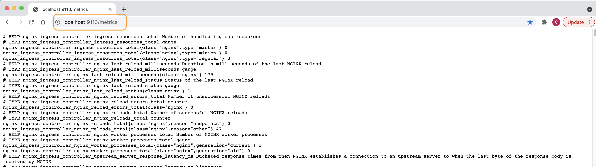
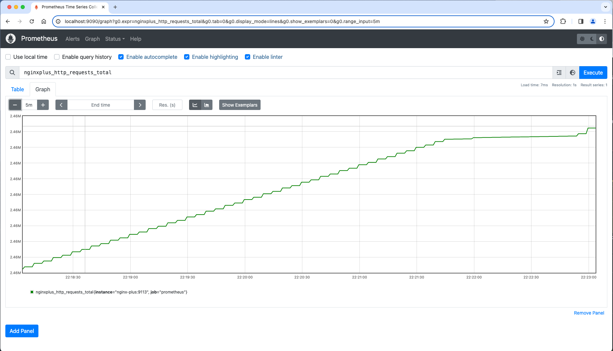
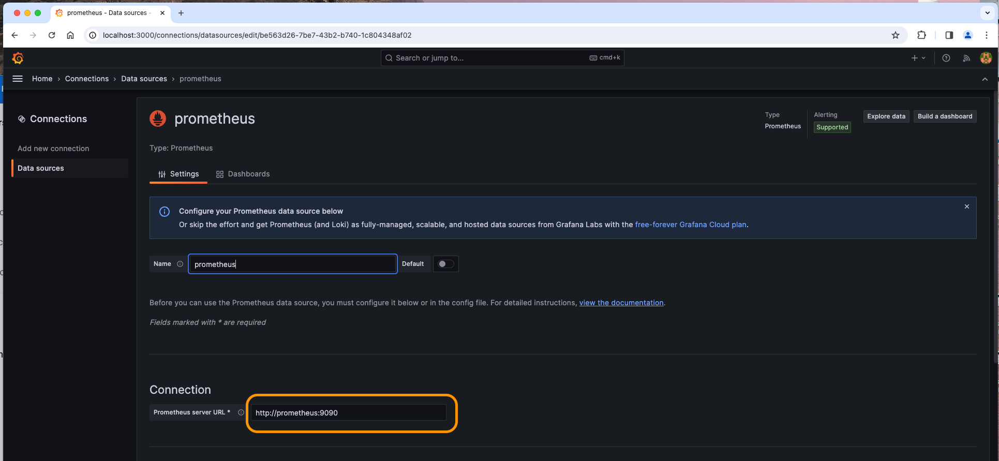
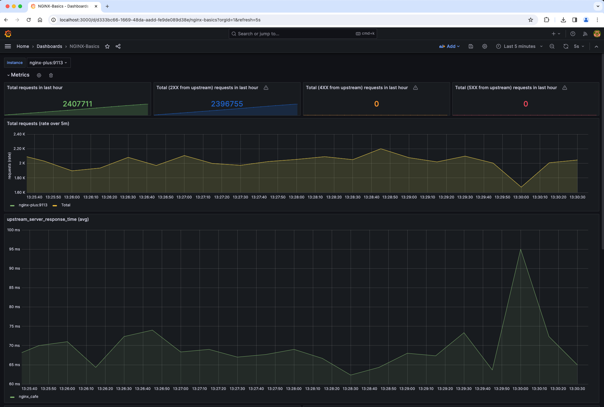

# Monitoring NGINX Plus with Prometheus and Grafana

## Introduction

In this lab, you will be exploring the integration between NGINX Plus, Prometheus and Grafana.

This Solution requires the use of the NGINX provided JaveScript and Prometheus modules to collect metrics from the NGINX Plus API, and export those metrics as an HTTP html/text page, commonly called the `scaper page` because it scrapes statistics for publication.  The metrics on this export page are then read and imported into Prometheus and Grafana's time-series database.  Once these metrics are in the database, you can create many different Dashboards, Thresholds, Alerts, and other types of graphs for Visualization and Reporting.  As you can imagine, there are literally hundreds of Grafana dashboards written by users of NGINX that you can try out for free.  Grafana also allows you to create and edit your own Dashboards.

NGINX Plus | Prometheus | Grafana
:-------------------------:|:-------------------------:|:-----:
  | |
  
## Learning Objectives

By the end of the lab you will be able to:

- Enable and configure NGINX Java Script
- Create Prometheus Exporter configuration
- Test the Prometheus Server
- Test the Grafana Server
- View Grafana Dashboard

## Pre-Requisites

- You must have Docker installed and running
- You must have Docker-compose installed
- You must an NGINX Plus license, Trial or subscription
- See `Lab0` for instructions on setting up your system for this Workshop
- Familiarity with basic Linux commands and commandline tools
- Familiarity with basic Docker concepts and commands
- Familiarity with basic HTTP protocol
- Familiarity with Prometheus
- Familiartiy with Grafana

As part of your Dockerfile, your NGINX Plus container already has the added `NGINX Java Script and NGINX Prometheus dynamic module` installed during the build process.  Refer to the Dockerfile if you want to check it out.

1. Ensure you are in the `lab6` folder.  Using a Terminal, run Docker Compose to build and run all the containers.

    ```bash
     cd lab6
     docker compose up --force-recreate -d
    ```

1. Edit your `nginx.conf` file, you will make 2 changes.

    - Uncomment Line #8 to enable the `ngx_http_js_module` module.
    - Uncomment Line #37 to set a parameter for an NGINX buffer called `subrequest_output_buffer_size`.

    ```nginx
    ...snip

    user  nginx;
    worker_processes  auto;

    error_log  /var/log/nginx/error.log notice;
    pid        /var/run/nginx.pid;

    # Uncomment to enable NGINX JavaScript module
    load_module modules/ngx_http_js_module.so;   # Added for Prometheus

    ...snip

        # Uncomment for Prometheus scraper page output
        subrequest_output_buffer_size 32k;       # Added for Prometheus

    ...snip

    ```

1. Inspect the `prometheus.conf` file in the `labs/lab6/nginx-plus/etc/nginx/conf.d` folder.  This is the NGINX config file which opens up port 9113, and provides access to the scraper page.  Uncomment all the lines to enable this.

    ```nginx
    # NGINX Plus Prometheus configuration, for HTTP scraper page
    # Chris Akker, Shouvik Dutta - Feb 2024
    # https://www.nginx.com/blog/how-to-visualize-nginx-plus-with-prometheus-and-grafana/
    # Nginx Basics
    #
    # Uncomment all lines below
    js_import /usr/share/nginx-plus-module-prometheus/prometheus.js;

    server {
    
        listen 9113;               # This is the default port for Prometheus scraper page
        
        location = /metrics {
            js_content prometheus.metrics;
        }

        location /api {
            api;
        } 

    }

    ```

1. Once the contents of both files has been updated and saved, Docker Exec into the nginx-plus container.

    ```bash
     docker exec -it nginx-plus bin/bash
    ```

1. Test and reload your NGINX config by running `nginx -t` and `nginx -s reload` commands respectively from within the container.

1. Start the WRK load generation tool.  This will provide some traffic to the nginx-plus container, so the statistics will be increasing.

    ```bash
    docker run --name wrk --network=lab6_default --rm williamyeh/wrk -t4 -c200 -d20m -H 'Host: cafe.example.com' --timeout 2s http://nginx-plus/coffee
    ```

1. Test the Prometheus scraper page.  Open your browser to <http://localhost:9113/metrics>.  You should see an html/text page like this one.  You will notice there are MANY statistcs available, this page is like a text version of the NGINX Plus dashboard. This page can be easily imported into your existing Performance Management and Monitoring tools.  You will see how to do this in the next section with Prometheus and Grafana.

    Click refresh a couple times, and some of the metrics should increment.

    

<br/>

## Prometheus and Grafana Server Docker containers

<br/>

  |
--- | ---

1. Inspect your `docker-compose.yml` file, you will see it includes 2 additional Docker containers for this lab, one for a Prometheus server, and one for a Grafana server.  These have been configured to run for you, but the images will be pulled from public repos.

    ```bash
    ...snip
    
    prometheus:
        hostname: prometheus
        container_name: prometheus
        image: prom/prometheus
        volumes:
            - ./nginx-plus/etc/prometheus/prometheus.yml:/etc/prometheus/prometheus.yml
        ports:
            - "9090:9090"
        restart: always
        depends_on:
            - nginx-plus
    grafana:
        hostname: grafana
        container_name: grafana
        volumes:
            - grafana-storage:/var/lib/grafana
        image: grafana/grafana
        ports:
            - "3000:3000"
        restart: always
        depends_on:
            - nginx-plus
    volumes:
    grafana-storage:
        name: "grafana-storage"
        external: false

    ```

1. Verify these 2 containers are running.

    ```bash
    docker ps -a
    ```

    ```bash
    ##Sample output##
    CONTAINER ID   IMAGE                   COMMAND                  CREATED          STATUS          PORTS                                                                                      NAMES
    8a61c66fc511   prom/prometheus         "/bin/prometheus --c…"   36 minutes ago   Up 36 minutes   0.0.0.0:9090->9090/tcp                                                                     prometheus
    4d38710ed4ec   grafana/grafana         "/run.sh"                36 minutes ago   Up 36 minutes   0.0.0.0:3000->3000/tcp                                                                     grafana

    ...snip

    ```

<br/>

### Prometheus

<br/>

Prometheus is a software package that can watch and collect statistics from many different NGINX instances. The Prometheus server will collect the statistics from the scraper page that you enabled in the previous section.

<br/>

1. Using Chrome, navigate to <http://localhost:9090>. You should see a Prometheus webpage like this one. Search for `nginxplus_` in the query box to see a list of all the statistics that Prometheus is collecting for you.  Select `nginxplus_http_requests_total` from the list, click on Graph, and then click the "Execute" Button.  Change the Time window if needed. This will provide a graph similar to this one:

    

    Take a few minutes to explore other metrics available from NGINX Plus.  What is the Upstream Response Time of your 3 backend web servers???

<br/>

### Grafana

<br/>

Grafana is a data visualization tool, which contains a time series database and graphical web presentation tools. Grafana imports the Prometheus scraper page statistics into it's database, and allows you to create Dashboards of the statistics that are important to you.

1. Log into the Web console access for Grafana at <http://localhost:3000>.  The default Login should be user/pass of `admin/admin`.  This will present the main Grafana page.

1. Create a Prometheus Data Source.  In the middle of the Grafana Welcome page, click on `Add Data Source`, and Select the Prometheus icon.

1. Set the Connection URL to `http://prometheus:9090` as shown:

    

1. Scroll to the bottom and click `Test and Save`.

1. Import the provided `labs/lab6/NGINX-Basics.json` file to see statistics like the NGINX Plus HTTP Requests Per Second and Upstream Response Times.  Click on New Dashboard, then Import.  Copy and Paste the `labs/lab6/NGINX-Basics.json` file provided.  You should see a dashboard like this one:

    

    There are many different Grafana Dashboards available, and you have the option to create and build dashboards to suite your needs.  NGINX Plus provides over 240 metrics for TCP, HTTP, SSL, Virtual Servers, Locations, Rate Limits, and Upstreams.

>If you are finished with this lab, you can use Docker Compose to shut down your test environment. Make sure you are in the `lab6` folder:

```bash
cd lab6
docker compose down
```

```bash
##Sample output##
Running 5/5
Container nginx-plus         Removed
Container web2               Removed
Container prometheus         Removed
Container web3               Removed
Container web1               Removed
Container grafana            Removed                            
Network lab6_default         Removed

```

<br/>

**This completes Lab6.**

<br/>

## References:

- [NGINX Plus](https://www.nginx.com/products/nginx/)
- [NGINX Admin Guide](https://docs.nginx.com/nginx/admin-guide/)
- [NGINX Technical Specs](https://docs.nginx.com/nginx/technical-specs/)
- [NGINX Prometheus Exporter Metrics](https://github.com/nginxinc/nginx-prometheus-exporter?tab=readme-ov-file#exported-metrics)

<br/>

### Authors

- Chris Akker - Solutions Architect - Community and Alliances @ F5, Inc.
- Shouvik Dutta - Solutions Architect - Community and Alliances @ F5, Inc.

-------------

Navigate to ([Main Menu](../readme.md))