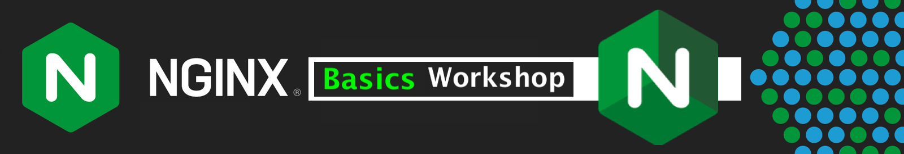

## NGINX Basics Workshop

### Overview

 

> **Welcome to the NGINX OSS and Plus Basics Workshop**

 

This Workshop will introduce NGINX Webserver and Reverse Proxy with hands-on practice through self-paced lab exercises.  

You will learn about `NGINX` Opensource Software (OSS) and `NGINX Plus`, the Commerical version of NGINX, with no prior experience required. The lab exercises provided will teach you by example how to install, configure, test, operate, troubleshoot, and fix NGINX; using common commands, tools, and applications. There are dozens of use cases for NGINX, this Basics Workshop will focus on the most common ones for new users and deployments. This Workshop content is designed to run in almost any environment that can host Docker and Linux containers, for broad appeal and consumption by users.

 

 

These Hands-On Lab Exercises are designed to be independent, with later labs adding additional services and features as you progress through them. Completing the labs in sequential order is highly recommended.

By the end of this Workshop, you will have a working, operational NGINX OSS or Plus Docker environment, routing traffic to and from backend web application servers, with the necessary skills to deploy and operate NGINX for your own Modern Applications. Thank You for taking the time to attend this NGINXpert Workshop!

## Lab Outline

#### Lab 0: Workshop pre-work (Choose any one)

- [Lab 0: Workshop pre-work using F5 provided workshop environment](lab0/readme.md)
  
- [Lab 0: Workshop pre-work using your own system](lab0/prerequisites.md)

#### Lab 1: Build and Run NGINX Opensource on Docker

- [Lab 1: Build and Run NGINX Opensource on Docker](lab1/readme.md)

#### Lab 2: NGINX as a Web Server

- [Lab 2: NGINX as a Web Server](lab2/readme.md)

#### Lab 3: NGINX Web Server with TLS

- [Lab 3: NGINX Web Server with TLS](lab3/readme.md)

#### Lab 4: NGINX Reverse Proxy and HTTP Load Balancing

- [Lab 4: NGINX Reverse Proxy and HTTP Load Balancing](lab4/readme.md)

#### Lab 5: Build and Run NGINX Plus on Docker

- [Lab 5: Build and Run NGINX Plus on Docker](lab5/readme.md)

#### Lab 6: Monitoring NGINX Plus with Prometheus and Grafana

- [Lab 6: Monitoring NGINX Plus with Prometheus and Grafana](lab6/readme.md)

 

Click [Lab1: Build and Run NGINX Opensource on Docker](lab1/readme.md) to get started!

------------

### Authors

- Chris Akker - Solutions Architect - Community and Alliances @ F5, Inc.
- Shouvik Dutta - Solutions Architect - Community and Alliances @ F5, Inc.
