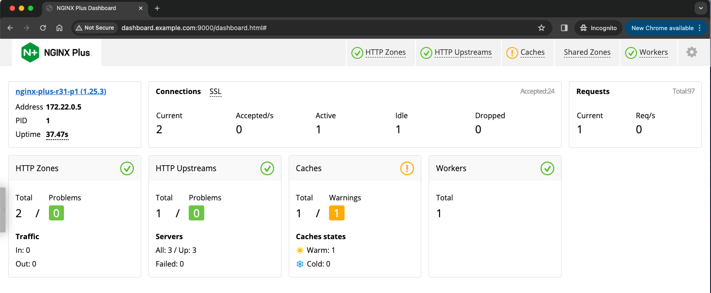

# NGINX Caching

## Introduction

NGINX can be used as an HTTP cache, delivering static content directly from memory and disk.  This can improve the response time and appearance of your web pages by providing this content much faster than waiting for the origin server to deliver it.  You have complete control over all parameters of HTTP caching, like the Headers, aging, refresh time, and other controls.  This high performance, low latency, scalable HTTP caching capability is the backbone of many of the world's largest Content Delivery Networks.  You will configure and test NGINX caching, with configurations you can use for your own website.

<br/>

## Learning Objectives 

By the end of the lab you will be able to: 
 * Create a new lab environment for cache testing
 * Configure NGINX caching
 * Monitor and Log important cache metadata
 * Run performance tests

## Build an NGINX Cache lab environment

<br/>

NGINX Plus | Caching
:-------------------------:|:-------------------------:
 | 


1. Inspect the `docker-compose.yml` file located in the /lab6 folder.  You see that we are still using NGINX Plus, but are changing the backend webservers to JuiceShop.  This is a simple web application that looks like a retail Juice shop, where customers can browse and shop the website for different drinks.  This Juiceshop website has many images and is an ideal candidate for Caching.

< Juice shop website image here>

```bash

...snip

# Juiceshop web application containers
  juice1:
      hostname: juice1
      container_name: juice1
      image: bkimminich/juice-shop            # Image from Docker Hub
      ports:
        - "3000"
  juice2:
      hostname: juice2
      container_name: juice2
      image: bkimminich/juice-shop
      ports:
        - "3000"
  juice3:
      hostname: juice3
      container_name: juice3
      image: bkimminich/juice-shop
      ports:
        - "3000"

```

1. Run the `docker-compose` command to download and run these 4 containers:

```bash
docker-compose up

```

Verify they are all up and running

```bash
docker ps -a

```

Should look something like:

```bash

<docker ps here>

```

### Update your DNS /etc/hosts file

Add `juiceshop.example.com` and `dashboard.example.com` hostnames to your /etc/hosts DNS file:

    ```bash
    cat /etc/hosts

    127.0.0.1 localhost juiceshop.example.com dashboard.example.com cafe.example.com cars.example.com www.example.com www2.example.com

    ```


<br/>

### Configure NGINX to Load Balance JuiceShop

<br/>

1. Create a new `upstreams-juice.conf` file in your `/etc/nginx/conf.d` folder, where you keep NGINX HTTP configuration files.  This will be your Upstream configuration.

    ```nginx
    # NGINX Basics, Plus Proxy to three upstream juiceshop servers
    # Chris Akker, Shouvik Dutta - Feb 2024
    #
    # nginx-juice servers 
    upstream nginx_juice {

        zone nginx_juice 256k;

        # Uncomment for Least Time Last Byte      
        least_time last_byte;

        # From Docker-Compose:
        server juice1:3000;
        server juice2:3000;
        server juice3:3000;

        # Uncomment for keepalive TCP connections to upstreams
        keepalive 16;

    }

    ```

1. Create a new `juice.example.com.conf` file in your `/etc/nginx/conf.d` folder, where you keep NGINX HTTP configuration files.  This will be your Server and Location blocks configuration.

```nginx
# juice.example.com HTTP
# NGINX Basics Workshop
# Feb 2024, Chris Akker, Shouvik Dutta
#
server {
    
    listen 80;      # Listening on port 80 on all IP addresses on this machine

    server_name juiceshop.example.com;   # Set hostname to match in request
    status_zone http://juiceshop.example.com;

    access_log  /var/log/nginx/juiceshop.example.com.log main;
    # access_log  /var/log/nginx/juiceshop.example.com.log main_ext;   Extended Logging
    error_log   /var/log/nginx/juiceshop.example.com_error.log notice;

    root /usr/share/nginx/html;       # Set the root folder for the HTML and JPG files

    location / {
        status_zone /;
        include includes/proxy_headers.conf;
        include includes/keepalive.conf;
        
        proxy_pass http://nginx_juice;        # Proxy AND load balance to a list of servers
    }

} 

```

1. Using your browser, open the NGINX Plus dashboard at http://dashboard.example.com:9000/dashboard.html.  Leave this browser open for the remainder of this lab, you will refer to it often.

    Check out the HTTP Zone tab, and the HTTP Upstreams tab.  You should see the Juiceshop Virtual Server, Location zones, and three Juiceshop upstream servers.

1. There are onely three steps required to configure and enable NGINX caching for HTTP static content.

    * Define the cache name, size, and location
    * Configure the HTTP Proxy Cache Headers
    * Enable the cache in a Location block

1. Inspect the `proxy_cache_global.conf` file, located in the /includes directory.  Uncomment lines #3-8, to enable the `proxy_cache_path` Directive and parameters.

    ```nginx
    #
    # Proxy Cache configuration
    #
    proxy_cache_path /var/cache/nginx
                levels=1:2
                keys_zone=image_cache:10m
                max_size=100m
                inactive=60m
                use_temp_path=off;

    ...snip

    ```

    - The location is set for `/var/cache/nginx` on the file system.  For high performance, this should obviously be an SSD-backed volume if you have one.
    - The levels=1:2 means use a two level directory structure for the objects being cached
    - The keys_zone parameter sets "image_cache" as the `cache hash keys zone name`, and creates a shared memory zone to store the cache hash keys.  The keys_zone name must match the name of the actual cache - "image_cache".
    - The max_size of the cache is 100m (100MB) in size.
    - The inactive=60m parameter sets the cache object maximum age.  Objects older than 60 minutes are removed from the cache.
    - The use_temp_path parameter disables using tempory file writing.
    - You will find many more parameters and details about NGINX caching in the References section.

    Save the file.  Test your config and Reload NGINX.

1. Inspect the `image_cache.conf` file, also located in the /includes folder.  Uncomment line#4, to enable the `image_cache`, which has the same name defined in the previous step.

    ```nginx
    #
    # Required
    #
    proxy_cache image_cache;   # Uncomment this line
    #
    # Set caching time for different response codes
    proxy_cache_valid 200 30s;
    proxy_cache_valid 301 302 10m;
    proxy_cache_valid 404 1m;
    proxy_cache_valid any 10s;

    # Override cache control headers
    proxy_ignore_headers X-Accel-Expires Expires Cache-Control Set-Cookie;
    expires 365d;
    add_header Cache-Control "public";

    # Cache status header added
    add_header X-Cache-Status $upstream_cache_status;

    ```

    - You see, with the `proxy_cache` Directive, you are enabling the cache, and setting separate timers based a different HTTP return codes from the Upstreams.  NOTE:  the Valid timer for `HTTP 200` codes is set very short to 30 seconds for this lab, so you can see it expire during the exercises.  You would normally set this higher in an actual configuration, like 60 minutes.
    - You also note the HTTP Caching Control Headers from the client are being Overriden, so NGINX will ignore these, and cache objects based on your settings, instead of the Browser settings.  
    - You are also adding a `custom HTTP Header` from NGINX that will tell you if the object requested was in the cache `(HIT)`, not in the cache `(MISS)`, or an expired `(EXPIRED)` object in the cache.

    Save your file.  Test and Reload NGINX.

1. Observe your NGINX Plus Dashboard, you should see a new `Cache` tab.  The icon will be yellow because there is nothing in the cache yet.

    

1. Update your `juiceshop.example.com.conf` file, uncomment line #32 for a new status zone, and line #35 to enable the `image_cache`.

    ```nginx
    ...snip

        # Cache Proxy example for static images / page components only
        # Match common files
        location ~* \.(?:jpg|gif|png|ico|css|js)$ {
            
            ### Uncomment for new status_zone in dashboard
            status_zone images;

            ### Uncomment to enable NGINX Proxy cache
            include includes/image_cache.conf;

    ...snip

    ```

    The Location block provided, 

        ```nginx
        location ~* \.(?:jpg|gif|png|ico|css|js)$ {}

        ### Uncomment for new status_zone in dashboard
            status_zone images;

        ```

    is a `Reqular Expression`, that tells NGINX to look at the `end of the URL` for the object type, and will only cache the object types listed.  You will notice `jpg, gif, png, ico` image objects, and also added `css and js` objects used for webpages.

    A new `status_zone` is added, so you can see the metrics for this Location block.

1. Check your NGINX Plus Dashboard, you should see a new `images` Location zone in the HTTP Zones tab.  This will track metrics for this Location block.

1. Time to test it out!  You will use curl and then Chrome Developer Tools to see how NGINX is caching (or not) the objects from the Juiceshop Upstreams.

```bash
curl -I http://juiceshop.example.com

```

```
##Sample output##
HTTP/1.1 200 OK
Server: nginx/1.25.3

...snip

Cache-Control: public         # set to public by NGINX
X-Cache-Status: MISS          # Notice the new Header
Accept-Ranges: bytes

```

The first request is a `MISS`, because there is nothing in the cache yet. Try it again, you should see it `HIT`

```
##Sample output##
HTTP/1.1 200 OK
Server: nginx/1.25.3

...snip

Cache-Control: public         # set to public by NGINX
X-Cache-Status: HIT           # Notice the new Header
Accept-Ranges: bytes

```

Wait at least 30 seconds, try again, you should see a `EXPIRED`:

```
##Sample output##
HTTP/1.1 200 OK
Server: nginx/1.25.3

...snip

Cache-Control: public         # set to public by NGINX
X-Cache-Status: EXPIRED       # Notice the new Header
Accept-Ranges: bytes

```

The request cache-status should be EXPIRED, because the `HTTP 200 Response timer` is set low to 30 seconds.  Remember, you set this low intentionally so you can see this.

1. Open a new browser, and go to `http://juiceshop.example.com`, you should see the full website.  Hit refresh a 4-5 times to send some additional requests.

What do you see in the Plus Dashboard?

- HTTP Server Zone Requests increasing
- HTTP Location Zone Requests increasing
- Juiceshop Upstreams being load balanced


<br/>

**This completes Lab 6.**

## References

- [NGINX Plus](https://docs.nginx.com/nginx/)
- [NGINX Admin Guide](https://docs.nginx.com/nginx/admin-guide/)
- [NGINX Technical Specs](https://docs.nginx.com/nginx/technical-specs/)

### Authors

- Chris Akker - Solutions Architect - Community and Alliances @ F5, Inc.
- Shouvik Dutta - Solutions Architect - Community and Alliances @ F5, Inc.

-------------

Navigate to ([Lab7](../lab7/readme.md) | [Main Menu](../readme.md))
